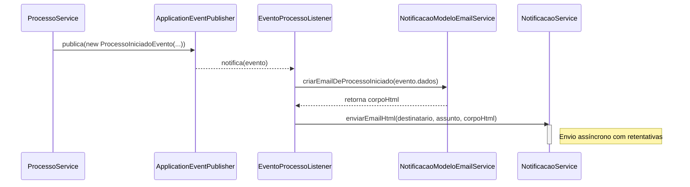

# Módulo de Notificação por E-mail - SGC

## Visão Geral
Este pacote é responsável pelo envio de notificações por e-mail. Ele é projetado para ser robusto e assíncrono, garantindo que falhas no envio de e-mail não interrompam os fluxos de negócio principais. A arquitetura é orientada a eventos, reagindo a eventos de domínio (como `ProcessoIniciadoEvento`) para acionar o envio das notificações.

## Arquitetura e Componentes

- **`NotificacaoService.java`**: A implementação principal que realiza o envio de e-mails.
  - **Persistência**: Salva uma entidade `Notificacao` antes de tentar o envio.
  - **Envio Assíncrono**: Executa o envio em um pool de threads separado (`@Async`).
  - **Retentativas**: Tenta reenviar o e-mail em caso de falha.
- **`NotificacaoModeloEmailService.java`**: Serviço utilitário dedicado a criar o conteúdo HTML dos e-mails a partir de templates.
- **`EventoProcessoListener.java`**: Listener de eventos do Spring (`@EventListener`) que escuta eventos de domínio (ex: `ProcessoIniciadoEvento`), orquestra a criação do e-mail e o envia.
- **`modelo/`**:
  - **`Notificacao.java`**: Entidade JPA que representa um registro de notificação.
  - **`NotificacaoRepo.java`**: Repositório para a entidade `Notificacao`.
- **`dto/`**:
  - **`EmailDto.java`**: `record` para transportar os dados do e-mail.

## Diagrama de Sequência (Orientado a Eventos)


## Fluxo de Notificação

1.  **Ação de Negócio**: Um serviço (ex: `ProcessoService`) executa uma operação.
2.  **Publicação do Evento**: O serviço publica um evento de domínio.
3.  **Captura do Evento**: O `EventoProcessoListener` captura o evento.
4.  **Criação do Template**: O listener chama o `NotificacaoModeloEmailService` para gerar o corpo do e-mail.
5.  **Envio do E-mail**: O listener chama `NotificacaoService.enviarEmailHtml()`.
6.  **Processamento Assíncrono**: `NotificacaoService` persiste a notificação e inicia o envio assíncrono.

## Como Usar
O envio de notificações é majoritariamente automático e baseado em eventos. Para envios manuais, injete `NotificacaoService`.

**Exemplo:**
```java
@Autowired
private NotificacaoService notificacaoService;

public void notificarManualmente(String email, String mensagem) {
    notificacaoService.enviarEmail(email, "Aviso Manual do SGC", mensagem);
}
```

## Notas Importantes
- **Desacoplamento**: A arquitetura orientada a eventos desacopla o módulo de notificação dos módulos de negócio.
- **Robustez**: O tratamento de erros, a persistência e o envio assíncrono tornam o sistema resiliente.