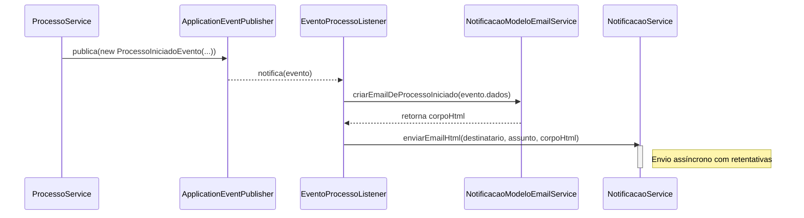

# Módulo de Notificação por E-mail - SGC

## Visão Geral
Este pacote é responsável pelo envio de notificações por e-mail para os usuários do sistema. Ele é projetado para ser robusto e assíncrono, garantindo que as falhas no envio de e-mail não interrompam os fluxos de negócio principais da aplicação.

A arquitetura é orientada a eventos, utilizando um `EventoProcessoListener` para reagir a eventos de domínio (como `ProcessoIniciadoEvento`) e acionar o envio das notificações correspondentes.

## Arquivos e Componentes Principais

### 1. `NotificacaoService.java`
- **Localização:** `backend/src/main/java/sgc/notificacao/`
- **Descrição:** Classe de serviço que centraliza toda a lógica de envio de e-mails.
- **Funcionalidades Chave:**
  - **Persistência:** Antes de tentar o envio, uma entidade `Notificacao` é salva no banco de dados para fins de auditoria.
  - **Envio Assíncrono:** O envio de e-mail é executado em um pool de threads separado (`@Async`), evitando o bloqueio da thread principal da aplicação.
  - **Retentativas:** Em caso de falha, o sistema tenta reenviar o e-mail automaticamente (até 3 tentativas com tempo de espera crescente).
  - **Validação:** Verifica se o formato do e-mail do destinatário é válido antes do envio.

### 2. `NotificacaoModeloEmailService.java`
- **Localização:** `backend/src/main/java/sgc/notificacao/NotificacaoModeloEmailService.java`
- **Descrição:** Um serviço utilitário dedicado a criar o conteúdo HTML dos e-mails. Cada método corresponde a um evento de negócio específico (ex: `criarEmailDeProcessoIniciado`, `criarEmailDeCadastroDevolvido`), garantindo que todas as notificações tenham um formato padronizado e informativo.

### 3. `EventoProcessoListener.java`
- **Localização:** `backend/src/main/java/sgc/notificacao/EventoProcessoListener.java`
- **Descrição:** Um listener de eventos do Spring (`@EventListener`) que escuta por eventos de domínio publicados pelo `ProcessoServico`. Ao capturar um evento, ele orquestra a criação do e-mail (usando `NotificacaoModeloEmailService`) e o envia (usando `NotificacaoService`).

### 4. `Notificacao.java` (Entidade)
- **Localização:** `backend/src/main/java/sgc/notificacao/modelo/Notificacao.java`
- **Descrição:** Entidade JPA que representa um registro de notificação no banco de dados. Armazena informações sobre o destinatário, o conteúdo e o momento em que a notificação foi gerada.

### 5. `EmailDto.java` (DTO)
- **Localização:** `backend/src/main/java/sgc/notificacao/dto/EmailDto.java`
- **Descrição:** Um `record` Java simples usado para transportar os dados do e-mail (destinatário, assunto, corpo, se é HTML) entre os componentes do módulo.

## Diagrama de Sequência (Orientado a Eventos)


## Fluxo de Notificação (Orientado a Eventos)

1.  **Ação de Negócio**: Um serviço, como o `ProcessoServico`, executa uma operação importante (ex: iniciar um processo).
2.  **Publicação do Evento**: Ao final da operação, o `ProcessoServico` publica um evento de domínio (ex: `new ProcessoIniciadoEvento(this, ...)`).
3.  **Captura do Evento**: O `EventoProcessoListener` captura o evento.
4.  **Criação do Template**: O listener chama o `NotificacaoModeloEmailService` para gerar o corpo do e-mail em HTML com os dados do evento.
5.  **Envio do E-mail**: O listener chama `NotificacaoService.enviarEmailHtml()`.
6.  **Processamento Assíncrono**: `NotificacaoService` persiste a notificação e inicia o processo de envio assíncrono com retentativas.

## Como Usar
Na maioria dos casos, o envio de notificações é automático e baseado em eventos. Para enviar um e-mail manualmente, injete `NotificacaoServico`.

**Exemplo:**
```java
@Autowired
private NotificacaoService notificacaoService;

public void notificarManualmente(String email, String mensagem) {
    notificacaoService.enviarEmail(email, "Aviso Manual do SGC", mensagem);
}
```

## Notas Importantes
- **Desacoplamento**: A arquitetura orientada a eventos desacopla fortemente o módulo de notificação dos módulos de negócio. O `ProcessoServico` não precisa saber como os e-mails são enviados; ele apenas anuncia que algo aconteceu.
- **Robustez**: O tratamento de erros, a persistência e o envio assíncrono tornam o sistema de notificações resiliente a falhas na infraestrutura de e-mail.