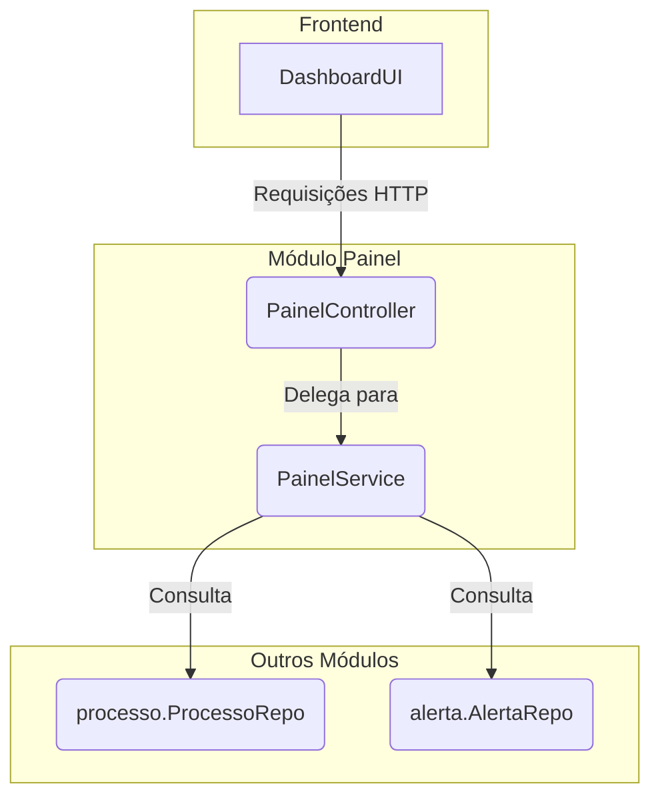

# Módulo Painel


## Visão Geral

O módulo `painel` é responsável por fornecer os dados agregados para o dashboard (painel de controle) da aplicação. Ele
centraliza a lógica de negócio que coleta informações de diferentes módulos, como `processo` e `alerta`, para apresentar
uma visão consolidada ao usuário.

## Estrutura Spring Modulith

Este módulo segue a convenção Spring Modulith:

### API Pública
- **`PainelService`** (raiz do módulo) - Facade para operações do painel

### Implementação Interna
- `internal/PainelController` - REST endpoints
- `internal/erros/` - Exceções específicas do módulo

**⚠️ Importante:** Outros módulos **NÃO** devem acessar classes em `internal/`.

## Dependências

### Módulos que este módulo depende
- `processo` - Consulta de processos para dashboard
- `alerta` - Consulta de alertas para dashboard
- `unidade` - Informações de unidades organizacionais
- `sgrh` - Informações de perfis e usuários
- `comum` - Componentes compartilhados

### Características
- Módulo read-only que agrega dados de outros módulos
- Não possui eventos próprios

## Arquitetura

Este módulo segue a arquitetura padrão da aplicação, com uma camada de Controle e uma de Serviço.



## Componentes Principais

- **`PainelController`**: Expõe a API REST para o painel. Recebe as requisições do frontend e delega a busca dos dados
  para o `PainelService`.
- **`PainelService`**: Contém a lógica de negócio para buscar e agregar os dados. Ele interage com os repositórios de
  outros módulos para construir as visualizações necessárias para o painel.

## Fluxos de Trabalho

1. O frontend solicita os dados do painel ao `PainelController`.
2. O `PainelController` invoca o `PainelService` com os parâmetros da requisição (ex: perfil do usuário, unidade).
3. O `PainelService` consulta o `ProcessoRepo` e o `AlertaRepo` para buscar os dados relevantes.
4. O `PainelService` processa e agrega os dados, retornando uma página de DTOs (`ProcessoResumoDto`, `AlertaDto`).
5. O `PainelController` retorna os dados como uma resposta JSON para o frontend.


## Como Testar

Para executar apenas os testes deste módulo:
```bash
./gradlew :backend:test --tests "sgc.painel.*"
```
