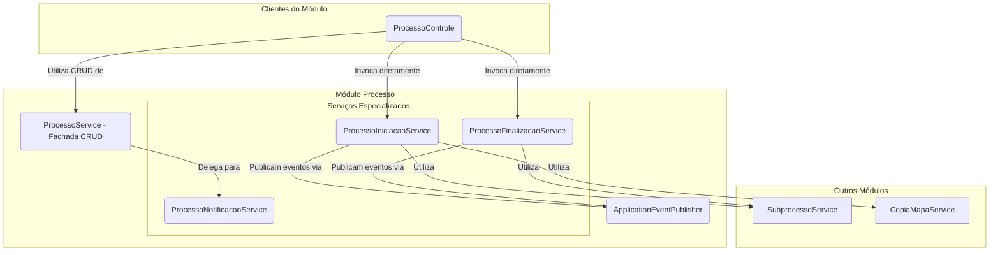

# Módulo de Processo

## Visão Geral
O pacote `processo` é o **orquestrador central** dos fluxos de trabalho do SGC. Ele gerencia a entidade `Processo`, que representa uma iniciativa de alto nível, como um "Mapeamento Anual de Competências".

Este módulo inicia e finaliza os fluxos de trabalho, coordena a criação de `Subprocessos` e `Mapas` e, crucialmente, **publica eventos de domínio** para comunicar-se de forma desacoplada com outros módulos, como `alerta` e `notificacao`.

## Arquitetura de Serviços (Padrão Fachada Parcial)
Assim como o módulo `mapa`, este pacote utiliza o padrão **Service Facade**, mas de forma parcial. O `ProcessoService` atua como o ponto de entrada para operações de CRUD e consulta, enquanto o `ProcessoControle` invoca diretamente os serviços especializados (`ProcessoIniciacaoService`, `ProcessoFinalizacaoService`) para as ações de workflow.

## Componentes Principais

### Camada de Fachada
- **`ProcessoService`**: Atua como fachada para operações de CRUD (criar, ler, atualizar, excluir) e consultas de processos.

### Serviços Especializados
- **`ProcessoIniciacaoService`**: Contém toda a lógica para iniciar um novo processo. Suas responsabilidades incluem:
  - Criar os `Subprocessos` para cada unidade participante.
  - Invocar o `CopiaMapaService` para clonar o mapa vigente (em caso de "Revisão").
  - Publicar o `ProcessoIniciadoEvento`.
- **`ProcessoFinalizacaoService`**: Contém a lógica para finalizar um processo.
- **`ProcessoNotificacaoService`**: Centraliza a lógica para enviar notificações específicas do processo.

### Outros Componentes
- **`ProcessoControle`**: Expõe a API REST. Para operações de CRUD, delega para o `ProcessoService`. Para as ações de iniciar e finalizar, invoca diretamente os serviços especializados.
- **`eventos/`**: Define os eventos de domínio (`ProcessoIniciadoEvento`, etc.) que são publicados para desacoplar a comunicação com outros módulos.
- **`modelo/`**: Contém as entidades JPA, como `Processo` e `UnidadeProcesso`.
- **`ProcessoSeguranca`**: Centraliza as regras de verificação de permissões.

## Fluxo de Iniciação de um Processo
1.  O `ProcessoControle` recebe a requisição para iniciar um processo.
2.  Ele chama diretamente o `ProcessoIniciacaoService.iniciarProcesso(...)`.
3.  O `ProcessoIniciacaoService`, dentro de uma transação, executa toda a lógica de criação de subprocessos e mapas.
4.  Ao final, ele publica um `ProcessoIniciadoEvento` usando o `ApplicationEventPublisher`.
5.  Os módulos `alerta` e `notificacao` recebem o evento e executam suas ações de forma independente.

A arquitetura orientada a eventos e a separação em serviços coesos garantem que este módulo, apesar de sua importância central, permaneça testável e desacoplado.
