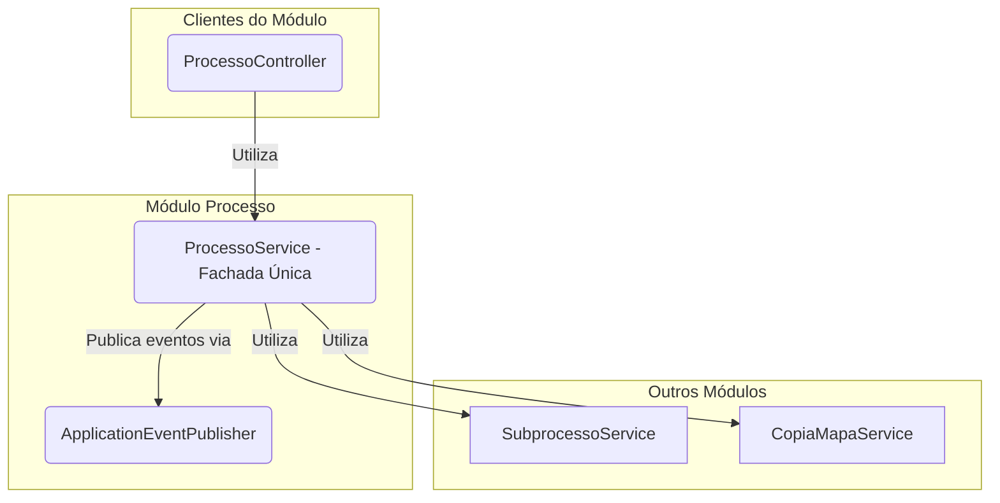

# Módulo de Processo


## Visão Geral

O módulo `processo` é o **orquestrador central** dos fluxos de trabalho do SGC. Ele gerencia a entidade `Processo`, que
representa uma iniciativa de alto nível, como um "Mapeamento Anual de Competências" ou "Revisão de Mapas".

Este módulo inicia e finaliza os fluxos de trabalho, coordena a criação de `Subprocessos` para cada unidade participante
e **publica eventos de domínio** para comunicar-se de forma desacoplada com outros módulos, como `alerta` e
`notificacao`.

## Estrutura Spring Modulith

Este módulo segue a convenção Spring Modulith:

### API Pública
- **`ProcessoService`** (raiz do módulo) - Facade única para todas as operações do módulo
- **`api/ProcessoDto`** - DTO principal de processo
- **`api/ProcessoDetalheDto`** - DTO detalhado com subprocessos
- **`api/eventos/*`** - 22 eventos de domínio publicados:
  - `EventoProcessoCriado`, `EventoProcessoIniciado`, `EventoProcessoFinalizado`
  - `EventoSubprocesso*` - Diversos eventos de workflow de subprocessos

### Implementação Interna
- `internal/ProcessoController` - REST endpoints
- `internal/ProcessoMapper` - Mapeamento entre entidade e DTO
- `internal/model/Processo` - Entidade JPA
- `internal/model/ProcessoRepo` - Repositório
- `internal/model/TipoProcesso`, `SituacaoProcesso` - Enums

**⚠️ Importante:** Outros módulos **NÃO** devem acessar classes em `internal/`.

## Dependências

### Módulos que este módulo depende
- `subprocesso` - Criação e gerenciamento de subprocessos
- `mapa` - Cópia de mapas em processos de revisão
- `atividade` - Acesso a dados de atividades
- `unidade` - Estrutura organizacional
- `sgrh` - Informações de usuários
- `comum` - Componentes compartilhados

### Módulos que dependem deste módulo
- `notificacao` - Consome eventos publicados
- `alerta` - Consome eventos publicados
- `subprocesso` - Referência a processo pai
- `painel` - Dashboard com dados de processos

## Eventos de Domínio

### Publicados (Spring Modulith Event Publication Registry)
Todos os eventos são persistidos na tabela `EVENT_PUBLICATION` para garantir processamento resiliente:

- `EventoProcessoCriado` - Quando processo é criado
- `EventoProcessoIniciado` - Quando processo é iniciado
- `EventoProcessoFinalizado` - Quando processo é finalizado
- `EventoSubprocessoCadastroDisponibilizado` - Cadastro liberado para unidade
- `EventoSubprocessoCadastroDevolvido` - Cadastro devolvido para ajustes
- `EventoSubprocessoCadastroAceito` - Cadastro aceito
- `EventoSubprocessoCadastroHomologado` - Cadastro homologado
- `EventoSubprocessoMapaIniciado` - Mapa iniciado
- `EventoSubprocessoMapaAjustadoSubmetido` - Mapa ajustado submetido
- `EventoSubprocessoMapaComSugestoes` - Mapa devolvido com sugestões
- `EventoSubprocessoMapaAceito` - Mapa aceito
- `EventoSubprocessoRevisaoDisponibilizada` - Revisão disponibilizada
- `EventoSubprocessoRevisaoDevolvida` - Revisão devolvida
- `EventoSubprocessoRevisaoAceita` - Revisão aceita
- `EventoSubprocessoRevisaoHomologada` - Revisão homologada
- E outros eventos de workflow...

### Consumidos
Nenhum evento é consumido diretamente por este módulo.

## Arquitetura de Serviços (Padrão Fachada)

O módulo adota o padrão **Service Facade**, onde o `ProcessoService` serve como o ponto de entrada único para todas as
operações principais.



## Componentes Principais

### Controladores e Serviços

- **`ProcessoService`**: Atua como a fachada única para o módulo. Responsabilidades:
    - CRUD de Processos.
    - Iniciar processos (criando subprocessos e mapas).
    - Finalizar processos (homologando mapas vigentes).
    - Publicar eventos de domínio (`EventoProcessoIniciado`, `EventoProcessoFinalizado`).
- **`ProcessoController`**: Expõe a API REST.
    - `GET /api/processos/ativos`: Lista processos em andamento.
    - `GET /api/processos/{id}/detalhes`: Visão completa do processo e seus subprocessos.
    - `POST /api/processos/{id}/iniciar`: Dispara o início do processo (CDU-03).
    - `POST /api/processos/{id}/finalizar`: Encerra o processo (CDU-21).

### Modelo de Dados (`model`)

- **`Processo`**: Entidade principal. Contém título, datas, tipo (`MAPEAMENTO`, `REVISAO`, `DIAGNOSTICO`) e situação.
- **`TipoProcesso` / `SituacaoProcesso`**: Enums de domínio.

### Eventos de Domínio (`eventos`)

- **`EventoProcessoIniciado`**: Publicado quando um processo começa.
- **`EventoProcessoFinalizado`**: Publicado quando um processo termina.
- **`EventoRevisaoSubprocessoDisponibilizada`**: Publicado quando uma revisão é liberada.

## Fluxo de Iniciação de um Processo

1. O `ProcessoController` recebe a requisição `POST /iniciar`.
2. O `ProcessoService` inicia uma transação.
3. Para cada unidade participante, o serviço cria um `Subprocesso`.
4. Se for um processo de **REVISAO**, o `CopiaMapaService` (do módulo `mapa`) é invocado para duplicar o mapa vigente da
   unidade.
5. Ao final, um `EventoProcessoIniciado` é publicado, disparando alertas e e-mails através dos listeners no pacote
   `notificacao`.


## Como Testar

Para executar apenas os testes deste módulo:
```bash
./gradlew :backend:test --tests "sgc.processo.*"
```
