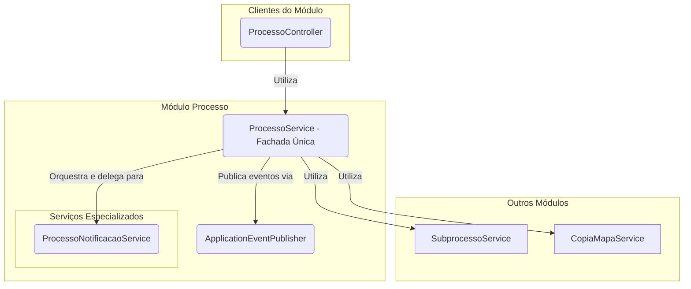

# Módulo de Processo

## Visão Geral
O pacote `processo` é o **orquestrador central** dos fluxos de trabalho do SGC. Ele gerencia a entidade `Processo`, que representa uma iniciativa de alto nível, como um "Mapeamento Anual de Competências".

Este módulo inicia e finaliza os fluxos de trabalho, coordena a criação de `Subprocessos` e `Mapas` e, crucialmente, **publica eventos de domínio** para comunicar-se de forma desacoplada com outros módulos, como `alerta` e `notificacao`.

## Arquitetura de Serviços (Padrão Fachada)
O módulo adota o padrão **Service Facade**, onde o `ProcessoService` serve como o ponto de entrada único para todas as operações. O `ProcessoController` e outros serviços externos interagem exclusivamente com esta fachada, que orquestra os serviços especializados e a lógica de negócio.

## Componentes Principais

### Camada de Fachada
- **`ProcessoService`**: Atua como a fachada única para o módulo. Suas responsabilidades incluem:
  - Gerenciar operações de CRUD.
  - Conter toda a lógica para iniciar e finalizar um novo processo.
  - Invocar o `CopiaMapaService` para clonar o mapa vigente (em caso de "Revisão").
  - Publicar eventos de domínio como `EventoProcessoIniciado`.

### Serviços Especializados
- **`ProcessoNotificacaoService`**: Centraliza a lógica para enviar notificações específicas do processo.

### Outros Componentes

- **`ProcessoController`**: Expõe a API REST e delega todas as chamadas para o `ProcessoService`.
- **`eventos/`**: Define os eventos de domínio (`EventoProcessoIniciado`, etc.) que são publicados para desacoplar a comunicação com outros módulos.
- **`model/`**: Contém as entidades JPA, como `Processo` e `UnidadeProcesso`.

## Fluxo de Iniciação de um Processo

1. O `ProcessoController` recebe a requisição para iniciar um processo.
2.  Ele chama o `ProcessoService.iniciarProcesso(...)`.
3.  O `ProcessoService`, dentro de uma transação, executa toda a lógica de criação de subprocessos e mapas.
4.  Ao final, ele publica um `EventoProcessoIniciado` usando o `ApplicationEventPublisher`.
5.  Os módulos `alerta` e `notificacao` recebem o evento e executam suas ações de forma independente.

A arquitetura orientada a eventos e o uso de uma fachada coesa garantem que este módulo, apesar de sua importância central, permaneça testável e desacoplado.
