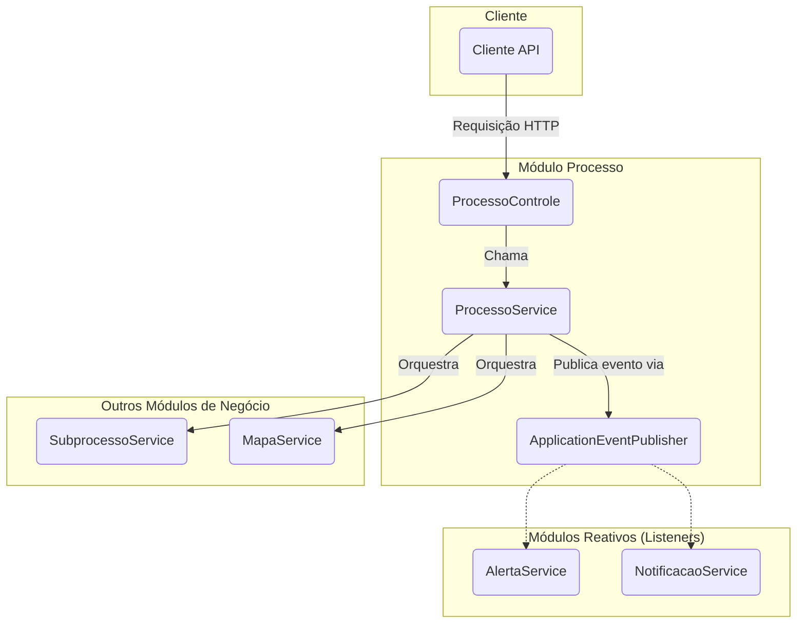

# Módulo de Processo - SGC

## Visão Geral
O pacote `processo` é o orquestrador central de fluxos de trabalho do SGC. Ele gerencia o ciclo de vida de um **Processo**, uma iniciativa de alto nível como um "Mapeamento de Competências". Este módulo coordena a criação de `Subprocessos` e `Mapas`, e utiliza uma arquitetura orientada a eventos para se comunicar de forma desacoplada com outros módulos como `alerta` e `notificacao`.

## Arquitetura e Componentes

- **`ProcessoControle.java`**: Controller REST que expõe os endpoints da API para interagir com o `ProcessoService`.
- **`ProcessoService.java`**: Contém a lógica de negócio para gerenciar o ciclo de vida dos processos, incluindo criação, iniciação e finalização.
- **`ProcessoSeguranca.java`**: Centraliza as verificações de permissão para garantir que apenas usuários autorizados possam executar ações.
- **`eventos/`**: Contém as classes que representam os eventos de domínio (`ProcessoIniciadoEvento`, `ProcessoFinalizadoEvento`, etc.). O `ProcessoService` publica esses eventos usando o `ApplicationEventPublisher` do Spring.
- **`dto/`**: Contém os DTOs para a comunicação com a API, como `CriarProcessoReq`, `AtualizarProcessoReq`, e `ProcessoDetalheDto`, além de mappers (`ProcessoMapper`, `ProcessoDetalheMapperInterface`).
- **`modelo/`**:
  - **`Processo.java`**: Entidade JPA que representa um processo.
  - **`UnidadeProcesso.java`**: Entidade "snapshot" que armazena os dados das unidades participantes no momento do início do processo.
  - **`ProcessoRepo.java`**: Repositório para a entidade `Processo`.
  - **`UnidadeProcessoRepo.java`**: Repositório para a entidade `UnidadeProcesso`.
  - **`TipoProcesso.java`**: Enum que define os tipos de processo.

## Diagrama de Orquestração

## Fluxo de Iniciação de um Processo
1.  **Requisição**: O cliente solicita o início de um processo via API.
2.  **Controller**: O `ProcessoControle` recebe a requisição e chama o `ProcessoService`.
3.  **Serviço**: Dentro de uma transação, o `ProcessoService` valida as regras, cria `Subprocessos` e `Mapas`, cria "snapshots" das unidades em `UnidadeProcesso`, altera o status do `Processo` e publica um `ProcessoIniciadoEvento`.
4.  **Listeners**: Módulos como `alerta` e `notificacao` recebem o evento e executam suas ações (criar alertas, enviar e-mails).
5.  **Resposta**: O controller retorna a resposta. A transação é revertida em caso de falha.

## Notas Importantes
- **Orquestrador Central**: Entender este pacote é fundamental para compreender o fluxo de negócio do SGC.
- **Design Desacoplado**: O uso de eventos permite adicionar novas funcionalidades sem modificar o `ProcessoService`.
- **Snapshot Histórico**: A `UnidadeProcesso` é crucial para a auditoria e integridade histórica.