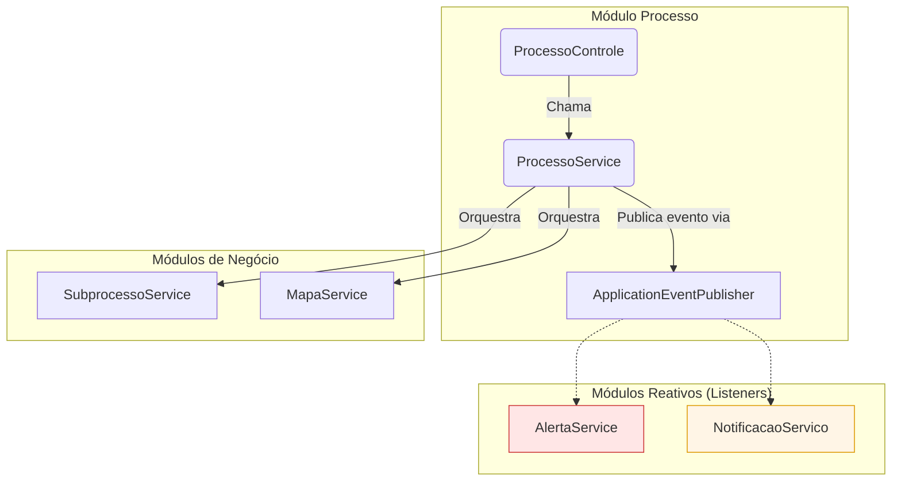

# Módulo de Processos - SGC

## Visão Geral
O pacote `processo` é o principal orquestrador de fluxos de trabalho do sistema. Ele gerencia o ciclo de vida de um **Processo**, que é uma iniciativa de alto nível, como um "Mapeamento de Competências" ou uma "Revisão Anual".

Este módulo é o ponto de partida para as operações mais importantes do SGC. Ele não apenas gerencia a entidade `Processo`, mas também coordena a criação de `Subprocessos`, `Mapas`, `Alertas` e `Notificações`, utilizando uma arquitetura orientada a eventos para manter o baixo acoplamento com outros módulos.

## Arquivos e Componentes Principais

### 1. Entidades (`modelo/`)
**Localização:** `backend/src/main/java/sgc/processo/modelo/`
- **`Processo.java`**: A entidade JPA que representa um processo. Contém campos importantes como `tipo` e `situacao` (`CRIADO`, `EM_ANDAMENTO`, `FINALIZADO`).
- **`UnidadeProcesso.java`**: Uma entidade de "snapshot" (fotografia). Quando um processo é iniciado, os dados das unidades participantes são copiados para esta tabela. Isso garante um registro histórico de como a unidade era no momento da execução do processo.

### 2. Serviço de Negócio
- **`ProcessoService.java`**: O cérebro do pacote. Este serviço contém a lógica de negócio complexa para gerenciar o ciclo de vida dos processos, incluindo:
  - **Criação e Iniciação**: Orquestra a criação de `Subprocessos`, `Mapas` e a publicação de eventos de início.
  - **Finalização**: Orquestra a conclusão de um processo, promovendo mapas e publicando eventos de finalização.
  - **Controle de Acesso**: Valida as permissões do usuário para visualizar ou interagir com os processos.

### 3. Arquitetura de Eventos (`eventos/`)
**Localização:** `backend/src/main/java/sgc/processo/eventos/`
- **Descrição:** Contém as classes de registro (records) que representam os eventos de domínio, como `ProcessoIniciadoEvento` e `ProcessoFinalizadoEvento`.
- **Funcionamento:** O `ProcessoService` publica esses eventos usando o `ApplicationEventPublisher` do Spring. Outros componentes em pacotes diferentes (como `AlertaService` ou `NotificacaoServico`) "escutam" esses eventos e executam ações (como criar um alerta ou enviar um e-mail) sem que o `ProcessoService` precise conhecê-los diretamente. Isso resulta em um design limpo e desacoplado.

### 4. Controlador e Segurança
- **`ProcessoControle.java`**: Expõe os endpoints da API para interagir com o `ProcessoService`.
- **`ProcessoSeguranca.java`**: Uma classe dedicada a centralizar as verificações de permissão, garantindo que apenas usuários autorizados (como `ADMIN` ou o gestor da unidade correta) possam executar determinadas ações.

### 5. DTOs (`dto/`)
**Localização:** `backend/src/main/java/sgc/processo/dto/`
- **Descrição:** Contém os Data Transfer Objects para a comunicação com a API.
- **DTOs Notáveis:**
  - `ProcessoRequestDto`: DTO para a criação e atualização de um processo.
  - `ProcessoResponseDto`: Um DTO rico que agrega todas as informações de um processo, incluindo seus subprocessos e os snapshots das unidades, para ser exibido na tela de detalhes.

## Fluxo de Iniciação de um Processo
1.  **Requisição**: O usuário, através da interface, solicita o início de um processo.
2.  **Controller**: O `ProcessoControle` recebe a requisição e chama o `ProcessoService`.
3.  **Serviço (em uma transação)**:
    a. `ProcessoService` valida as regras de negócio e permissões.
    b. Para cada unidade participante, o serviço cria um `Subprocesso`, um `Mapa` e uma `Movimentacao`.
    c. O serviço cria um "snapshot" da unidade em `UnidadeProcesso`.
    d. O status do `Processo` é alterado para `EM_ANDAMENTO`.
    e. No final, o serviço publica um `ProcessoIniciadoEvento`.
4.  **Listeners de Evento**:
    a. Um listener no pacote `alerta` recebe o evento e cria os alertas para os usuários.
    b. Um listener no pacote `notificacao` recebe o evento e enfileira os e-mails a serem enviados.
5.  **Resposta**: O controller retorna a resposta ao cliente. Se qualquer passo falhar, a transação é revertida.

## Notas Importantes
- **Orquestrador Central**: Este pacote é o principal orquestrador da aplicação. Entender seu funcionamento é fundamental para compreender o fluxo de negócio do SGC.
- **Design Desacoplado**: O uso de eventos é um pilar da arquitetura deste pacote, permitindo que novas funcionalidades sejam adicionadas sem modificar o `ProcessoService`.
- **Importância do Snapshot**: A tabela `UnidadeProcesso` é crucial para a auditoria e a integridade histórica, garantindo que os dados do processo permaneçam consistentes mesmo que as unidades organizacionais mudem.

## Diagrama de Orquestração
