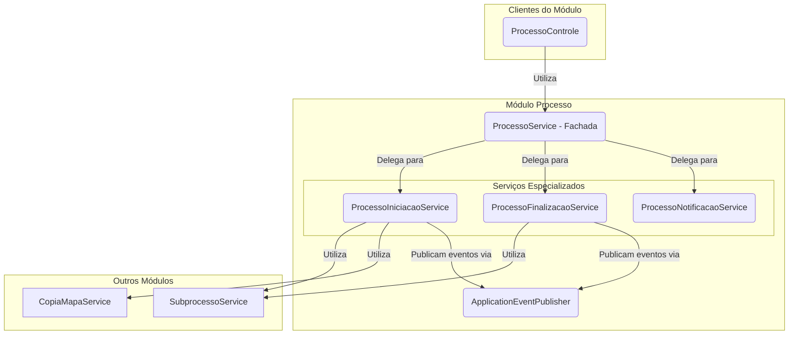

# Módulo de Processo

## Visão Geral
O pacote `processo` é o **orquestrador central** dos fluxos de trabalho do SGC. Ele gerencia a entidade `Processo`, que representa uma iniciativa de alto nível, como um "Mapeamento Anual de Competências".

Este módulo inicia e finaliza os fluxos de trabalho, coordena a criação de `Subprocessos` e `Mapas` e, crucialmente, **publica eventos de domínio** para comunicar-se de forma desacoplada com outros módulos, como `alerta` e `notificacao`.

## Arquitetura de Serviços (Padrão Fachada)
Assim como o módulo `mapa`, este pacote utiliza o padrão **Service Facade**. O `ProcessoService` atua como o ponto de entrada, orquestrando as operações e delegando a lógica de negócio complexa para serviços mais especializados.

## Componentes Principais

### Camada de Fachada
- **`ProcessoService`**: O ponto de entrada principal do módulo. Ele orquestra os outros serviços para executar as ações de alto nível, como `iniciarProcesso` ou `finalizarProcesso`.

### Serviços Especializados
- **`ProcessoIniciacaoService`**: Contém toda a lógica para iniciar um novo processo. Suas responsabilidades incluem:
  - Criar os `Subprocessos` para cada unidade participante.
  - Invocar o `CopiaMapaService` para clonar o mapa vigente (em caso de "Revisão").
  - Publicar o `ProcessoIniciadoEvento`.
- **`ProcessoFinalizacaoService`**: Contém a lógica para finalizar um processo.
- **`ProcessoNotificacaoService`**: Centraliza a lógica para enviar notificações específicas do processo.

### Outros Componentes
- **`ProcessoControle`**: Expõe a API REST para o frontend, delegando as chamadas para o `ProcessoService`.
- **`eventos/`**: Define os eventos de domínio (`ProcessoIniciadoEvento`, etc.) que são publicados para desacoplar a comunicação com outros módulos.
- **`modelo/`**: Contém as entidades JPA, como `Processo` e `UnidadeProcesso` (um "snapshot" histórico da unidade no momento do processo).
- **`ProcessoSeguranca`**: Centraliza as regras de verificação de permissões.

## Fluxo de Iniciação de um Processo
1.  O `ProcessoControle` recebe a requisição para iniciar um processo.
2.  Ele chama o `ProcessoService.iniciarProcesso(...)`.
3.  O `ProcessoService` delega a chamada para o `ProcessoIniciacaoService`.
4.  O `ProcessoIniciacaoService`, dentro de uma transação, executa toda a lógica de criação de subprocessos e mapas.
5.  Ao final, ele publica um `ProcessoIniciadoEvento` usando o `ApplicationEventPublisher`.
6.  Os módulos `alerta` e `notificacao` recebem o evento e executam suas ações (criar alerta, enviar e-mail) de forma independente.

A arquitetura orientada a eventos e o padrão de fachada garantem que este módulo, apesar de sua importância central, permaneça coeso, testável e desacoplado do resto do sistema.