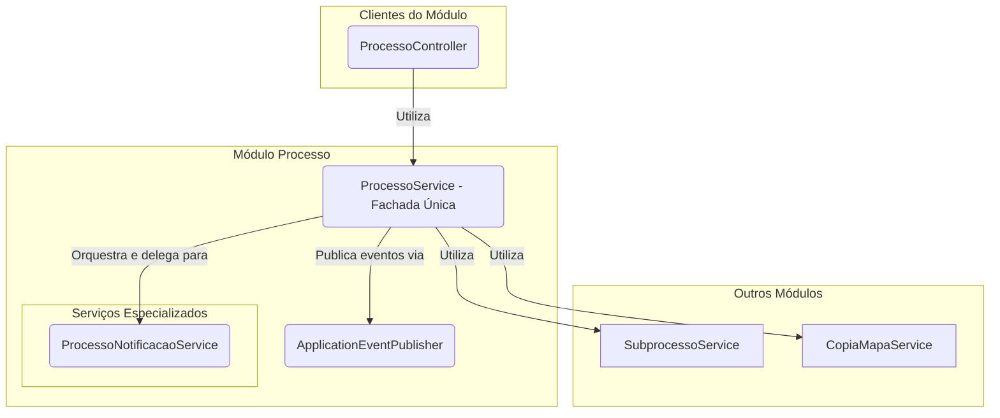

# Módulo de Processo

Última atualização: 2025-12-14

## Visão Geral

O pacote `processo` é o **orquestrador central** dos fluxos de trabalho do SGC. Ele gerencia a entidade `Processo`, que
representa uma iniciativa de alto nível, como um "Mapeamento Anual de Competências" ou "Revisão de Mapas".

Este módulo inicia e finaliza os fluxos de trabalho, coordena a criação de `Subprocessos` para cada unidade participante
e **publica eventos de domínio** para comunicar-se de forma desacoplada com outros módulos, como `alerta` e
`notificacao`.

## Arquitetura de Serviços (Padrão Fachada)

O módulo adota o padrão **Service Facade**, onde o `ProcessoService` serve como o ponto de entrada único para todas as
operações principais.

## Componentes Principais

### Controladores e Serviços

- **`ProcessoService`**: Atua como a fachada única para o módulo. Responsabilidades:
    - CRUD de Processos.
    - Iniciar processos (criando subprocessos e mapas).
    - Finalizar processos (homologando mapas vigentes).
    - Publicar eventos de domínio (`EventoProcessoIniciado`, `EventoProcessoFinalizado`).
- **`ProcessoController`**: Expõe a API REST.
    - `GET /api/processos/ativos`: Lista processos em andamento.
    - `GET /api/processos/{id}/detalhes`: Visão completa do processo e seus subprocessos.
    - `POST /api/processos/{id}/iniciar`: Dispara o início do processo (CDU-03).
    - `POST /api/processos/{id}/finalizar`: Encerra o processo (CDU-21).
- **`ProcessoNotificacaoService`**: Centraliza a lógica para enviar notificações específicas do processo, mantendo a
  fachada mais limpa.

### Modelo de Dados (`model`)

- **`Processo`**: Entidade principal. Contém título, datas, tipo (`MAPEAMENTO`, `REVISAO`, `DIAGNOSTICO`) e situação.
- **`TipoProcesso` / `SituacaoProcesso`**: Enums de domínio.

### Eventos de Domínio (`eventos`)

- **`EventoProcessoIniciado`**: Publicado quando um processo começa.
- **`EventoProcessoFinalizado`**: Publicado quando um processo termina.
- **`EventoRevisaoSubprocessoDisponibilizada`**: Publicado quando uma revisão é liberada.

## Fluxo de Iniciação de um Processo

1. O `ProcessoController` recebe a requisição `POST /iniciar`.
2. O `ProcessoService` inicia uma transação.
3. Para cada unidade participante, o serviço cria um `Subprocesso`.
4. Se for um processo de **REVISAO**, o `CopiaMapaService` (do módulo `mapa`) é invocado para duplicar o mapa vigente da
   unidade.
5. Ao final, um `EventoProcessoIniciado` é publicado, disparando alertas e e-mails através dos listeners no pacote
   `notificacao`.

## Detalhamento técnico (gerado em 2025-12-14)

Resumo detalhado dos artefatos, comandos e observações técnicas gerado automaticamente.
