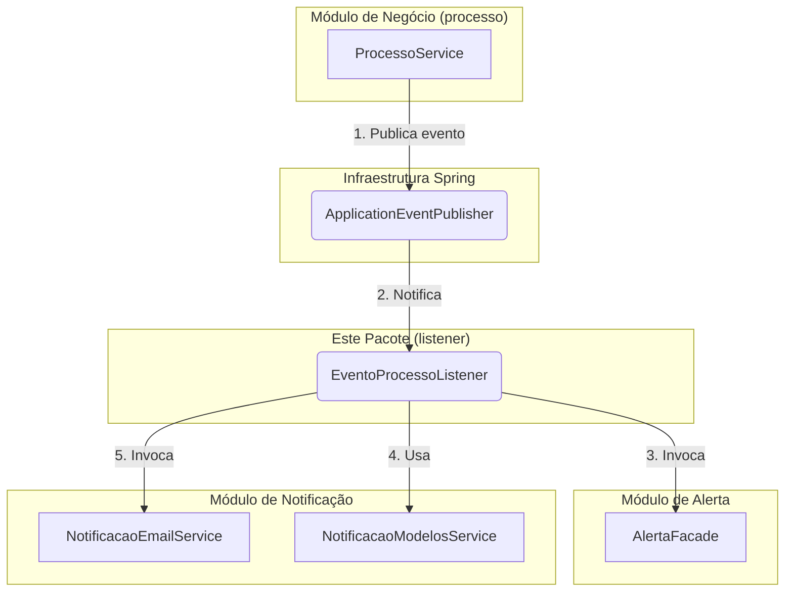

# Listeners de Eventos de Processo

## Visão Geral

Este pacote contém os listeners que reagem a eventos de domínio publicados pelo módulo de processo.
Os listeners são responsáveis por orquestrar ações assíncronas como criação de alertas e envio de notificações.

## Componentes

### `EventoProcessoListener`

Listener assíncrono principal que processa eventos de processo iniciado e finalizado.

**Eventos processados:**

- `EventoProcessoIniciado` - Quando um novo processo de mapeamento ou revisão é iniciado
- `EventoProcessoFinalizado` - Quando um processo é concluído

**Responsabilidades:**

1. Criação de alertas diferenciados por tipo de unidade
2. Envio de e-mails para titulares e substitutos das unidades participantes
3. Tratamento diferenciado para unidades operacionais, interoperacionais e intermediárias

## Arquitetura



### Fluxo de Trabalho

1. **Ação de Negócio:** O `ProcessoService` executa uma ação (ex: inicia um processo).
2. **Publicação do Evento:** Ele publica um evento de domínio (ex: `EventoProcessoIniciado`).
3. **Captura do Evento:** O `EventoProcessoListener` captura este evento.
4. **Criação de Alertas:** O listener invoca o `AlertaFacade` para criar os alertas internos.
5. **Criação do E-mail:** O listener usa o `NotificacaoModelosService` para gerar o conteúdo HTML.
6. **Envio do E-mail:** O listener invoca o `NotificacaoEmailService` para enviar o e-mail.

## Características Técnicas

- **Assíncrono (`@Async`):** Executado em thread separada para não bloquear a transação principal
- **Transacional (`@Transactional`):** Garante consistência nas operações de banco
- **Tratamento de Erros:** Exceções são capturadas e logadas sem interromper o fluxo

## Pré-requisitos

As invariantes de dados organizacionais são validadas na inicialização do sistema pelo
`ValidadorDadosOrganizacionais`. O listener assume que os dados são válidos (toda unidade tem
titular, todo titular tem email, etc.).

## Como Testar

```bash
./gradlew test --tests "sgc.processo.listener.*"
```

## Referências

- [ADR-002: Unified Events Pattern](/docs/adr/ADR-002-unified-events.md)
- [Pacote de Eventos](/backend/src/main/java/sgc/processo/eventos/)
- [Módulo de Notificação](/backend/src/main/java/sgc/notificacao/)
