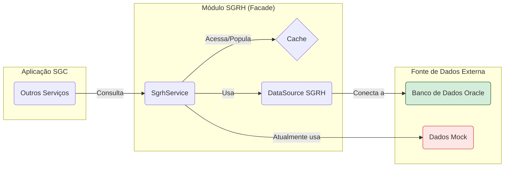

# Módulo de Integração com SGRH

## Visão Geral
Este pacote implementa a camada de integração do SGC com o SGRH (Sistema de Gestão de RH) para consultar dados essenciais, como:
- Dados dos servidores (usuários)
- Estrutura organizacional (unidades e sua hierarquia)
- Responsabilidades (titulares e substitutos de unidades)
- Perfis de acesso por unidade

## Status da Implementação
✅ **Estrutura Completa Criada**: A arquitetura está pronta, incluindo entidades, repositórios, DTOs, serviço com cache e configuração para um datasource separado.

⚠️ **Dados MOCK Ativos**: Atualmente, todos os métodos do `SgrhService` retornam dados **simulados (mock)**. A estrutura está pronta para ser conectada ao banco de dados Oracle real. Marcadores `// TODO:` no código indicam onde a lógica de acesso ao banco de dados deve ser implementada.

## Estrutura de Pacotes
```
sgc/sgrh/
├── modelo/              # Entidades JPA (mapeando views Oracle) e Repositories
│   ├── VwUsuario.java
│   ├── VwUsuarioRepo.java
│   ├── VwUnidade.java
│   ├── VwUnidadeRepo.java
│   └── ...
├── dto/                 # DTOs para transferência de dados
│   ├── UsuarioDto.java
│   ├── UnidadeDto.java
│   └── ...
└── SgrhService.java     # Serviço que abstrai o acesso aos dados (atualmente com MOCK)
```

## Configuração
Para conectar ao banco de dados real, configure as seguintes variáveis no `application.yml` ou como variáveis de ambiente:
```yaml
spring:
  sgrh:
    datasource:
      url: ${SGRH_DB_URL:jdbc:oracle:thin:@//localhost:1521/SGRH}
      username: ${SGRH_DB_USERNAME:sgrh_reader}
      password: ${SGRH_DB_PASSWORD:}
```

## Como Usar
Injete o `SgrhService` em qualquer outro serviço que precise de dados de RH. O cache (`@Cacheable`) já está configurado para otimizar consultas repetidas.
```java
@Service
@RequiredArgsConstructor
public class MeuServico {
    private final SgrhService sgrhService;
    
    public void executarAcao(String tituloUsuario, Long idUnidade) {
        // Buscar usuário por título
        Optional<UsuarioDto> usuario = sgrhService.buscarUsuarioPorTitulo(tituloUsuario);
        
        // Buscar responsável da unidade
        Optional<ResponsavelDto> responsavel = sgrhService.buscarResponsavelUnidade(idUnidade);
        
        // Construir a árvore hierárquica de unidades
        List<UnidadeDto> arvoreUnidades = sgrhService.construirArvoreHierarquica();
    }
}
```

## Migração de MOCK para Real
1.  **Configurar Conexão Oracle**: Forneça as credenciais do banco de dados SGRH (URL, usuário, senha).
2.  **Verificar Views no Oracle**: Confirme que as views mapeadas pelas entidades no pacote `modelo` existem no schema do SGRH (ex: `SGRH.VW_USUARIO`).
3.  **Implementar Métodos no Serviço**: No `SgrhService.java`, substitua a lógica de mock pela chamada ao respectivo repositório.

**Exemplo de substituição:**
```java
// ANTES (MOCK):
public Optional<UsuarioDto> buscarUsuarioPorTitulo(String titulo) {
    log.warn("MOCK SGRH: Buscando usuário por título: {}", titulo);
    return Optional.of(new UsuarioDto(...)); // Dados simulados
}

// DEPOIS (REAL):
public Optional<UsuarioDto> buscarUsuarioPorTitulo(String titulo) {
    log.debug("Buscando usuário por título no SGRH: {}", titulo);
    return vwUsuarioRepo.findById(titulo) // Supondo que VwUsuarioRepo se chame vwUsuarioRepo
        .map(vwUsuario -> new UsuarioDto(...)); // Mapeamento da entidade para DTO
}
```
4.  **Testar Conexão**: Crie testes de integração (`@SpringBootTest`) para validar a conexão e o retorno de dados do banco real.

## Segurança
⚠️ **IMPORTANTE**: A integração com o SGRH deve ser **somente leitura (read-only)**.
- O usuário do banco de dados deve ter apenas permissão de `SELECT`.
- As transações no `SgrhService` devem ser marcadas como `readOnly = true`.
- Nunca permita operações de `INSERT`, `UPDATE` ou `DELETE` através deste pacote.

## Diagrama de Integração


---
**Status Atual**: ✅ Estrutura Completa | ⚠️ Usando MOCK