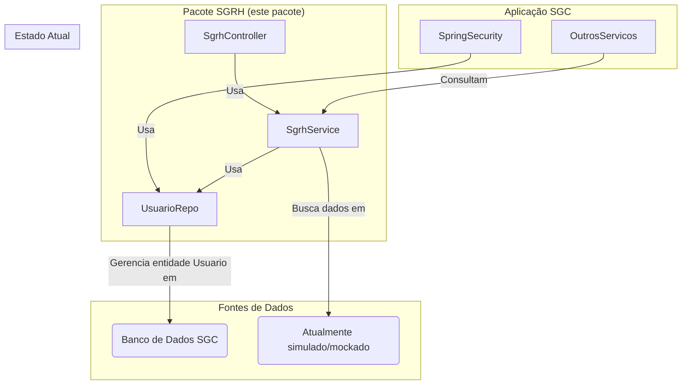

# Módulo SGRH (Sistema de Gestão de Recursos Humanos)


## Visão Geral

Este módulo tem uma **dupla responsabilidade** fundamental para o SGC:

1. **Gestão de Usuários e Autenticação:** Define e gerencia a entidade `Usuario` do próprio SGC. Esta entidade é usada
   pelo Spring Security para autenticação e para armazenar os perfis de acesso (`Perfil`) do usuário no sistema.
2. **Fachada para o Sistema de RH Externo:** Através do `SgrhService`, atua como uma camada de abstração (uma fachada)
   para buscar dados complementares de um sistema de RH externo, como a estrutura de unidades e os responsáveis por
   elas.

**Status da Integração:** A fachada (`SgrhService`) está implementada com **dados simulados (mock)**. Ela está pronta
para ser conectada a uma fonte de dados real, mas atualmente não realiza chamadas externas.

## Estrutura Spring Modulith

Este módulo segue a convenção Spring Modulith:

### API Pública
- **`SgrhService`** (raiz do módulo) - Facade unificada para autenticação e consultas de RH
- **`api/UsuarioDto`** - DTO de usuário
- **`api/PerfilDto`** - DTO de perfil de acesso
- **`api/AutenticacaoReq`**, **`api/EntrarReq`** - DTOs de requisições de login
- **`api/LoginResp`** - DTO de resposta de login

### Implementação Interna
- `internal/SgrhController` - REST endpoints (`/api/usuarios`)
- `internal/model/Usuario` - Entidade JPA (implementa `UserDetails`)
- `internal/model/Perfil` - Enum de perfis (`ADMIN`, `CHEFE`, `GESTOR`, `SERVIDOR`)
- `internal/model/UsuarioRepo` - Repositório

**⚠️ Importante:** Outros módulos **NÃO** devem acessar classes em `internal/`.

## Dependências

### Módulos que este módulo depende
- `comum` - Componentes compartilhados
- `unidade` - Estrutura organizacional

### Módulos que dependem deste módulo
- `processo` - Consulta usuários responsáveis
- `subprocesso` - Validações de perfil
- `alerta` - Consulta destinatários de alertas
- `notificacao` - Consulta dados de usuários para e-mails
- Spring Security - Autenticação e autorização

## Arquitetura Híbrida

O pacote gerencia uma entidade interna (`Usuario`) e, ao mesmo tempo, consulta um serviço externo, como ilustrado
abaixo.



## Componentes Principais

### Controladores e Serviços (`service`)

- **`SgrhService`**: Serviço unificado que gerencia autenticação/autorização de usuários e atua como fachada para o sistema de RH externo. Outros módulos do SGC utilizam este serviço para obter informações organizacionais.
- **`SgrhController`**: Expõe a API REST (`/api/usuarios`) para autenticação, autorização e finalização de login.

### Modelo de Dados (`model`)

- **`Usuario`**: Entidade JPA que representa o usuário do SGC. Implementa a interface `UserDetails` do Spring Security.
- **`Perfil`**: Enum que define os perfis de acesso (`ADMIN`, `CHEFE`, `GESTOR`, `SERVIDOR`).
- **`UsuarioRepo`**: Repositório para persistência de usuários.

### DTOs (`dto`)

- **`AutenticacaoReq`**, **`EntrarReq`**: Requisições de login.
- **`LoginResp`**: Resposta de login contendo token (simulado).

## Propósito e Uso

- **Para autenticação e autorização**, o Spring Security interage com o `UsuarioRepo` para carregar os dados do usuário.
- **Para obter dados de RH (unidades, responsáveis, etc.)**, outros serviços devem injetar e utilizar o `SgrhService`.


## Como Testar

Para executar apenas os testes deste módulo:
```bash
./gradlew :backend:test --tests "sgc.sgrh.*"
```
