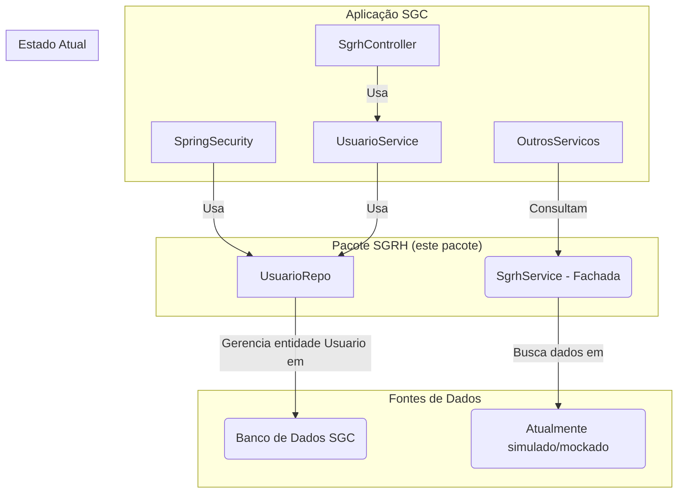

# Pacote SGRH e Usuário

Última atualização: 2025-12-14

## Visão Geral

Este pacote tem uma **dupla responsabilidade** fundamental para o SGC:

1. **Gestão de Usuários e Autenticação:** Define e gerencia a entidade `Usuario` do próprio SGC. Esta entidade é usada
   pelo Spring Security para autenticação e para armazenar os perfis de acesso (`Perfil`) do usuário no sistema.
2. **Fachada para o Sistema de RH Externo:** Através do `SgrhService`, atua como uma camada de abstração (uma fachada)
   para buscar dados complementares de um sistema de RH externo, como a estrutura de unidades e os responsáveis por
   elas.

**Status da Integração:** A fachada (`SgrhService`) está implementada com **dados simulados (mock)**. Ela está pronta
para ser conectada a uma fonte de dados real, mas atualmente não realiza chamadas externas.

## Arquitetura Híbrida

O pacote gerencia uma entidade interna (`Usuario`) e, ao mesmo tempo, consulta um serviço externo, como ilustrado
abaixo.

## Componentes Principais

### Controladores e Serviços (`service`)

- **`UsuarioService`**: Camada de serviço para lógica interna de usuários, como o fluxo de login/autenticação.
- **`SgrhService`**: O serviço que atua como fachada/cliente do sistema de RH externo. Outros módulos do SGC (como
  `alerta` ou `processo`) utilizam este serviço para obter informações organizacionais.
- **`SgrhController`**: Expõe a API REST (`/api/usuarios`) para autenticação, autorização e finalização de login.

### Modelo de Dados (`model`)

- **`Usuario`**: Entidade JPA que representa o usuário do SGC. Implementa a interface `UserDetails` do Spring Security.
- **`Perfil`**: Enum que define os perfis de acesso (`ADMIN`, `CHEFE`, `GESTOR`, `SERVIDOR`).
- **`UsuarioRepo`**: Repositório para persistência de usuários.

### DTOs (`dto`)

- **`AutenticacaoReq`**, **`EntrarReq`**: Requisições de login.
- **`LoginResp`**: Resposta de login contendo token (simulado).

## Propósito e Uso

- **Para autenticação e autorização**, o Spring Security interage com o `UsuarioRepo` para carregar os dados do usuário.
- **Para obter dados de RH (unidades, responsáveis, etc.)**, outros serviços devem injetar e utilizar o `SgrhService`.

## Detalhamento técnico (gerado em 2025-12-14)

Resumo detalhado dos artefatos, comandos e observações técnicas gerado automaticamente.
