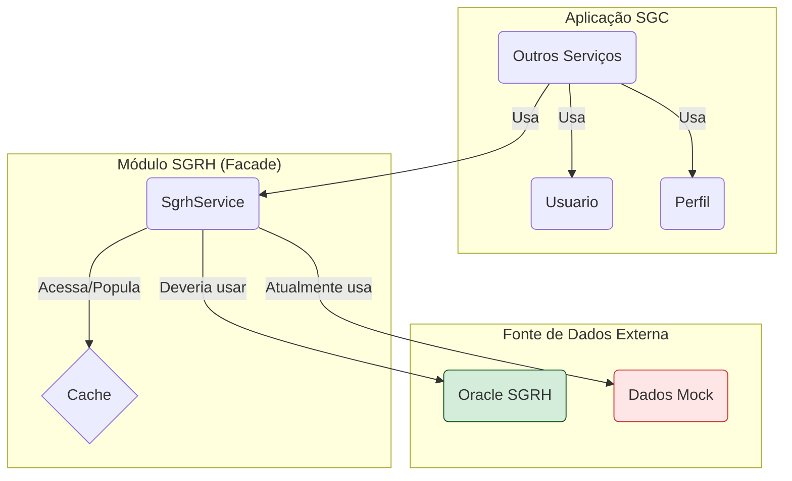

# Módulo de Usuário e Integração SGRH - SGC

## Visão Geral
Este pacote tem uma dupla responsabilidade:
1.  **Modelo de Usuário SGC**: Define as entidades `Usuario` e `Perfil` da própria aplicação SGC.
2.  **Integração com SGRH**: Atua como uma camada de integração (facade) com o sistema de RH (SGRH) para consultar dados de servidores, unidades e suas hierarquias.

Atualmente, a integração com o SGRH utiliza **dados simulados (mock)**, mas a estrutura está pronta para ser conectada a um banco de dados Oracle real.

## Arquitetura e Componentes

- **`Usuario.java` / `UsuarioRepo.java`**: A entidade `Usuario` principal do SGC e seu repositório.
- **`Perfil.java`**: Entidade que representa um perfil de acesso no SGC.
- **`SgrhService.java`**: O serviço que abstrai o acesso aos dados do SGRH. Atualmente, retorna dados mockados e utiliza cache (`@Cacheable`) para otimizar consultas.
- **`dto/`**: Contém DTOs para a transferência de dados, como `UsuarioDto`, `UnidadeDto`, `ResponsavelDto` e `PerfilDto`.
- **`modelo/`**: Contém as entidades JPA que mapeiam as *views* do banco de dados Oracle do SGRH, e seus respectivos repositórios.
  - **Entidades Notáveis**: `VwUsuario`, `VwUnidade`, `VwResponsabilidade`, `VwUsuarioPerfilUnidade`.
  - **Repositórios Notáveis**: `VwUsuarioRepo`, `VwUnidadeRepo`, etc.

## Diagrama de Integração

## Migração de Mock para Real
1.  **Configurar Conexão Oracle**: Preencha as credenciais do banco de dados SGRH no `application.properties`.
2.  **Verificar Views**: Confirme que as views mapeadas em `modelo/` existem no schema do SGRH.
3.  **Implementar Serviços**: No `SgrhService.java`, substitua a lógica de mock pelas chamadas aos repositórios (`Vw*Repo`).
4.  **Testar**: Crie testes de integração para validar a conexão real.

## Segurança
A integração com o SGRH deve ser **somente leitura**. O usuário do banco de dados deve ter apenas permissão de `SELECT`, e as transações no `SgrhService` devem ser marcadas como `readOnly = true`.