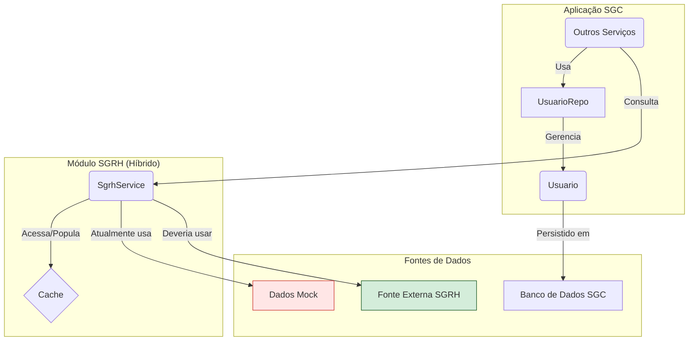

# Módulo de Integração SGRH e Modelo de Usuário

## Visão Geral
Este pacote possui uma **responsabilidade dupla** e é fundamental para o funcionamento do SGC:

1.  **Modelo de Domínio Interno**: Define as entidades principais de segurança e usuário da aplicação, como `Usuario` e `Perfil`, que são persistidas no banco de dados do próprio SGC.
2.  **Fachada de Integração (Facade)**: Atua como uma camada de abstração para consultar dados de um sistema de RH externo (SGRH). Estes dados (como a estrutura organizacional e os responsáveis por unidades) são complementares e não são armazenados diretamente no SGC.

## Status da Implementação
- ✅ **Modelo de Domínio Interno**: O modelo de `Usuario` e `Perfil` está completo e funcional.
- ⚠️ **Fachada com Dados MOCK**: O `SgrhService` está totalmente implementado com **dados simulados (mock)**. Ele está pronto para ser conectado a uma fonte de dados real (como um banco de dados Oracle), mas atualmente não realiza chamadas externas. Marcadores `// TODO:` no código indicam onde a lógica de acesso real deve ser implementada.

## Estrutura de Pacotes
```
sgc/sgrh/
├── modelo/              # Contém DTOs para a comunicação com a fachada
│   ├── dto/
├── Usuario.java         # A entidade JPA principal para usuários no SGC
├── Perfil.java          # A entidade para perfis de acesso
├── UsuarioRepo.java     # Repositório para a entidade Usuario
└── SgrhService.java     # Serviço que atua como fachada (atualmente com MOCK)
```

## Configuração para Conexão Real
Para conectar o `SgrhService` a uma fonte de dados real (ex: Oracle), configure as variáveis no `application.yml`:
```yaml
spring:
  sgrh:
    datasource:
      url: ${SGRH_DB_URL:jdbc:oracle:thin:@//localhost:1521/SGRH}
      username: ${SGRH_DB_USERNAME:sgrh_reader}
      password: ${SGRH_DB_PASSWORD:}
```

## Como Usar
- **Para autenticação e autorização**, o Spring Security interage com `Usuario` e `UsuarioRepo`.
- **Para obter dados de RH (unidades, responsáveis)**, outros serviços devem injetar e usar o `SgrhService`.

```java
@Service
@RequiredArgsConstructor
public class MeuServico {
    private final SgrhService sgrhService;
    private final UsuarioRepo usuarioRepo;
    
    public void executarAcao(String tituloUsuario, Long idUnidade) {
        // Obter o usuário interno do SGC
        Optional<Usuario> usuarioInterno = usuarioRepo.findByTitulo(tituloUsuario);

        // Obter dados externos (atualmente mockados) do SGRH
        Optional<ResponsavelDto> responsavel = sgrhService.buscarResponsavelUnidade(idUnidade);
    }
}
```

## Migração de MOCK para Real no `SgrhService`
1.  **Configurar Conexão**: Forneça as credenciais da fonte de dados externa.
2.  **Implementar Métodos no Serviço**: No `SgrhService.java`, substitua a lógica de mock pelas chamadas reais (ex: usando `JdbcTemplate`, um cliente REST, ou repositórios que mapeiem views externas).

## Diagrama de Arquitetura


---
**Status Atual**: ✅ Modelo Interno OK | ⚠️ Fachada Externa com MOCK