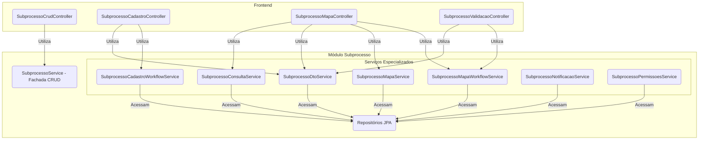

# Módulo de Subprocesso


## Visão Geral

Este módulo é o **motor do workflow** do SGC. Ele gerencia a entidade `Subprocesso`, que representa a tarefa de uma
única unidade organizacional dentro de um `Processo` maior. Ele funciona como uma **máquina de estados**, controlando o
ciclo de vida de cada tarefa, desde sua criação até a homologação.

A principal responsabilidade deste módulo é garantir que as transições de estado (`situacao`) sigam as regras de negócio
e que cada ação seja registrada em uma trilha de auditoria imutável (`Movimentacao`).

Para melhor organização e desacoplamento, o `SubprocessoController` original foi dividido em múltiplos controladores
especializados.

## Estrutura Spring Modulith

Este módulo segue a convenção Spring Modulith:

### API Pública
- **`SubprocessoService`** (raiz do módulo) - Facade para operações de CRUD
- **`api/SubprocessoDto`** - DTO principal de subprocesso
- **`api/SubprocessoDetalheDto`** - DTO detalhado com movimentações
- **`api/SubprocessoMapaDto`** - DTO de mapa no contexto do subprocesso

### Implementação Interna
- Controllers especializados:
  - `internal/SubprocessoCrudController` - Operações CRUD
  - `internal/SubprocessoCadastroController` - Workflow etapa de cadastro
  - `internal/SubprocessoMapaController` - Operações relacionadas ao mapa
  - `internal/SubprocessoValidacaoController` - Workflow etapa de validação
- Serviços especializados:
  - `internal/service/SubprocessoCadastroWorkflowService` - Lógica de cadastro
  - `internal/service/SubprocessoMapaWorkflowService` - Lógica de mapa
  - `internal/service/SubprocessoConsultaService` - Consultas complexas
  - `internal/service/SubprocessoDtoService` - Construção de DTOs
  - `internal/service/SubprocessoMapaService` - Operações de mapa
  - `internal/service/SubprocessoNotificacaoService` - Notificações
  - `internal/service/SubprocessoPermissoesService` - Validação de permissões
- `internal/listeners/MovimentacaoListener` - Listener **síncrono** para auditoria crítica
- `internal/model/Subprocesso`, `Movimentacao` - Entidades JPA
- `internal/model/SubprocessoRepo`, `MovimentacaoRepo` - Repositórios
- `internal/model/SituacaoSubprocesso` - Enum de estados

**⚠️ Importante:** Outros módulos **NÃO** devem acessar classes em `internal/`.

## Dependências

### Módulos que este módulo depende
- `processo::api.eventos` - Consome eventos de processo (dependência granular)
- `mapa` - Gerencia mapas de competências
- `analise` - Registra análises de revisão
- `unidade` - Estrutura organizacional
- `sgrh` - Informações de usuários
- `comum` - Componentes compartilhados

### Módulos que dependem deste módulo
- `processo` - Cria e gerencia subprocessos
- `notificacao` - Acessa dados de subprocessos
- `painel` - Dashboard com dados de subprocessos

## Listener Síncrono (MovimentacaoListener)

**Decisão Arquitetural**: O `MovimentacaoListener` permanece **síncrono** (usa `@EventListener` em vez de `@ApplicationModuleListener`) porque:
- Registra auditoria crítica de transições de estado
- Deve executar na mesma transação (`Propagation.MANDATORY`)
- Falhas não devem ser silenciosas (devem quebrar a transação principal)

## Arquitetura de Serviços

A complexidade do workflow é gerenciada através de uma arquitetura de serviços coesa e granular. O `SubprocessoService`
atua como uma fachada apenas para operações de CRUD básicas, enquanto os controladores de workflow interagem diretamente
com serviços especializados para cada domínio de ação.



## Componentes Principais

### Controladores REST

- **`SubprocessoCrudController`**:
    - `GET /api/subprocessos/{id}`: Detalhes do subprocesso.
    - `GET /api/subprocessos`: Listagem geral.

- **`SubprocessoCadastroController`**: Lida com o workflow da etapa de cadastro.
    - `POST /disponibilizar-cadastro`
    - `POST /devolver-cadastro`
    - `POST /aceitar-cadastro`

- **`SubprocessoValidacaoController`**: Lida com o workflow da etapa de validação.
    - `POST /devolver-mapa`
    - `POST /validar-mapa`
    - `POST /homologar-mapa`

- **`SubprocessoMapaController`**: Gerencia o mapa de competências dentro do contexto do subprocesso.
    - `GET /mapa-completo` e `GET /mapa-visualizacao`: Visualização do mapa.
    - `POST /mapa-completo/atualizar`: Salva o mapa inteiro de uma vez.
    - `GET /impactos-mapa`: Analisa diferenças entre versões.
    - **CRUD de Competências (Exceção ao padrão POST):**
        - `POST .../competencias`: Cria competência.
        - `PUT .../competencias/{id}`: Atualiza competência.
        - `DELETE .../competencias/{id}`: Remove competência.

### Serviços Especializados

- **`SubprocessoCadastroWorkflowService`**: Gerencia a fase de cadastro de atividades e conhecimentos, incluindo
  disponibilização, devolução, aceite e homologação do cadastro.
- **`SubprocessoMapaWorkflowService`**: Gerencia a fase de elaboração e validação do mapa de competências. Responsável
  pela disponibilização, validação, sugestões, aceite e homologação final do mapa.
- **`SubprocessoConsultaService`**: Centraliza as consultas complexas (ex: buscar subprocesso com mapa carregado).
- **`SubprocessoPermissoesService`**: Centraliza a lógica de segurança e verificação de permissões.

## Diagrama da Máquina de Estados (`SituacaoSubprocesso`)

```mermaid
stateDiagram-v2
    direction LR

    [*] --> PENDENTE_CADASTRO: Processo iniciado

    state "Fluxo de Cadastro" {
        PENDENTE_CADASTRO --> CADASTRO_DISPONIBILIZADO: disponibilizarCadastro()
        CADASTRO_DISPONIBILIZADO --> PENDENTE_AJUSTES_CADASTRO: devolverCadastro()
        PENDENTE_AJUSTES_CADASTRO --> CADASTRO_DISPONIBILIZADO: disponibilizarCadastro()
        CADASTRO_DISPONIBILIZADO --> REVISAO_CADASTRO_HOMOLOGADA: aceitarCadastro()
    }

    state "Fluxo de Ajuste/Revisão" {
         REVISAO_CADASTRO_HOMOLOGADA --> MAPA_AJUSTADO: submeterMapaAjustado()
         MAPA_AJUSTADO --> PENDENTE_AJUSTES_MAPA: devolverMapa()
         PENDENTE_AJUSTES_MAPA --> MAPA_AJUSTADO: submeterMapaAjustado()
         MAPA_AJUSTADO --> MAPA_VALIDADO: validarMapa()
    }

    MAPA_VALIDADO --> MAPA_HOMOLOGADO: homologarMapa()
    MAPA_HOMOLOGADO --> [*]: Processo finalizado
```

## Trilha de Auditoria (`Movimentacao`)

Para cada transição de estado, uma nova entidade `Movimentacao` é persistida, garantindo um histórico completo de quem
fez o quê e quando.


## Como Testar

Para executar apenas os testes deste módulo:
```bash
./gradlew :backend:test --tests "sgc.subprocesso.*"
```