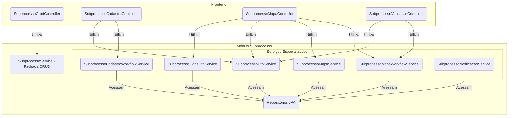
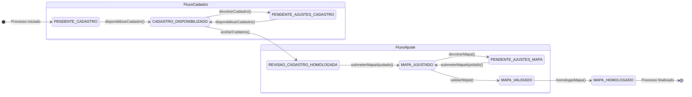

# Módulo de Subprocesso

## Visão Geral

Este pacote é o **motor do workflow** do SGC. Ele gerencia a entidade `Subprocesso`, que representa a tarefa de uma
única unidade organizacional dentro de um `Processo` maior. Ele funciona como uma **máquina de estados**, controlando o
ciclo de vida de cada tarefa, desde sua criação até a homologação.

A principal responsabilidade deste módulo é garantir que as transições de estado (`situacao`) sigam as regras de negócio
e que cada ação seja registrada em uma trilha de auditoria imutável (`Movimentacao`).

Para melhor organização e desacoplamento, a camada de controle foi dividida em múltiplos controladores especializados.

## Arquitetura de Serviços

A complexidade do workflow é gerenciada através de uma arquitetura de serviços coesa e granular. O `SubprocessoService`
atua como uma fachada apenas para operações de CRUD básicas, enquanto os controladores de workflow interagem diretamente
com serviços especializados para cada domínio de ação.



## Componentes Principais

### Controladores REST

- **`SubprocessoCrudControle`**:
    - `GET /api/subprocessos/{id}`: Detalhes do subprocesso.
    - `GET /api/subprocessos`: Listagem geral.

- **`SubprocessoCadastroControle`**: Lida com o workflow da etapa de cadastro.
    - `POST /disponibilizar-cadastro`
    - `POST /devolver-cadastro`
    - `POST /aceitar-cadastro`

- **`SubprocessoValidacaoControle`**: Lida com o workflow da etapa de validação.
    - `POST /devolver-mapa`
    - `POST /validar-mapa`
    - `POST /homologar-mapa`

- **`SubprocessoMapaControle`**: Gerencia o mapa de competências dentro do contexto do subprocesso.
    - `GET /mapa-completo` e `GET /mapa-visualizacao`: Visualização do mapa.
    - `POST /mapa-completo/atualizar`: Salva o mapa inteiro de uma vez.
    - `GET /impactos-mapa`: Analisa diferenças entre versões.
    - **CRUD de Competências (Exceção ao padrão POST):**
        - `POST .../competencias`: Cria competência.
        - `PUT .../competencias/{id}`: Atualiza competência.
        - `DELETE .../competencias/{id}`: Remove competência.

### Serviços Especializados

- **`SubprocessoCadastroWorkflowService`**: Gerencia a fase de cadastro de atividades e conhecimentos, incluindo
  disponibilização, devolução, aceite e homologação do cadastro.
- **`SubprocessoMapaWorkflowService`**: Gerencia a fase de elaboração e validação do mapa de competências. Responsável
  pela disponibilização, validação, sugestões, aceite e homologação final do mapa.
- **`SubprocessoConsultaService`**: Centraliza as consultas complexas (ex: buscar subprocesso com mapa carregado).

## Diagrama da Máquina de Estados (`SituacaoSubprocesso`)



## Trilha de Auditoria (`Movimentacao`)

Para cada transição de estado, uma nova entidade `Movimentacao` é persistida, garantindo um histórico completo de quem
fez o quê e quando.

## Como Testar

Para executar apenas os testes deste módulo (a partir do diretório `backend`):

```bash
./gradlew test --tests "sgc.subprocesso.*"
```
