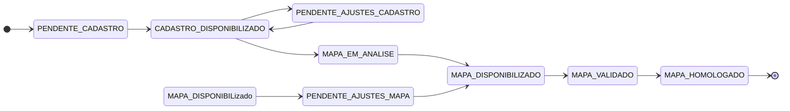

# Módulo de Subprocesso - SGC

## Visão Geral
O pacote `subprocesso` é o motor do workflow do SGC, gerenciando a jornada detalhada de cada unidade organizacional dentro de um `Processo`. Cada `Subprocesso` representa a tarefa de uma única unidade, e este pacote gerencia seu estado, transições e histórico.

## Arquitetura e Componentes

- **`SubprocessoControle.java`**: Controller REST que expõe os endpoints para o frontend interagir com o workflow.
- **`SubprocessoService.java`**: O coração do pacote, funcionando como uma **state machine**. Contém a lógica de negócio para cada ação no ciclo de vida de um subprocesso.
- **`dto/`**: Contém DTOs de requisição específicos para cada ação (`DevolverCadastroReq`, `HomologarCadastroReq`, etc.), DTOs de resposta (`SubprocessoDetalheDto`, `MovimentacaoDto`), e mappers (`SubprocessoMapper`, `MovimentacaoMapper`).
- **`modelo/`**:
  - **`Subprocesso.java`**: A entidade central, vinculada a `Processo`, `Unidade` e `Mapa`. Seu campo `situacao` (do enum `SituacaoSubprocesso` em `comum.enums`) gerencia o estado do workflow.
  - **`Movimentacao.java`**: Entidade de log que cria uma trilha de auditoria para cada ação realizada.
  - **`SubprocessoRepo.java` / `MovimentacaoRepo.java`**: Repositórios para as entidades.
  - **`ErroSubprocesso.java`**: Classe de exceção específica do módulo.

## Diagrama de State Machine

## Fluxo de Devolução de Cadastro
1.  **Requisição**: O usuário envia um `POST` para `/api/subprocessos/{id}/devolver-cadastro` com um `DevolverCadastroReq` DTO.
2.  **Controller**: `SubprocessoControle` chama `subprocessoService.devolverCadastro()`.
3.  **Serviço**: Em uma transação, o serviço valida o estado, atualiza a `situacao` do `Subprocesso`, cria uma `Movimentacao` para auditoria, grava uma `Analise` com a justificativa e dispara notificações/alertas.
4.  **Resposta**: O controller retorna uma resposta de sucesso. A transação é revertida em caso de falha.

## Notas Importantes
- **Motor do Negócio**: Este pacote contém a representação mais fiel das regras de negócio do sistema.
- **Trilha de Auditoria Imutável**: A `Movimentacao` garante uma trilha de auditoria completa e imutável.
- **DTOs Específicos**: O uso de DTOs de requisição específicos para cada ação cria um contrato de API claro e robusto.