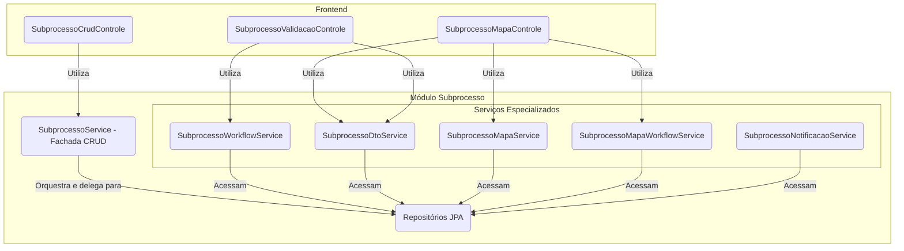

# Módulo de Subprocesso

## Visão Geral
Este pacote é o **motor do workflow** do SGC. Ele gerencia a entidade `Subprocesso`, que representa a tarefa de uma única unidade organizacional dentro de um `Processo` maior. Ele funciona como uma **máquina de estados**, controlando o ciclo de vida de cada tarefa, desde sua criação até a homologação.

A principal responsabilidade deste módulo é garantir que as transições de estado (`situacao`) sigam as regras de negócio e que cada ação seja registrada em uma trilha de auditoria imutável (`Movimentacao`).

Para melhor organização e desacoplamento, o `SubprocessoControle` original foi dividido em três controladores especializados: `SubprocessoCrudControle`, `SubprocessoMapaControle` e `SubprocessoValidacaoControle`. Além disso, um novo serviço, `SubprocessoMapaWorkflowService`, foi introduzido para gerenciar a lógica de salvamento do mapa no contexto do workflow.

## Arquitetura de Serviços (Padrão Fachada)
A complexidade do workflow é gerenciada através de uma arquitetura de serviços coesa, usando o padrão **Service Facade**. O `SubprocessoService` atua como o ponto de entrada para operações de CRUD, enquanto os novos controladores delegam a lógica para serviços mais especializados.

## Componentes Principais

### Controladores REST
- **`SubprocessoCrudControle`**: Gerencia as operações básicas de CRUD (criar, ler, atualizar, excluir) para a entidade `Subprocesso`.
- **`SubprocessoMapaControle`**: Expõe endpoints relacionados à gestão do mapa de competências dentro de um subprocesso, incluindo visualização, salvamento e verificação de impactos.
- **`SubprocessoValidacaoControle`**: Lida com as ações de workflow e validação do subprocesso, como disponibilizar o mapa, apresentar sugestões, validar, devolver e homologar.

### Camada de Fachada
- **`SubprocessoService`**: Atua como o ponto de entrada para as operações de CRUD do subprocesso, delegando para os repositórios.

### Serviços Especializados
- **`SubprocessoWorkflowService`**: O coração da máquina de estados. Contém a lógica para todas as transições de estado, validando a situação atual, atualizando-a e criando o registro de `Movimentacao`.
- **`SubprocessoDtoService`**: Responsável por construir os DTOs de visualização complexos (ex: `SubprocessoCadastroDto`), que agregam dados de múltiplas fontes.
- **`SubprocessoMapaService`**: Contém a lógica de negócio relacionada à interação entre o subprocesso e o mapa de competências.
- **`SubprocessoMapaWorkflowService`**: Gerencia a lógica de salvamento do mapa no contexto do workflow do subprocesso, incluindo a atualização do estado do subprocesso.
- **`SubprocessoNotificacaoService`**: Gerencia o envio de notificações (e-mails, alertas) específicas para os eventos do subprocesso.
- **`modelo/`**: Contém as entidades JPA `Subprocesso` e `Movimentacao`.
- **`SituacaoSubprocesso`**: Enum que define todos os estados possíveis do workflow.

## Diagrama da Máquina de Estados
O fluxo de trabalho do subprocesso segue o diagrama de estados abaixo:

```mermaid
stateDiagram-v2
    direction LR

    [*] --> PENDENTE_CADASTRO: Processo iniciado

    PENDENTE_CADASTRO --> CADASTRO_DISPONIBILIZADO: disponibilizarCadastro()
    CADASTRO_DISPONIBILIZADO --> PENDENTE_AJUSTES_CADASTRO: devolverCadastro()
    PENDENTE_AJUSTES_CADASTRO --> CADASTRO_DISPONIBILIZADO: disponibilizarCadastro()

    CADASTRO_DISPONIBILIZADO --> MAPA_EM_ANALISE: aceitarCadastro()
    MAPA_EM_ANALISE --> MAPA_AJUSTADO: submeterMapaAjustado()

    MAPA_AJUSTADO --> PENDENTE_AJUSTES_MAPA: devolverMapa()
    PENDENTE_AJUSTES_MAPA --> MAPA_AJUSTADO: submeterMapaAjustado()

    MAPA_AJUSTADO --> MAPA_VALIDADO: validarMapa()
    MAPA_VALIDADO --> MAPA_HOMOLOGADO: homologarMapa()
    MAPA_HOMOLOGADO --> [*]: Processo finalizado
```

## Trilha de Auditoria (`Movimentacao`)
Para cada transição de estado no diagrama acima, uma nova entidade `Movimentacao` é criada e persistida. Isso cria um histórico imutável e detalhado de todas as ações realizadas em um subprocesso, garantindo total rastreabilidade.