# Módulo de Subprocessos - SGC

## Visão Geral
O pacote `subprocesso` é o motor do fluxo de trabalho (workflow) do SGC. Enquanto o pacote `processo` gerencia a iniciativa de alto nível, o `subprocesso` gerencia a jornada detalhada que cada unidade organizacional individual percorre dentro desse processo.

Cada `Subprocesso` representa a tarefa de uma única unidade (ex: a "Zona Eleitoral 001" preenchendo seu mapa de competências). Este pacote gerencia o estado, as transições, as validações e o histórico de cada uma dessas tarefas individuais.

## Arquivos e Componentes Principais

### 1. Entidades Core (`modelo/`)
**Localização:** `backend/src/main/java/sgc/subprocesso/modelo/`
- **`Subprocesso.java`**: A entidade JPA central que representa a tarefa de uma unidade dentro de um processo.
  - **Associações:** Vinculada a `Processo` (pai), `Unidade` (executora) e `Mapa` (o artefato sendo trabalhado).
  - **Gerenciamento de Estado:** O campo `situacao`, do tipo `SituacaoSubprocesso` (enum), é a chave para o workflow, armazenando o estado atual (ex: `PENDENTE_CADASTRO`, `CADASTRO_DISPONIBILIZADO`, `MAPA_HOMOLOGADO`).
- **`Movimentacao.java`**: Uma entidade de log/auditoria. Para **cada ação** realizada em um subprocesso (disponibilizar, devolver, aprovar), um novo registro de `Movimentacao` é criado, garantindo uma trilha de auditoria completa.

### 2. Serviço de Workflow
- **`SubprocessoService.java`**: O coração do pacote, funcionando como um **mecanismo de state machine**. Ele contém a lógica de negócio para cada ação possível no ciclo de vida de um subprocesso.
- **Padrão de Ação:** Cada método de ação (ex: `devolverCadastro`, `validarMapa`, `homologarCadastro`) segue um padrão rigoroso dentro de uma transação:
  1.  **Buscar** o `Subprocesso`.
  2.  **Validar** o estado atual (garantir que a ação é permitida).
  3.  **Atualizar** o estado do `Subprocesso` (alterar o enum `situacao`).
  4.  **Criar** uma `Movimentacao` para a trilha de auditoria.
  5.  **Gravar** uma `Analise` (se aplicável) com justificativas.
  6.  **Disparar** notificações e alertas para os usuários relevantes.

### 3. DTOs e Controlador
- **`SubprocessoControle.java`**: O controlador REST que expõe os endpoints para o frontend interagir com o workflow. Cada endpoint geralmente corresponde a uma ação na interface do usuário (ex: "Devolver", "Aprovar").
- **DTOs Específicos (`dto/`)**: O pacote utiliza DTOs de requisição específicos para cada ação, como `DevolucaoRequestDto` e `DisponibilizacaoRequestDto`, criando um contrato de API claro e robusto.

## Exemplo de Fluxo: Devolução de um Cadastro
1.  **Ação do Usuário**: Um gestor clica no botão "Devolver" na tela de análise, preenchendo um motivo.
2.  **Requisição**: O frontend envia um `POST` para `/api/subprocessos/{id}/devolver-cadastro` com um DTO contendo o motivo.
3.  **Controller**: O `SubprocessoControle` recebe a requisição e chama `subprocessoService.devolverCadastro(...)`.
4.  **Serviço (em uma transação)**:
    a. O serviço carrega o `Subprocesso`.
    b. Valida se a `situacao` atual é `CADASTRO_DISPONIBILIZADO`.
    c. Altera a `situacao` para `PENDENTE_AJUSTES_CADASTRO`.
    d. Cria uma `Movimentacao` registrando a devolução.
    e. Salva o motivo da devolução em uma nova entidade `AnaliseCadastro`.
    f. Dispara eventos que resultarão em e-mails e alertas para o responsável da unidade original.
5.  **Resposta**: O controller retorna uma resposta de sucesso. Se qualquer passo falhar, a transação é revertida.

## Notas Importantes
- **Motor do Negócio**: Este pacote é o verdadeiro motor que impulsiona o fluxo de trabalho principal do SGC. A lógica aqui contida é a representação mais fiel das regras de negócio do sistema.
- **Trilha de Auditoria Imutável**: O uso da entidade `Movimentacao` para registrar cada passo garante uma trilha de auditoria completa e imutável, essencial para a transparência do processo.
- **Complexidade Gerenciada**: A complexidade do workflow é bem gerenciada através da separação de responsabilidades entre o serviço (regras de negócio), a entidade `Subprocesso` (estado) e a entidade `Movimentacao` (histórico).

## Diagrama de State Machine

```mermaid
stateDiagram-v2
    direction LR

    [*] --> PENDENTE_CADASTRO: Processo iniciado

    PENDENTE_CADASTRO --> CADASTRO_DISPONIBILIZADO: disponibilizarCadastro()
    CADASTRO_DISPONIBILIZADO --> PENDENTE_AJUSTES_CADASTRO: devolverCadastro()
    PENDENTE_AJUSTES_CADASTRO --> CADASTRO_DISPONIBILIZADO: disponibilizarCadastro()

    CADASTRO_DISPONIBILIZADO --> MAPA_EM_ANALISE: aceitarCadastro()
    MAPA_EM_ANALISE --> MAPA_DISPONIBILIZADO: disponibilizarMapa()

    MAPA_DISPONIBILIZADO --> PENDENTE_AJUSTES_MAPA: devolverMapa()
    PENDENTE_AJUSTES_MAPA --> MAPA_DISPONIBILIZADO: disponibilizarMapa()

    MAPA_DISPONIBILIZADO --> MAPA_VALIDADO: validarMapa()
    MAPA_VALIDADO --> MAPA_HOMOLOGADO: homologarMapa()
    MAPA_HOMOLOGADO --> [*]: Processo finalizado

    note "Para cada transição, uma Movimentacao é criada" as N1
```
