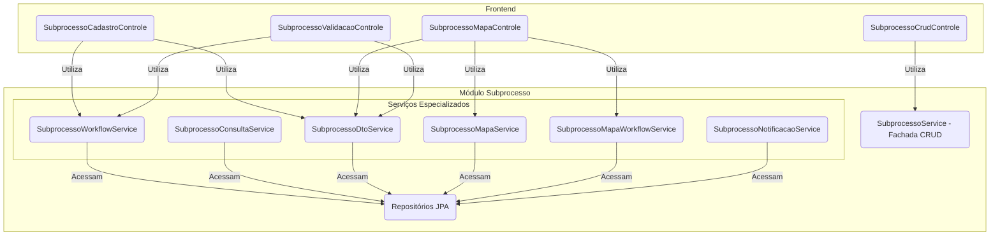

# Módulo de Subprocesso

## Visão Geral
Este pacote é o **motor do workflow** do SGC. Ele gerencia a entidade `Subprocesso`, que representa a tarefa de uma única unidade organizacional dentro de um `Processo` maior. Ele funciona como uma **máquina de estados**, controlando o ciclo de vida de cada tarefa, desde sua criação até a homologação.

A principal responsabilidade deste módulo é garantir que as transições de estado (`situacao`) sigam as regras de negócio e que cada ação seja registrada em uma trilha de auditoria imutável (`Movimentacao`).

Para melhor organização e desacoplamento, o `SubprocessoControle` original foi dividido em múltiplos controladores especializados.

## Arquitetura de Serviços
A complexidade do workflow é gerenciada através de uma arquitetura de serviços coesa e granular. O `SubprocessoService` atua como uma fachada apenas para operações de CRUD, enquanto os controladores de workflow interagem diretamente com os serviços especializados.



## Componentes Principais

### Controladores REST
- **`SubprocessoCrudControle`**: Gerencia as operações básicas de CRUD.
- **`SubprocessoCadastroControle`**: Lida com as ações de workflow da etapa de cadastro (disponibilizar, devolver, aceitar, etc.).
- **`SubprocessoMapaControle`**: Expõe endpoints relacionados à gestão do mapa de competências.
- **`SubprocessoValidacaoControle`**: Lida com as ações de workflow da etapa de validação.

### Camada de Fachada
- **`SubprocessoService`**: Atua como o ponto de entrada para as operações de CRUD.

### Serviços Especializados
- **`SubprocessoWorkflowService`**: O coração da máquina de estados. Contém a lógica para todas as transições de estado.
- **`SubprocessoConsultaService`**: Centraliza as consultas complexas e a lógica de busca de subprocessos.
- **`SubprocessoDtoService`**: Responsável por construir os DTOs de visualização complexos.
- **`SubprocessoMapaService`**: Contém a lógica de negócio relacionada à interação com o mapa.
- **`SubprocessoMapaWorkflowService`**: Gerencia a lógica de salvamento do mapa no contexto do workflow.
- **`SubprocessoNotificacaoService`**: Gerencia o envio de notificações específicas do subprocesso.
- **`modelo/`**: Contém as entidades JPA `Subprocesso` e `Movimentacao`.
- **`SituacaoSubprocesso`**: Enum que define todos os estados possíveis do workflow.

## Diagrama da Máquina de Estados
O fluxo de trabalho do subprocesso segue o diagrama de estados abaixo. Note que existem fluxos paralelos para "cadastro" e "revisão de cadastro".

```mermaid
stateDiagram-v2
    direction LR

    [*] --> PENDENTE_CADASTRO: Processo iniciado

    state "Fluxo de Cadastro Inicial" {
        PENDENTE_CADASTRO --> CADASTRO_DISPONIBILIZADO: disponibilizarCadastro()
        CADASTRO_DISPONIBILIZADO --> PENDENTE_AJUSTES_CADASTRO: devolverCadastro()
        PENDENTE_AJUSTES_CADASTRO --> CADASTRO_DISPONIBILIZADO: disponibilizarCadastro()
        CADASTRO_DISPONIBILIZADO --> REVISAO_CADASTRO_HOMOLOGADA: aceitarCadastro()
    }

    state "Fluxo de Ajuste/Revisão" {
         REVISAO_CADASTRO_HOMOLOGADA --> MAPA_AJUSTADO: submeterMapaAjustado()
         MAPA_AJUSTADO --> PENDENTE_AJUSTES_MAPA: devolverMapa()
         PENDENTE_AJUSTES_MAPA --> MAPA_AJUSTADO: submeterMapaAjustado()
         MAPA_AJUSTADO --> MAPA_VALIDADO: validarMapa()
    }

    MAPA_VALIDADO --> MAPA_HOMOLOGADO: homologarMapa()
    MAPA_HOMOLOGADO --> [*]: Processo finalizado
```

## Trilha de Auditoria (`Movimentacao`)
Para cada transição de estado no diagrama acima, uma nova entidade `Movimentacao` é criada e persistida. Isso cria um histórico imutável e detalhado de todas as ações realizadas em um subprocesso, garantindo total rastreabilidade.
