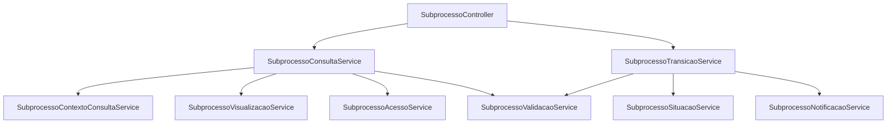

# Módulo `subprocesso`

## Papel no domínio

`sgc.subprocesso` representa a execução do processo por unidade organizacional. Se `processo` é o ciclo macro, `subprocesso` é o workflow operacional real: onde cadastro, mapa, análises, movimentações, permissões e transições acontecem.

É o módulo mais importante para a leitura do produto, porque nele convergem contexto do usuário, situação do workflow e conteúdo do mapa.

## Responsabilidades centrais

- detalhar um subprocesso para a UI;
- montar contexto de edição e cadastro;
- calcular permissões estruturadas por ação;
- controlar transições de workflow;
- validar pré-condições de cadastro e mapa;
- registrar histórico e movimentações;
- disparar notificações decorrentes das transições;
- apoiar ações em bloco e operações administrativas relacionadas.

## Estrutura do pacote

| Área | Papel |
|---|---|
| `SubprocessoController` | endpoints REST do domínio |
| `dto/` | contratos HTTP e respostas orientadas à UI |
| `model/` | entidades, enums e repositórios do módulo |
| `service/` | serviços especializados por responsabilidade |

## Serviços principais

| Serviço | Responsabilidade |
|---|---|
| `SubprocessoConsultaService` | leitura de detalhes, contexto, permissões, histórico, atividades e mapas para visualização |
| `SubprocessoService` | operações administrativas e orquestrações amplas do módulo |
| `SubprocessoTransicaoService` | aceite, devolução, homologação, disponibilização, reabertura e mudanças de status |
| `SubprocessoValidacaoService` | pré-condições e consistência do fluxo |
| `SubprocessoAcessoService` | cálculo das permissões estruturadas consumidas pela UI |
| `SubprocessoVisualizacaoService` | montagem de respostas ricas para detalhe, contexto e histórico |
| `SubprocessoContextoConsultaService` | composição do contexto-base (perfil, hierarquia, localização, mapa vigente...) |
| `SubprocessoSituacaoService` | reconciliação da situação conforme o estado do mapa |
| `SubprocessoNotificacaoService` | notificações e efeitos colaterais de transição |
| `LocalizacaoSubprocessoService` | localização atual do subprocesso |
| `AnaliseHistoricoService` | histórico analítico do workflow |
| `CadastroFluxoService` | regras do fluxo de cadastro/revisão de cadastro |

## Como o módulo se organiza


```mermaid
graph TD
    Controller[SubprocessoController]
    Consulta[SubprocessoConsultaService]
    Transicao[SubprocessoTransicaoService]
    Visualizacao[SubprocessoVisualizacaoService]
    Acesso[SubprocessoAcessoService]
    Contexto[SubprocessoContextoConsultaService]
    Validacao[SubprocessoValidacaoService]
    Situacao[SubprocessoSituacaoService]
    Notificacao[SubprocessoNotificacaoService]

    Controller --> Consulta
    Controller --> Transicao
    Consulta --> Contexto
    Consulta --> Visualizacao
    Consulta --> Acesso
    Consulta --> Validacao
    Transicao --> Validacao
    Transicao --> Situacao
    Transicao --> Notificacao
```

## Modelo mental para entender o fluxo

1. o controller recebe uma operação sobre um subprocesso;
2. a segurança valida perfil/hierarquia/localização;
3. o serviço de transição ou consulta monta o contexto adequado;
4. serviços especializados aplicam validação, visualização, status e notificações;
5. a API responde com DTOs ricos, já pensados para a necessidade da UI.

## Relação com outros domínios

- depende de `processo` para contexto macro do ciclo;
- conversa com `mapa` para ler/manter atividades, conhecimentos e sugestões;
- usa `organizacao` para hierarquia e unidade atual;
- usa `seguranca` para autorização fina;
- usa `alerta` para consequências de notificação.

## O que a UI consome daqui

O frontend depende fortemente deste módulo para:

- `SubprocessoDetalheResponse`
- contexto de edição/cadastro
- permissões estruturadas por ação
- histórico de análise
- visualização do mapa e de impactos

Isso explica por que o módulo possui serviços explícitos de contexto e visualização, em vez de retornar entidades ou estados crus.

## Regras arquiteturais importantes

- DTOs na fronteira HTTP, nunca entidades JPA;
- leitura e escrita separadas por serviços especializados;
- autorização baseada em `@PreAuthorize` + `SgcPermissionEvaluator`;
- ações de workflow expostas por endpoints `POST` com verbo explícito.

## Testes relacionados

O módulo é coberto por:

- `SubprocessoControllerTest`
- testes de integração específicos do pacote `sgc.subprocesso.service`
- vários cenários do diretório `src/test/java/sgc/integracao`, como `SubprocessoFluxoIntegrationTest`, `SubprocessoServiceContextoIntegrationTest`, `SubprocessoServiceValidacaoIntegrationTest` e CDU-13/14/20/22/23/24/25/26/32/33

Comando principal:

```bash
./gradlew :backend:test
```

## Referências

- [Backend do SGC](../../../../../../backend/README.md)
- [Regras de acesso](../../../../../../etc/reqs/acesso.md)
