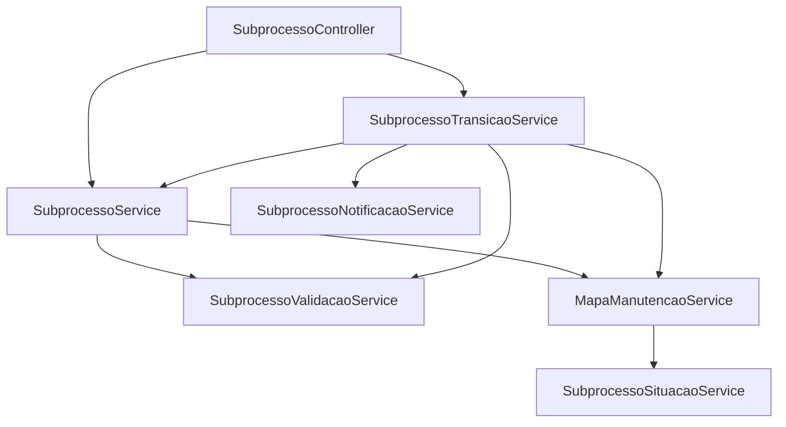

# Módulo de Subprocesso

## Visão geral

Este módulo implementa o workflow de `Subprocesso`, que representa a execução de um `Processo` por uma unidade
organizacional específica. O módulo concentra:

* transições de situação;
* trilha de auditoria por `Movimentacao`;
* validações de cadastro e mapa;
* montagem de respostas detalhadas para a API;
* permissões derivadas do contexto do usuário e da situação atual.

O desenho atual do módulo é baseado em um controller REST unificado e em serviços especializados por responsabilidade,
sem expor entidades JPA diretamente na API.

## Estrutura atual

### Controller principal

* **`SubprocessoController`**:
  concentra endpoints de consulta, cadastro, mapa, validação, ajustes, importação e ações em bloco.

### Serviços principais

* **`SubprocessoService`**:
  consultas, CRUD administrativo, montagem de contexto/detalhe, permissões de UI, operações de mapa dentro do
  contexto do subprocesso, importação de atividades e histórico.
* **`SubprocessoTransicaoService`**:
  workflow de cadastro, revisão, validação, homologação, reabertura e alteração de prazo.
* **`SubprocessoValidacaoService`**:
  validações de situação, consistência de cadastro, associação de mapa e regras para disponibilização/finalização.
* **`SubprocessoSituacaoService`**:
  reconciliação de situação com base no conteúdo do mapa.
* **`SubprocessoNotificacaoService`**:
  disparo de alertas e e-mails decorrentes das transições.

## Relação entre os serviços


```mermaid
graph TD
    Controle["SubprocessoController"]

    Subprocesso["SubprocessoService"]
    Transicao["SubprocessoTransicaoService"]
    Validacao["SubprocessoValidacaoService"]
    Situacao["SubprocessoSituacaoService"]
    Notificacao["SubprocessoNotificacaoService"]
    Mapa["MapaManutencaoService"]

    Controle --> Subprocesso
    Controle --> Transicao

    Subprocesso --> Validacao
    Subprocesso --> Mapa

    Transicao --> Subprocesso
    Transicao --> Validacao
    Transicao --> Notificacao
    Transicao --> Mapa

    Mapa --> Situacao
```

## Responsabilidades práticas

### Consultas e contexto

`SubprocessoService` é o ponto principal para:

* buscar subprocesso com fetch necessário;
* montar detalhes e contexto de edição;
* listar atividades e históricos;
* calcular permissões de interface.

### Workflow

`SubprocessoTransicaoService` é o ponto principal para:

* disponibilizar cadastro ou revisão;
* devolver, aceitar e homologar cadastro;
* disponibilizar, validar, devolver, aceitar e homologar mapa;
* reabrir etapas;
* alterar data limite;
* registrar análises e movimentações.

### Validação e consistência

`SubprocessoValidacaoService` centraliza regras como:

* situações permitidas por ação;
* existência de atividades e conhecimentos;
* associação entre competências e atividades;
* validação de subprocessos para finalização de processo.

### Reconciliação automática de situação

`MapaManutencaoService` aciona `SubprocessoSituacaoService` quando alterações no mapa impactam a situação do
subprocesso, especialmente em cenários de mapa vazio ou início de preenchimento.

## Observações arquiteturais

* DTOs continuam sendo obrigatórios na fronteira da API.
* Simplificações devem preservar proteção contra lazy loading e serialização acidental de entidades.
* O módulo ainda concentra responsabilidades amplas em `SubprocessoService`; por isso, qualquer simplificação deve ser
  incremental e guiada por duplicação real, não por remoção mecânica de camadas.

## Como testar

Para executar os testes relacionados ao backend:

```bash
./gradlew :backend:test
```
