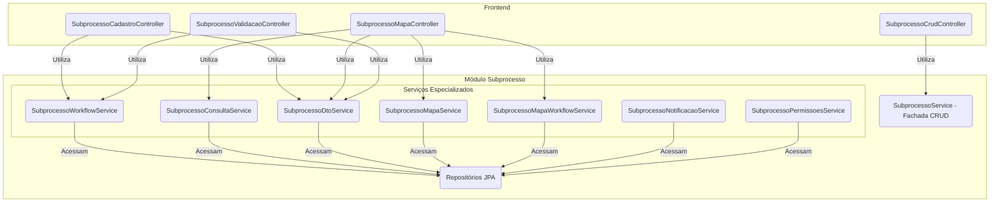

# Módulo de Subprocesso
Última atualização: 2025-12-04 14:18:38Z

## Visão Geral
Este pacote é o **motor do workflow** do SGC. Ele gerencia a entidade `Subprocesso`, que representa a tarefa de uma única unidade organizacional dentro de um `Processo` maior. Ele funciona como uma **máquina de estados**, controlando o ciclo de vida de cada tarefa, desde sua criação até a homologação.

A principal responsabilidade deste módulo é garantir que as transições de estado (`situacao`) sigam as regras de negócio e que cada ação seja registrada em uma trilha de auditoria imutável (`Movimentacao`).

Para melhor organização e desacoplamento, o `SubprocessoController` original foi dividido em múltiplos controladores especializados.

## Arquitetura de Serviços
A complexidade do workflow é gerenciada através de uma arquitetura de serviços coesa e granular. O `SubprocessoService` atua como uma fachada apenas para operações de CRUD básicas, enquanto os controladores de workflow interagem diretamente com serviços especializados para cada domínio de ação.



## Componentes Principais

### Controladores REST

- **`SubprocessoCrudController`**:
  - `GET /api/subprocessos/{id}`: Detalhes do subprocesso.
  - `GET /api/subprocessos`: Listagem geral.

- **`SubprocessoCadastroController`**: Lida com o workflow da etapa de cadastro.
  - `POST /disponibilizar-cadastro`
  - `POST /devolver-cadastro`
  - `POST /aceitar-cadastro`

- **`SubprocessoValidacaoController`**: Lida com o workflow da etapa de validação.
  - `POST /devolver-mapa`
  - `POST /validar-mapa`
  - `POST /homologar-mapa`

- **`SubprocessoMapaController`**: Gerencia o mapa de competências dentro do contexto do subprocesso.
  - `GET /mapa-completo` e `GET /mapa-visualizacao`: Visualização do mapa.
  - `POST /mapa-completo/atualizar`: Salva o mapa inteiro de uma vez.
  - `GET /impactos-mapa`: Analisa diferenças entre versões.
  - **CRUD de Competências (Exceção ao padrão POST):**
    - `POST .../competencias`: Cria competência.
    - `PUT .../competencias/{id}`: Atualiza competência.
    - `DELETE .../competencias/{id}`: Remove competência.

### Serviços Especializados
- **`SubprocessoWorkflowService`**: O coração da máquina de estados. Contém a lógica para todas as transições de estado (exceto as relacionadas diretamente à edição do mapa).
- **`SubprocessoMapaWorkflowService`**: Gerencia a lógica de salvamento do mapa e suas validações durante o workflow.
- **`SubprocessoConsultaService`**: Centraliza as consultas complexas (ex: buscar subprocesso com mapa carregado).
- **`SubprocessoPermissoesService`**: Centraliza a lógica de segurança e verificação de permissões.

## Diagrama da Máquina de Estados (`SituacaoSubprocesso`)

```mermaid
stateDiagram-v2
    direction LR

    [*] --> PENDENTE_CADASTRO: Processo iniciado

    state "Fluxo de Cadastro" {
        PENDENTE_CADASTRO --> CADASTRO_DISPONIBILIZADO: disponibilizarCadastro()
        CADASTRO_DISPONIBILIZADO --> PENDENTE_AJUSTES_CADASTRO: devolverCadastro()
        PENDENTE_AJUSTES_CADASTRO --> CADASTRO_DISPONIBILIZADO: disponibilizarCadastro()
        CADASTRO_DISPONIBILIZADO --> REVISAO_CADASTRO_HOMOLOGADA: aceitarCadastro()
    }

    state "Fluxo de Ajuste/Revisão" {
         REVISAO_CADASTRO_HOMOLOGADA --> MAPA_AJUSTADO: submeterMapaAjustado()
         MAPA_AJUSTADO --> PENDENTE_AJUSTES_MAPA: devolverMapa()
         PENDENTE_AJUSTES_MAPA --> MAPA_AJUSTADO: submeterMapaAjustado()
         MAPA_AJUSTADO --> MAPA_VALIDADO: validarMapa()
    }

    MAPA_VALIDADO --> MAPA_HOMOLOGADO: homologarMapa()
    MAPA_HOMOLOGADO --> [*]: Processo finalizado
```

## Trilha de Auditoria (`Movimentacao`)
Para cada transição de estado, uma nova entidade `Movimentacao` é persistida, garantindo um histórico completo de quem fez o quê e quando.


## Detalhamento técnico (gerado em 2025-12-04T14:22:48Z)

Resumo detalhado dos artefatos, comandos e observações técnicas gerado automaticamente.
