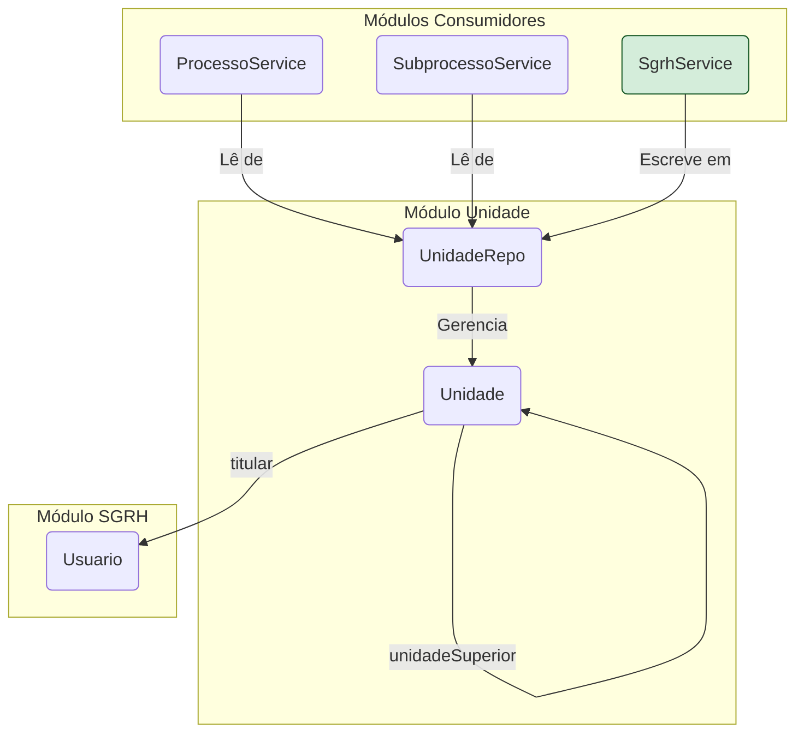

# Módulo de Unidade - SGC

## Visão Geral
O pacote `unidade` define a estrutura organizacional do sistema. Ele contém as entidades JPA que modelam as **Unidades Organizacionais**, suas hierarquias e outros relacionamentos. Este pacote é primariamente um módulo de modelo de dados, servindo como a base sobre a qual outros módulos operam.

## Arquitetura e Componentes

- **`modelo/`**: Contém todas as entidades e o repositório principal.
  - **`Unidade.java`**: A entidade central que representa uma unidade organizacional.
    - **Relacionamentos Chave**: `titular` (com `Usuario`), `unidadeSuperior` (auto-relacionamento hierárquico).
    - **Campos Importantes**: `tipo` (`TipoUnidade`), `situacao` (`SituacaoUnidade`).
  - **`AtribuicaoTemporaria.java`**: Entidade para atribuições de responsabilidade temporária.
  - **`VinculacaoUnidade.java`**: Modela um vínculo ou agrupamento entre unidades.
  - **`UnidadeRepo.java`**: A interface Spring Data JPA para acesso aos dados da entidade `Unidade`.
  - **Enums**: `TipoUnidade.java` e `SituacaoUnidade.java` estão localizados aqui.

## Como as Entidades são Utilizadas
- **`ProcessoService`**: Usa `UnidadeRepo` para selecionar unidades para um novo processo.
- **`SubprocessoService`**: Depende da hierarquia (`unidadeSuperior`) para o fluxo de aprovações.
- **`SgrhService`**: É o principal responsável por popular e manter os dados da entidade `Unidade` sincronizados com o sistema de RH.

## Diagrama de Relacionamento

## Notas Importantes
- **Fonte da Verdade Organizacional**: Este pacote é a "fonte da verdade" para a estrutura organizacional no SGC.
- **Sincronização Externa**: A arquitetura prevê que o `SgrhService` alimente os dados da tabela `UNIDADE`.
- **Ausência de Controller**: A gestão das unidades não é feita diretamente pelos usuários, mas por integração, garantindo a autoridade dos dados.