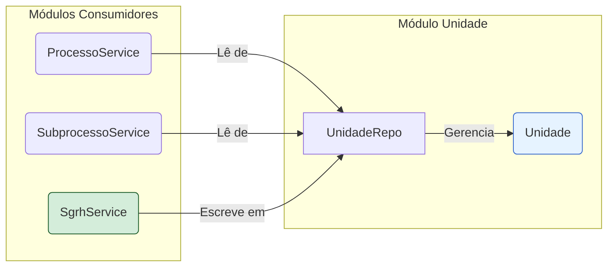

# Módulo de Unidade - SGC

## Visão Geral
O pacote `unidade` é responsável por definir a estrutura organizacional do sistema. Ele contém as entidades JPA que modelam as **Unidades Organizacionais**, suas hierarquias e outros relacionamentos relevantes.

Este pacote é, em grande parte, um módulo de modelo de dados. Ele não contém serviços com lógica de negócio complexa ou controladores REST. Em vez disso, suas entidades servem como a base sobre a qual os outros módulos (como `processo` e `sgrh`) operam. Ele forma o "esqueleto" organizacional da aplicação.

## Arquivos Principais

### 1. Entidades (`modelo/`)
**Localização:** `backend/src/main/java/sgc/unidade/modelo/`
- **`Unidade.java`**: A entidade mais importante do pacote. Representa uma unidade organizacional (ex: uma secretaria, uma seção, uma zona eleitoral).
  - **Relacionamentos Chave:**
    - `titular`: Associação com a entidade `Usuario` que é o responsável pela unidade.
    - `unidadeSuperior`: Auto-relacionamento que cria a estrutura hierárquica.
  - **Campos Importantes:**
    - `tipo`: Enum (`TipoUnidade`) que categoriza a unidade (ex: `OPERACIONAL`, `INTERMEDIARIA`), direcionando a lógica de negócio em outros pacotes.
    - `situacao`: Enum (`SituacaoUnidade`) que indica se a unidade está `ATIVA` ou `INATIVA`.
- **`AtribuicaoTemporaria.java`**: Entidade que representa uma atribuição de responsabilidade temporária sobre uma unidade, usada para cenários como férias ou licenças.
- **`VinculacaoUnidade.java`**: Entidade que modela um tipo de vínculo ou agrupamento entre unidades, possivelmente para fins de processos ou relatórios específicos.

### 2. Repositório
- **`UnidadeRepo.java`**: A interface Spring Data JPA para fornecer acesso aos dados da entidade `Unidade`. É utilizada por vários serviços em toda a aplicação para carregar informações sobre a estrutura organizacional.

### 3. Enums (`enums/`)
- **`TipoUnidade.java`** e **`SituacaoUnidade.java`**: Enumerações que definem os tipos e as situações possíveis para uma `Unidade`, garantindo consistência dos dados.

## Como as Entidades são Utilizadas
As entidades deste pacote são fundamentais para o funcionamento de todo o sistema:
- O **`ProcessoService`** utiliza o `UnidadeRepo` para selecionar as unidades que participarão de um novo processo.
- O **`SubprocessoService`** depende da hierarquia (`unidadeSuperior`) para determinar o fluxo de aprovações.
- O **`SgrhService`** é o principal responsável por popular e manter os dados da entidade `Unidade` sincronizados com o sistema de RH oficial.
- O controle de acesso e as permissões frequentemente dependem da unidade à qual o usuário está associado.

## Notas Importantes
- **Fonte da Verdade Organizacional**: Este pacote é a "fonte da verdade" para a estrutura organizacional dentro do SGC.
- **Sincronização Externa**: É crucial que os dados das unidades sejam mantidos atualizados. A arquitetura prevê que o `SgrhService` alimente os dados da tabela `UNIDADE` a partir de um sistema de RH externo.
- **Ausência de Controller**: A ausência de um `UnidadeControle` é uma decisão de design. A gestão das unidades não é feita diretamente pelos usuários através de uma tela de CRUD, mas sim através de uma integração com um sistema externo, o que garante a consistência e a autoridade dos dados.

## Diagrama de Relacionamento
