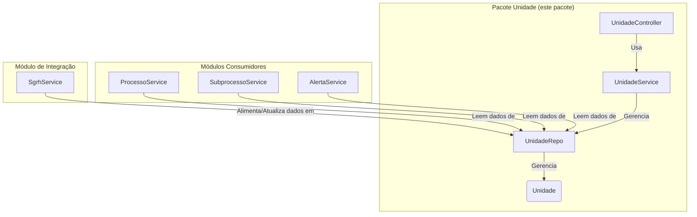

# Pacote Unidade
Última atualização: 2025-12-04 14:18:38Z

## Visão Geral

Este pacote define o **modelo de dados da estrutura organizacional** do SGC. Ele contém a entidade `Unidade`, que representa uma unidade organizacional (secretaria, seção, etc.), seu repositório e uma camada de serviço para operações relacionadas.

## Arquitetura e Propósito
A entidade `Unidade` serve como a "fonte da verdade" para a hierarquia organizacional dentro do SGC. Outros módulos consomem os dados deste pacote para executar seus fluxos de trabalho.

## Componentes Principais

### Controladores e Serviços
- **`UnidadeController`**: Expõe endpoints REST para consulta e operações pontuais.
  - `GET /api/unidades`: Lista hierárquica.
  - `GET /api/unidades/arvore-com-elegibilidade`: Árvore de unidades com flag de elegibilidade para processos.
  - `GET /api/unidades/{id}/servidores`: Lista servidores da unidade.
  - `POST /api/unidades/{id}/atribuicoes-temporarias`: Cria atribuição temporária.
- **`UnidadeService`**: Camada de serviço para lógica de negócio e consultas.

### Modelo de Dados (`model`)
- **`Unidade`**: Entidade JPA principal.
- **`UnidadeRepo`**: Repositório Spring Data.
- **`AtribuicaoTemporaria`**: Entidade para gerenciar atribuições temporárias de servidores.
- **`VinculacaoUnidade`**: Entidade para relacionamentos adicionais entre unidades.
- **`TipoUnidade`**: Enum (`OPERACIONAL`, `INTERMEDIARIA`, `INTEROPERACIONAL`).
- **`SituacaoUnidade`**: Enum (`ATIVA`, `EXTINTA`).

## Gerenciamento de Dados
- **Leitura:** Diversos serviços utilizam o `UnidadeRepo` para buscar informações estruturais.
- **Escrita:** A estrutura básica (entidade `Unidade`) é sincronizada via `SgrhService`. No entanto, o módulo permite operações específicas como a criação de `AtribuicaoTemporaria` via API.

