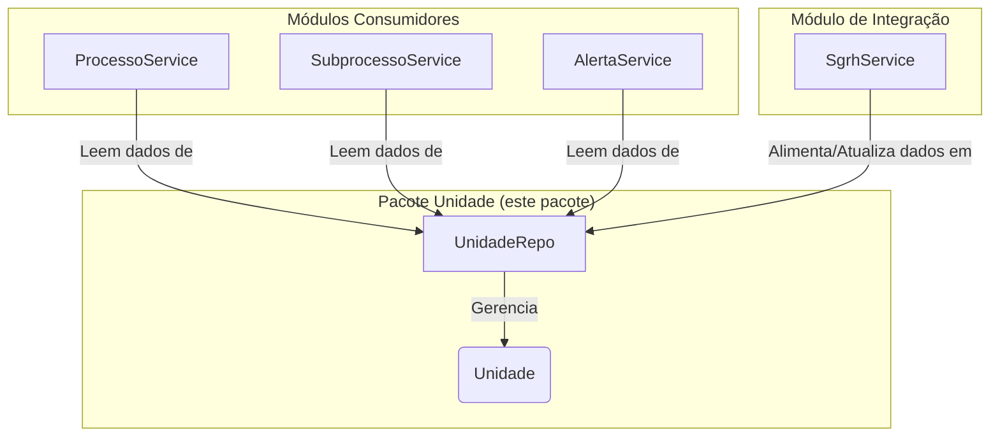

# Pacote Unidade (Modelo de Dados)

## Visão Geral
Este pacote define o **modelo de dados da estrutura organizacional** do SGC. Ele contém a entidade `Unidade`, que representa uma unidade organizacional (secretaria, seção, etc.), e seu repositório.

**Nota Arquitetural Importante:** Este pacote é estritamente um **módulo de modelo de dados**. Ele **não contém lógica de negócio, serviços ou controllers**. Sua única responsabilidade é definir a estrutura da entidade `Unidade` e como ela é persistida.

## Arquitetura e Propósito
A entidade `Unidade` serve como a "fonte da verdade" para a hierarquia organizacional dentro do SGC. Outros módulos consomem os dados deste pacote para executar seus fluxos de trabalho.

## Componentes Principais
- **`Unidade`**: A entidade JPA principal que representa uma unidade organizacional.
- **`UnidadeRepo`**: O repositório Spring Data JPA para acessar a entidade `Unidade`.
- **`AtribuicaoTemporaria` / `VinculacaoUnidade`**: Entidades relacionadas que modelam outras características da estrutura organizacional.
- **`TipoUnidade`**: Enum que classifica a unidade (ex: `OPERACIONAL`, `INTERMEDIARIA`), usado para direcionar a lógica em outros módulos.
- **`SituacaoUnidade`**: Enum que define a situação de uma unidade (ex: `ATIVA`, `EXTINTA`).

## Como os Dados são Gerenciados?
- **Leitura:** Diversos serviços (`ProcessoService`, `SubprocessoService`, etc.) utilizam o `UnidadeRepo` para buscar informações sobre a estrutura organizacional.
- **Escrita:** A criação e atualização das unidades **não são feitas por uma API de CRUD**. A responsabilidade de manter os dados da tabela `UNIDADE` sincronizados recai sobre o `SgrhService`, que deve buscar os dados de um sistema de RH externo (a fonte de verdade oficial) e populá-los no banco de dados do SGC.

Em resumo, este pacote fornece o "esqueleto" organizacional sobre o qual os outros módulos operam.