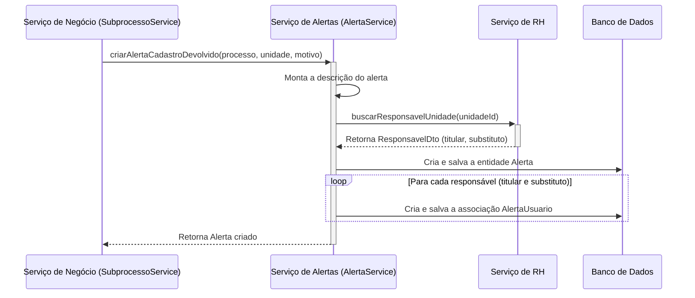

# Pacote `alerta`

## Visão Geral

O pacote `alerta` é responsável por gerenciar as **notificações internas** do sistema SGC. Os alertas são mensagens direcionadas aos usuários, exibidas na interface do sistema, para informá-los sobre eventos que requerem sua atenção ou ação.

A principal característica deste módulo é a sua capacidade de criar alertas contextuais, com mensagens e destinatários específicos, baseando-se no fluxo de negócio em andamento e no tipo da unidade organizacional envolvida.

## Diagrama de Fluxo: Criação de Alerta de Cadastro Devolvido

O diagrama abaixo ilustra como um alerta é gerado quando um gestor devolve um cadastro para a unidade subordinada, um fluxo que é iniciado diretamente por um serviço de negócio.

## Componentes Principais

### `AlertaService` (e `AlertaServiceImpl`)

O serviço central do pacote, responsável por toda a lógica de negócio da criação de alertas.

- **`criarAlerta(...)`**: Método genérico que forma a base para a criação de qualquer alerta.
- **Métodos Específicos**: Contém métodos de negócio como `criarAlertasProcessoIniciado()` e `criarAlertaCadastroDevolvido()`, que encapsulam a lógica para:
    1.  Construir a mensagem de alerta apropriada para o contexto.
    2.  Identificar a unidade de destino.
    3.  Chamar o `SgrhService` para encontrar os usuários (titular e substituto) responsáveis por aquela unidade.
    4.  Persistir as entidades `Alerta` e `AlertaUsuario` no banco de dados.
- **Customização**: A implementação em `AlertaServiceImpl` contém a lógica que diferencia as mensagens de alerta com base no tipo de unidade (Operacional, Intermediária, etc.), garantindo que a comunicação seja relevante para o destinatário.

### `modelo/`

Contém as entidades JPA que representam os alertas no banco de dados.
- **`Alerta.java`**: A entidade principal, que armazena a descrição, o tipo, as datas e a associação com o processo.
- **`AlertaUsuario.java`**: Uma tabela de associação que liga um `Alerta` a um ou mais usuários, e também armazena o status de leitura (`dataCiencia`).

### `AlertaControle.java`

Expõe os endpoints da API REST para que o frontend possa consultar os alertas de um usuário e marcá-los como lidos.

## Integração

O `AlertaService` é projetado para ser invocado por outros serviços de negócio (como `ProcessoService` ou `SubprocessoService`) ou por listeners de eventos, sempre que uma ação no sistema exigir que uma notificação interna seja gerada para um usuário.