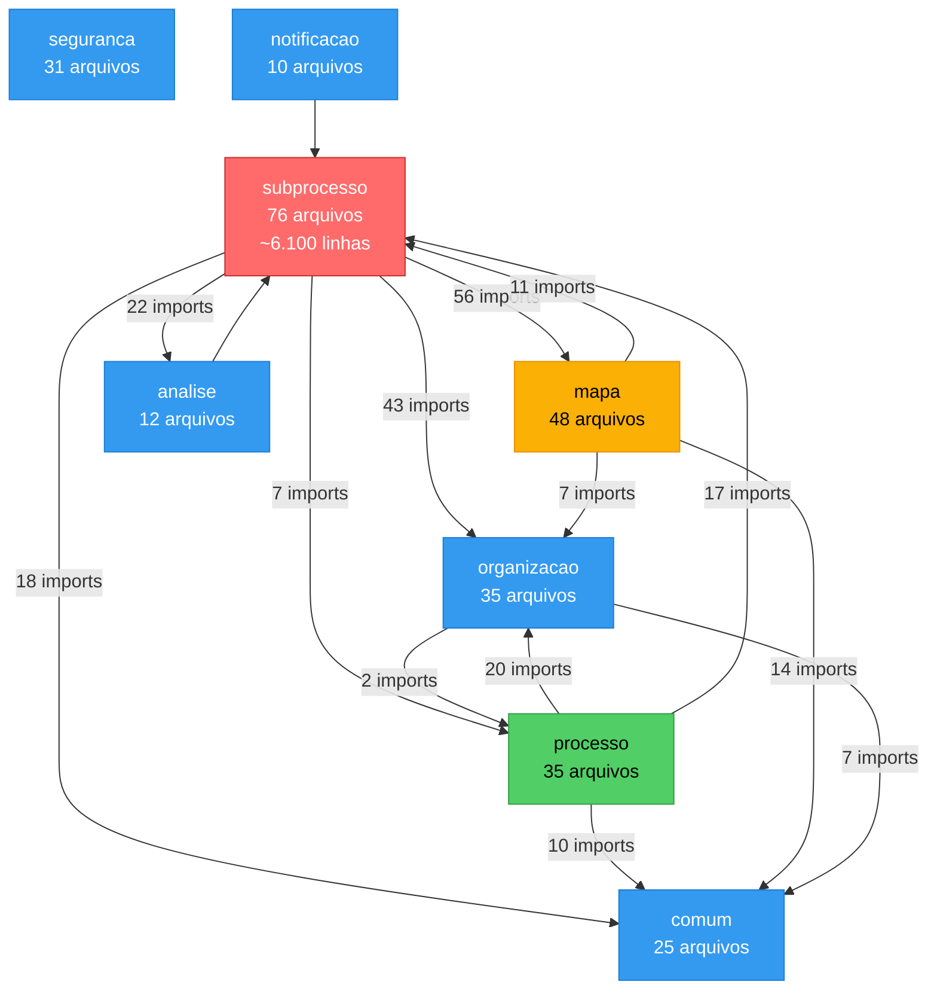
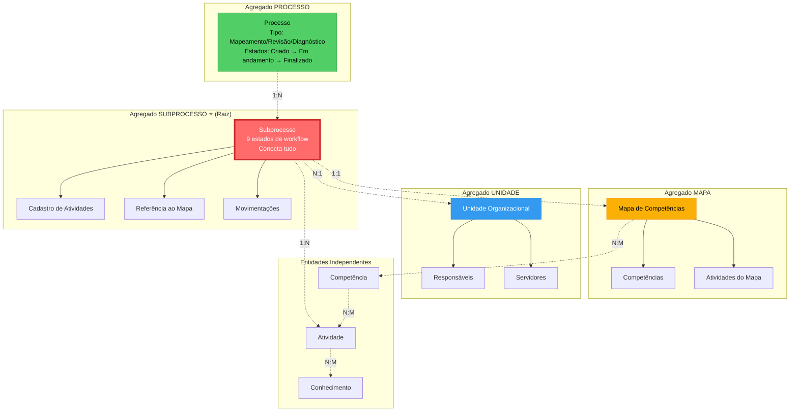
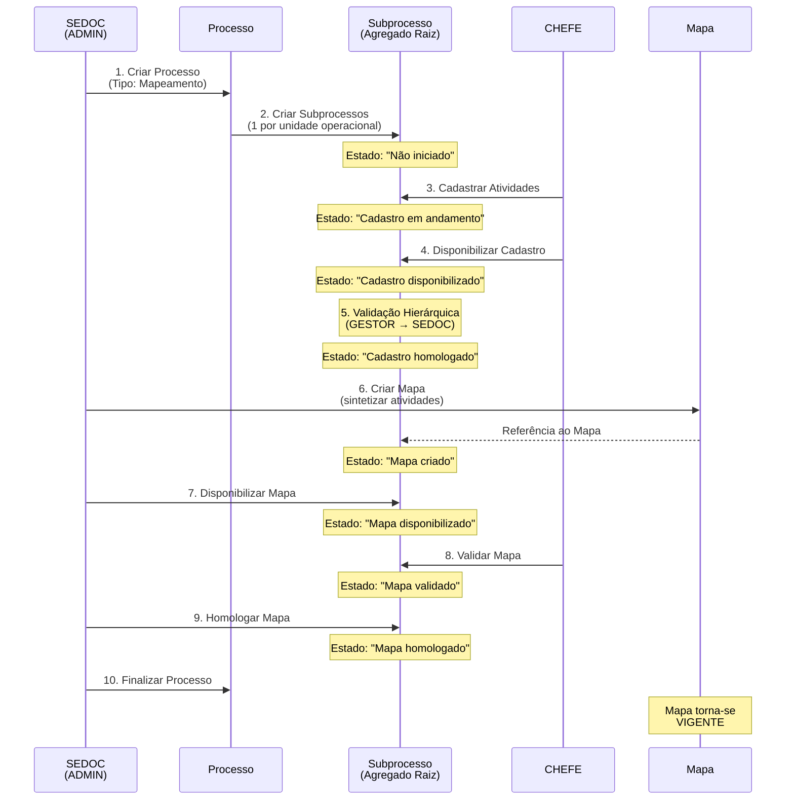
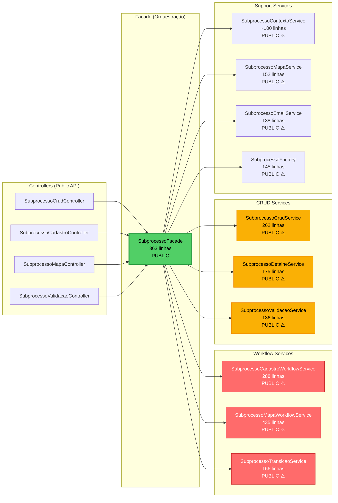
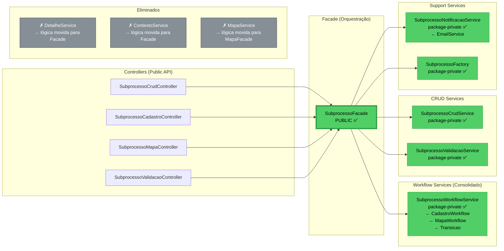
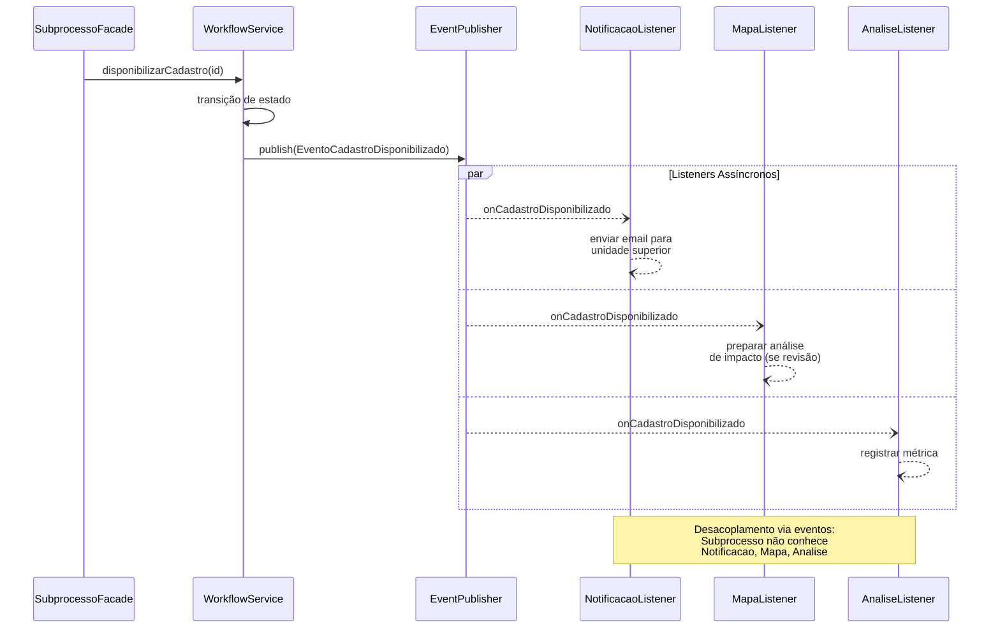
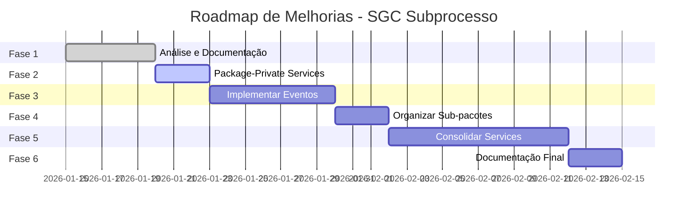

# Diagramas de Arquitetura SGC

**Data:** 2026-01-15  
**Versão:** 1.0

---

## 1. Dependências Entre Módulos (Atual)



**Legenda:**
- 🔴 Vermelho: Módulo mais central (Subprocesso)
- 🟡 Amarelo: Módulo com acoplamento significativo (Mapa)
- 🟢 Verde: Módulo orquestrador (Processo)
- 🔵 Azul: Módulos de suporte

**Observação:** Subprocesso é o módulo mais dependido (59 arquivos importam dele).

---

## 2. Hierarquia de Agregados (DDD)



**Legenda:**
- ⭐ **Agregado Raiz:** Subprocesso é o agregado central que conecta todos os outros
- Linhas pontilhadas: Relações entre agregados
- 1:N, N:1, N:M: Cardinalidade das relações

---

## 3. Fluxo de Dados Simplificado



**Observação:** Note como Subprocesso é central no fluxo - praticamente todas as operações passam por ele.

---

## 4. Arquitetura de Services - Subprocesso (Atual)



**Problema Identificado:**
- ⚠️ Todos os 12 services são PUBLIC (deveriam ser package-private)
- ⚠️ 12 services quando 6-7 seriam suficientes

---

## 5. Arquitetura de Services - Subprocesso (Proposta)



**Melhorias:**
- ✅ 12 services → 6 services (50% redução)
- ✅ Todos services package-private (exceto Facade)
- ✅ Lógica consolidada, menos duplicação

---

## 6. Comunicação por Eventos (Proposta)



**Benefícios:**
- ✅ Desacoplamento entre módulos
- ✅ Extensibilidade (novos listeners sem alterar código)
- ✅ Processamento assíncrono

---

## 7. Organização de Sub-pacotes (Proposta)

```
subprocesso/
├── 📄 SubprocessoCrudController.java
├── 📄 SubprocessoCadastroController.java
├── 📄 SubprocessoMapaController.java
├── 📄 SubprocessoValidacaoController.java
│
├── 📁 dto/
│   ├── SubprocessoDto.java
│   ├── SubprocessoDetalheDto.java
│   └── [outros DTOs]
│
├── 📁 mapper/
│   └── SubprocessoMapper.java
│
├── 📁 model/
│   ├── Subprocesso.java (entidade JPA)
│   ├── SituacaoSubprocesso.java (enum)
│   └── [outros modelos]
│
├── 📁 eventos/
│   ├── EventoTransicaoSubprocesso.java
│   └── TipoTransicao.java
│
├── 📁 listener/
│   └── SubprocessoEventListener.java
│
├── 📁 erros/
│   └── SubprocessoErro.java
│
└── 📁 service/
    ├── 📄 SubprocessoFacade.java (PUBLIC ✅)
    │
    ├── 📁 workflow/
    │   ├── 🔒 SubprocessoWorkflowService.java
    │   └── 🔒 SubprocessoTransicaoService.java
    │
    ├── 📁 crud/
    │   ├── 🔒 SubprocessoCrudService.java
    │   └── 🔒 SubprocessoValidacaoService.java
    │
    ├── 📁 notificacao/
    │   └── 🔒 SubprocessoNotificacaoService.java
    │
    └── 📁 factory/
        └── 🔒 SubprocessoFactory.java
```

**Legenda:**
- 📄 Arquivo público (controllers, facade)
- 🔒 Arquivo package-private (services especializados)
- 📁 Diretório

**Benefícios:**
- ✅ Navegação clara por responsabilidade
- ✅ Separação lógica (workflow/ vs crud/ vs notificacao/)
- ✅ Facilita identificar services relacionados

---

## 8. Comparação de Métricas

### Estado Atual

| Métrica | Valor |
|---------|-------|
| **Arquivos no módulo** | 76 |
| **Services** | 12 |
| **Services públicos** | 12 ⚠️ |
| **Linhas em services** | ~2.500 |
| **Eventos implementados** | 3 (TransicaoSubprocesso) |
| **Arquivos importando módulo** | 59 |
| **Comunicação** | Majoritariamente síncrona |

### Estado Proposto

| Métrica | Valor | Melhoria |
|---------|-------|----------|
| **Arquivos no módulo** | ~65 | ⬇️ 15% (eliminar redundantes) |
| **Services** | 6 | ⬇️ 50% |
| **Services públicos** | 1 (Facade) | ⬇️ 92% |
| **Linhas em services** | ~1.800 | ⬇️ 28% |
| **Eventos implementados** | 10+ | ⬆️ 233% |
| **Arquivos importando módulo** | 45-50 | ⬇️ 15-24% |
| **Comunicação** | Mix síncrona/assíncrona | ⬆️ Desacoplamento |

---

## 9. Cronograma de Implementação



**Total estimado:** 31 dias úteis (~6 semanas)

---

## 10. Conclusão Visual

```
┌─────────────────────────────────────────────────────────────┐
│                   ARQUITETURA ATUAL                         │
│                                                             │
│  ✅ CORRETO: Organização por Agregados de Domínio         │
│                                                             │
│  ⚠️ MELHORAR:                                              │
│     • Consolidar services (12 → 6)                         │
│     • Tornar services package-private                      │
│     • Implementar eventos de domínio                       │
│     • Organizar sub-pacotes                                │
│                                                             │
│  ❌ NÃO FAZER:                                             │
│     • Reorganizar por tipo de processo (duplicação!)       │
│     • Reorganizar por camadas técnicas (perde coesão)      │
│                                                             │
│  📊 IMPACTO ESPERADO:                                      │
│     • -50% services                                         │
│     • -28% linhas de código                                │
│     • +233% eventos (desacoplamento)                       │
│     • +100% encapsulamento (package-private)               │
└─────────────────────────────────────────────────────────────┘
```

---

**Mantido por:** GitHub Copilot AI Agent  
**Data:** 2026-01-15  
**Relacionado:** proposta-arquitetura.md, ADR-006
