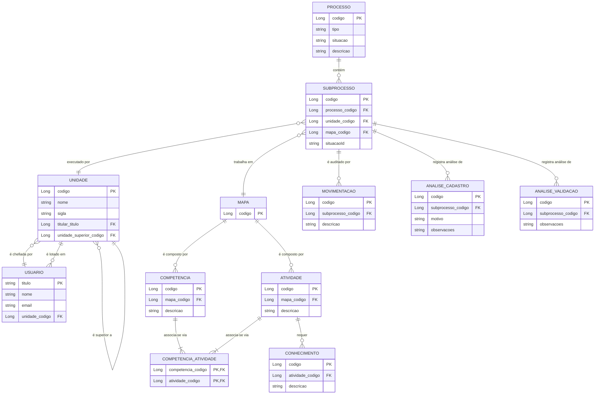

# Modelo de Entidade-Relacionamento (ER)

## Visão Geral

O diagrama abaixo representa o modelo de dados central da aplicação SGC. Ele ilustra as principais entidades e como elas se relacionam para formar a estrutura de processos, mapas de competências e a organização hierárquica.

A maioria das entidades herda uma chave primária `codigo` da classe `EntidadeBase`, com a notável exceção da entidade `Usuario`, que utiliza o `titulo` como sua chave.

## Diagrama ER

## Relacionamentos Principais

- **Processo e Subprocesso**: Um `PROCESSO` é a iniciativa macro, que se desdobra em um ou mais `SUBPROCESSO`s. Cada `SUBPROCESSO` representa a tarefa de uma `UNIDADE` específica.
- **Subprocesso, Mapa e Unidade**: Cada `SUBPROCESSO` está associado a um único `MAPA` de competências (que será elaborado ou revisado) e é executado por uma `UNIDADE` organizacional.
- **Composição do Mapa**: Um `MAPA` é o agregado que contém um conjunto de `ATIVIDADE`s e `COMPETENCIA`s.
- **Atividades, Conhecimentos e Competências**:
    - Uma `ATIVIDADE` pode requerer múltiplos `CONHECIMENTO`s (relação 1-N).
    - A relação entre `COMPETENCIA` e `ATIVIDADE` é muitos-para-muitos (N-N), implementada através da tabela de junção `COMPETENCIA_ATIVIDADE`. Isso significa que uma competência pode ser necessária para várias atividades, e uma atividade pode exigir várias competências.
- **Auditoria do Subprocesso**: Cada `SUBPROCESSO` tem seu histórico de ações registrado em `MOVIMENTACAO` e os resultados das análises (devoluções, aprovações) armazenados em `ANALISE_CADASTRO` e `ANALISE_VALIDACAO`.
- **Hierarquia de Unidades**: A entidade `UNIDADE` tem um auto-relacionamento (`unidade_superior_codigo`) que permite a construção da árvore hierárquica da organização.
- **Usuários e Unidades**: Um `USUARIO` é lotado em uma `UNIDADE`, e uma `UNIDADE` tem um `USUARIO` como seu titular.