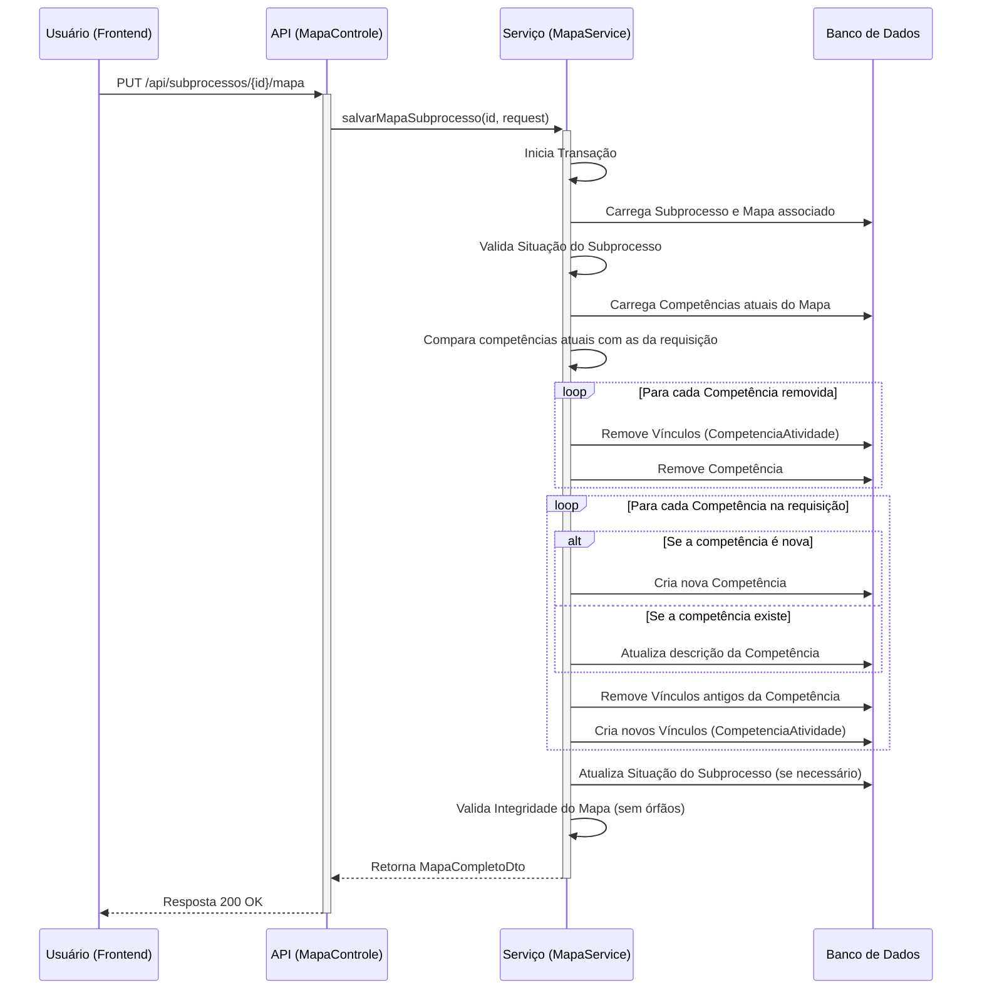

# Pacote `mapa`

## Visão Geral

O pacote `mapa` é um dos módulos mais críticos do SGC, pois gerencia o artefato de negócio central do sistema: o **Mapa de Competências**. Um mapa é uma estrutura de dados complexa que agrega competências, atividades e os vínculos entre elas para uma determinada unidade organizacional.

A arquitetura deste pacote é um excelente exemplo de design orientado a serviços, onde a lógica de negócio complexa foi segmentada em componentes com responsabilidades claras e coesas. Isso torna o código mais fácil de manter e entender.

## Diagrama de Fluxo: Salvamento de um Mapa

O diagrama abaixo ilustra a operação de salvar um mapa de competências. Ele destaca o caráter **atômico** e **transacional** da operação, garantindo que o mapa e todas as suas entidades relacionadas sejam persistidos de forma consistente.

## Componentes Principais

### `MapaService`

É o serviço principal, responsável pela orquestração das operações de leitura e escrita do agregado do mapa.
- **`salvarMapaSubprocesso()`**: Método transacional que salva um mapa completo. Ele lida com a lógica de `diff` para saber o que precisa ser inserido, atualizado ou excluído (competências e seus vínculos), garantindo a consistência dos dados.
- **`obterMapaCompleto()`**: Monta e retorna o `MapaCompletoDto`, um objeto rico que contém o mapa e toda a sua árvore de dependências (competências e atividades vinculadas) para ser consumido pelo frontend.
- **`validarMapaCompleto()`**: Aplica regras de negócio para garantir a integridade de um mapa, como verificar se existem atividades ou competências órfãs (não vinculadas).

### `CopiaMapaService`

Serviço com a responsabilidade única e bem definida de clonar mapas.
- **`copiarMapaParaUnidade()`**: Realiza uma cópia profunda de um mapa existente, incluindo todas as suas atividades e conhecimentos. Esta funcionalidade é essencial para o fluxo de "Iniciar Processo de Revisão", onde o mapa vigente de uma unidade serve como ponto de partida.

### `ImpactoMapaService`

Implementa a lógica de negócio do CDU-12 (Verificar Impactos no Mapa).
- **`verificarImpactos()`**: Compara um mapa em revisão (de um subprocesso) com o mapa vigente da unidade e produz um `ImpactoMapaDto`. Este DTO detalha:
    - Atividades inseridas, removidas e alteradas.
    - As competências que foram afetadas por essas mudanças.

### `modelo/`

Contém as entidades JPA que definem a estrutura do mapa no banco de dados:
- **`Mapa.java`**: A entidade raiz do agregado.
- **`UnidadeMapa.java`**: Tabela de associação que define qual mapa está vigente para qual unidade.

### `dto/`

Contém os Data Transfer Objects, que são cruciais para gerenciar a complexidade das interações com este pacote. Destaques:
- **`MapaCompletoDto`**: Estrutura aninhada que representa o mapa e suas relações para transferência de dados com o frontend.
- **`SalvarMapaRequest`**: DTO que encapsula a estrutura complexa necessária para a requisição de salvamento de um mapa.
- **`ImpactoMapaDto`**: Estrutura os resultados da análise de impacto de forma clara para o frontend.