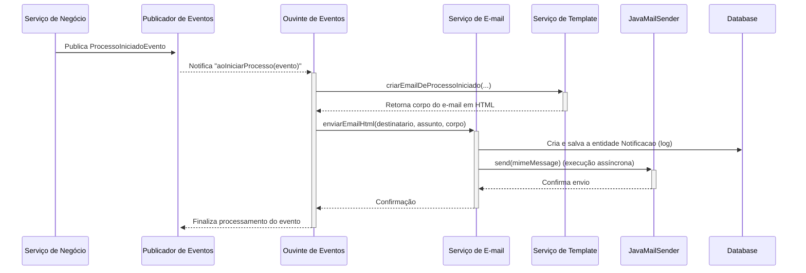

# Pacote `notificacao`

## Visão Geral

O pacote `notificacao` é responsável por todas as **comunicações externas** do sistema, especificamente o envio de e-mails. Ele foi projetado para ser robusto, flexível e, o mais importante, **desacoplado** dos módulos de negócio principais.

A arquitetura utiliza o `ApplicationEventPublisher` do Spring para "escutar" eventos de domínio (como `ProcessoIniciadoEvento`) e, em resposta, acionar o envio de e-mails. Isso significa que o `ProcessoService`, por exemplo, não precisa ter conhecimento direto sobre o sistema de e-mails, promovendo um design limpo e de baixo acoplamento.

## Diagrama de Fluxo: Notificação por Evento

O diagrama abaixo ilustra como uma notificação por e-mail é enviada quando um processo é iniciado, destacando a natureza desacoplada e orientada a eventos da arquitetura.

## Componentes Principais

### `EventoProcessoListener.java`

Este é o componente-chave que conecta o mundo dos negócios com o mundo das notificações.
- **`@EventListener`**: Contém métodos anotados com `@EventListener` que "escutam" eventos de domínio específicos, como `ProcessoIniciadoEvento`.
- **Orquestração**: Ao capturar um evento, este listener orquestra as ações necessárias:
    1.  Chama o `AlertaService` para criar alertas internos.
    2.  Chama o `NotificacaoTemplateEmailService` para gerar o conteúdo HTML do e-mail, com lógica para customizar a mensagem com base no tipo de unidade.
    3.  Chama o `NotificacaoEmailService` para efetivamente enviar o e-mail.

### `NotificacaoEmailService.java`

A implementação `@Primary` do serviço de e-mail, responsável pelo envio real.
- **Envio Assíncrono**: Utiliza `@Async` para enviar e-mails em uma thread separada, não bloqueando o fluxo principal da aplicação.
- **Resiliência**: Inclui lógica de retentativas (`@Retryable`) para lidar com falhas temporárias de conexão com o servidor de e-mail.
- **Auditoria**: Antes de tentar o envio, salva um registro na entidade `Notificacao` para fins de log e auditoria.

### `NotificacaoTemplateEmailService.java`

Um serviço auxiliar cuja única responsabilidade é gerar o corpo (conteúdo HTML) dos e-mails.
- **Separação de Responsabilidades**: Isola a lógica de formatação de HTML da lógica de envio de e-mail.
- **Templates**: Possui métodos específicos para cada tipo de notificação (ex: `criarEmailDeProcessoIniciado`, `criarEmailDeCadastroDevolvido`), tornando o código mais organizado e fácil de manter.

### `NotificacaoMockService.java`

Uma implementação alternativa do `NotificacaoService` que não envia e-mails reais, apenas registra a tentativa no console. É utilizada em ambientes de teste para evitar o envio de e-mails reais e para permitir a verificação de que o serviço de notificação foi chamado corretamente.

### `modelo/Notificacao.java`

A entidade JPA usada para registrar um log de todas as tentativas de envio de e-mail, servindo como uma trilha de auditoria para as comunicações externas.