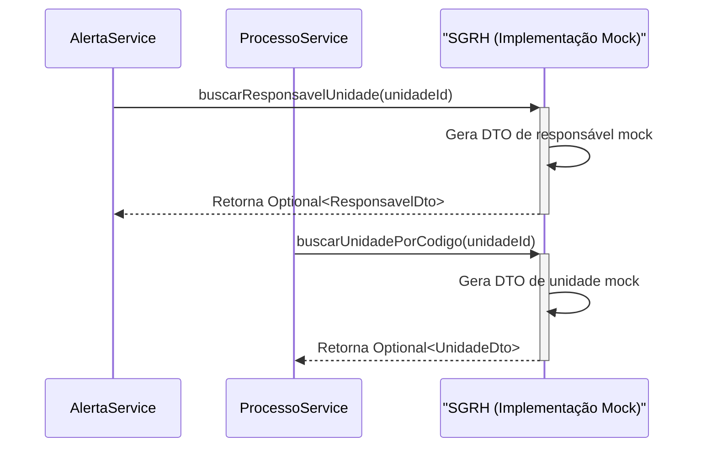

# Pacote de Integração `sgrh`

## Visão Geral

O pacote `sgrh` funciona como uma **camada de anticorrupção** (Anti-Corruption Layer) entre o SGC e o sistema externo de Gestão de Recursos Humanos (SGRH). Sua principal responsabilidade é abstrair a complexidade do sistema de RH e fornecer ao SGC uma interface limpa e consistente para consultar dados de usuários, unidades e suas hierarquias.

Este pacote é fundamental para o funcionamento de quase todos os outros módulos, pois fornece os dados básicos sobre quem são os usuários e como as unidades organizacionais estão estruturadas.

## Estado da Implementação: Mock

Atualmente, o pacote `sgrh` está implementado com **dados mock (falsos)**. Isso significa que ele não se conecta a um banco de dados real, mas sim retorna dados estáticos e pré-definidos diretamente do código.

- **`SgrhService.java`**: Contém a implementação que gera os dados mock.
- **Propósito do Mock**: Permitir o desenvolvimento e teste do restante da aplicação sem a necessidade de uma conexão ativa com o sistema de RH, que pode não estar disponível ou ser instável no ambiente de desenvolvimento.
- **Pronto para o Real**: A arquitetura do pacote (entidades, repositórios, DTOs e configuração de datasource) já está preparada para a conexão com um banco de dados Oracle real. O `README.md` do pacote contém instruções detalhadas para realizar a migração.

## Diagrama de Interação

O diagrama abaixo mostra como outros serviços no sistema consomem o `SgrhService` para obter informações essenciais, sem precisar saber se os dados vêm de um banco de dados real ou de uma implementação mock.

## Componentes Principais

### `SgrhService.java` (Serviço Mock)

Define o contrato e a implementação do serviço.
- **Dados Estáticos**: Contém métodos privados (ex: `criarUnidadesMock()`) que criam e retornam listas e objetos fixos.
- **Logs de Alerta**: Cada método registra um log com o prefixo `MOCK SGRH:` para deixar claro no console que os dados não são reais.
- **Cache**: Utiliza o cache do Spring (`@Cacheable`) para evitar a regeneração dos dados mock a cada chamada, simulando o comportamento de cache que seria desejável em uma implementação real.

### `modelo/` e `dto/`

- O subpacote `modelo` contém as entidades JPA que mapeiam as `Views` do banco de dados Oracle do SGRH. Elas estão prontas para serem usadas quando a conexão real for estabelecida.
- O subpacote `dto` contém os Data Transfer Objects (ex: `UsuarioDto`, `UnidadeDto`) que são usados para transferir os dados do SGRH para o resto da aplicação, garantindo o desacoplamento entre a camada de dados e a de negócio.

## Conclusão

O pacote `sgrh` é um exemplo de bom design de integração. Ao isolar a comunicação com o sistema externo e fornecer uma implementação mock, ele permite que o desenvolvimento do SGC prossiga de forma independente e robusta, ao mesmo tempo em que está estruturalmente pronto para a integração final.