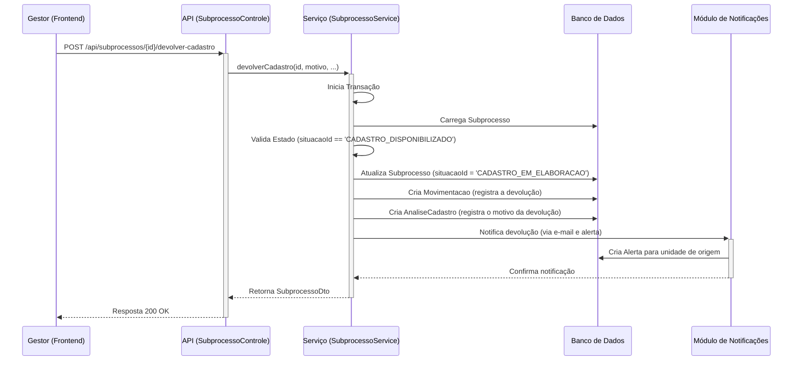

# Pacote `subprocesso`

## Visão Geral

O pacote `subprocesso` funciona como o motor do fluxo de trabalho (workflow) do SGC. Se o pacote `processo` gerencia a iniciativa macro, o `subprocesso` gerencia a jornada detalhada e o ciclo de vida da tarefa de cada unidade organizacional dentro desse processo.

Cada `Subprocesso` é, essencialmente, uma máquina de estados (state machine) que representa a tarefa de uma única unidade (ex: "a unidade X está preenchendo seu cadastro de atividades"). Este pacote é responsável por gerenciar as transições de estado, as validações e, crucialmente, a trilha de auditoria de cada ação.

## Diagrama de Fluxo: Devolução de um Cadastro

O diagrama a seguir ilustra o fluxo de trabalho quando um gestor de uma unidade superior devolve um cadastro para a unidade subordinada fazer ajustes. Este fluxo destaca o papel do pacote como uma máquina de estados e a importância da entidade `Movimentacao`.

## Componentes Principais

### `SubprocessoService.java`

Este serviço é o coração do pacote e implementa a lógica da máquina de estados. Cada método público corresponde a uma ação que pode ser executada em um subprocesso (ex: `disponibilizarCadastro`, `devolverCadastro`, `aceitarValidacao`). O padrão de implementação para cada ação é rigoroso e transacional:

1.  **Carregar Entidade**: Busca o `Subprocesso` no banco de dados.
2.  **Validar Estado**: Verifica se a `situacaoId` atual permite a execução da ação.
3.  **Atualizar Estado**: Altera a `situacaoId` do `Subprocesso` para o novo estado.
4.  **Criar Auditoria**: Instancia e salva uma nova entidade `Movimentacao` para registrar a ação.
5.  **Executar Ações Secundárias**: Salva justificativas (`AnaliseCadastro`), envia notificações (`NotificacaoService`) e cria alertas (`AlertaRepo`).

### `SubprocessoControle.java`

A camada de API REST que expõe as ações do `SubprocessoService`. Os endpoints são projetados para serem acionados por eventos da interface do usuário (cliques em botões como "Aprovar", "Devolver", etc.). O controlador utiliza DTOs específicos para cada tipo de requisição, garantindo um contrato de API claro.

### `modelo/Subprocesso.java`

A entidade JPA que representa o estado de uma tarefa. Suas principais responsabilidades são:
- Manter o estado atual através do campo `situacaoId`.
- Armazenar as associações com o `Processo` pai, a `Unidade` executora e o `Mapa` de competências em elaboração.
- Rastrear os prazos e datas de conclusão das etapas.

### `modelo/Movimentacao.java`

Uma entidade dedicada exclusivamente à trilha de auditoria. Para cada ação significativa em um `Subprocesso`, um novo registro de `Movimentacao` é criado. Isso garante um histórico imutável e detalhado, registrando:
- O `Subprocesso` afetado.
- A data e a hora da ação.
- A `Unidade` de origem da ação.
- A `Unidade` de destino (para onde o "trabalho" foi movido).
- Uma `descricao` textual da ação.

Este componente é vital para a transparência e rastreabilidade do sistema.