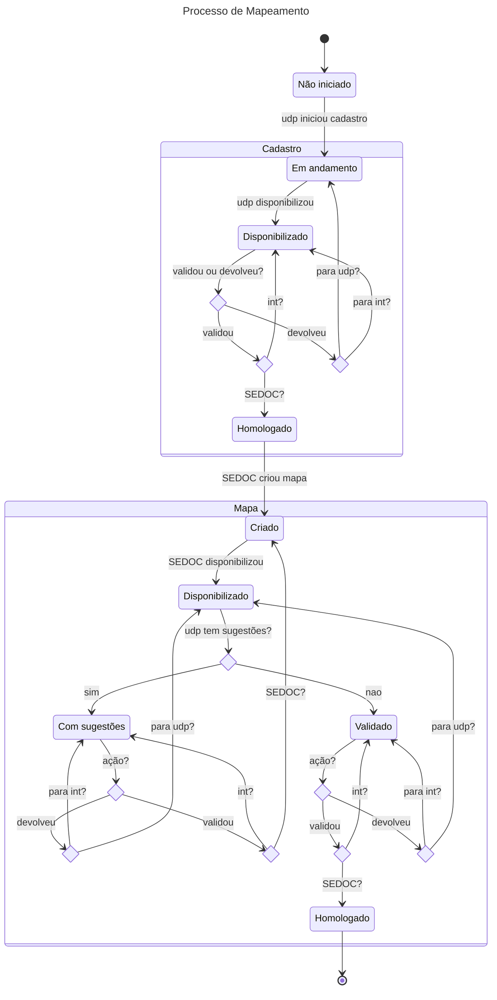

```mermaid
---
title: Processo de Mapeamento
---

stateDiagram-v2
    NaoIniciado: Não iniciado

    [*] --> NaoIniciado
    NaoIniciado --> CadastroEmAndamento: udp iniciou cadastro

    state Cadastro {
        CadastroEmAndamento: Em andamento
        CadastroDisponibilizado: Disponibilizado
        CadastroHomologado: Homologado

        state DecisaoValidacao <<choice>>
        state DecisaoDevolucao <<choice>>
        state DecisaoAcao <<choice>>

        CadastroEmAndamento --> CadastroDisponibilizado: udp disponibilizou

        CadastroDisponibilizado --> DecisaoAcao: validou ou devolveu?
        DecisaoAcao --> DecisaoDevolucao: devolveu
        DecisaoAcao --> DecisaoValidacao: validou
            
        DecisaoDevolucao --> CadastroEmAndamento: para udp?
        DecisaoDevolucao --> CadastroDisponibilizado: para int?

        DecisaoValidacao --> CadastroHomologado: SEDOC?
        DecisaoValidacao --> CadastroDisponibilizado: int?

        CadastroHomologado --> MapaCriado: SEDOC criou mapa
    }

    state Mapa {
        MapaCriado: Criado
        MapaDisponibilizado: Disponibilizado
        MapaValidado: Validado
        MapaComSugestoes: Com sugestões
        MapaHomologado: Homologado

        state DecisaoSugestoes <<choice>>

        state DecisaoDevolveSugestoes <<choice>>
        state DecisaoValidaSugestoes <<choice>>

        state DecisaoValidaMapa <<choice>>
        state DecisaoDevolveValidacaoMapa <<choice>>

        state DecisaoAcaoMapaSugestoes <<choice>>
        state DecisaoAcaoMapaValidado <<choice>>

        MapaCriado --> MapaDisponibilizado: SEDOC disponibilizou
            
        MapaDisponibilizado --> DecisaoSugestoes: udp tem sugestões?
        DecisaoSugestoes --> MapaComSugestoes: sim
        DecisaoSugestoes --> MapaValidado: nao
            
        DecisaoDevolveSugestoes --> MapaComSugestoes: para int?
        DecisaoDevolveSugestoes --> MapaDisponibilizado: para udp?
            
        MapaComSugestoes --> DecisaoAcaoMapaSugestoes: ação?
        DecisaoAcaoMapaSugestoes --> DecisaoValidaSugestoes: validou
        DecisaoAcaoMapaSugestoes --> DecisaoDevolveSugestoes: devolveu
            
        DecisaoValidaSugestoes --> MapaComSugestoes: int?
        DecisaoValidaSugestoes --> MapaCriado: SEDOC?

        DecisaoDevolveValidacaoMapa --> MapaValidado: para int?
        DecisaoDevolveValidacaoMapa --> MapaDisponibilizado: para udp?

        MapaValidado --> DecisaoAcaoMapaValidado: ação?
        DecisaoAcaoMapaValidado --> DecisaoValidaMapa: validou
        DecisaoAcaoMapaValidado --> DecisaoDevolveValidacaoMapa: devolveu

        DecisaoValidaMapa --> MapaHomologado: SEDOC?
        DecisaoValidaMapa --> MapaValidado: int?
    }
    MapaHomologado --> [*]
```