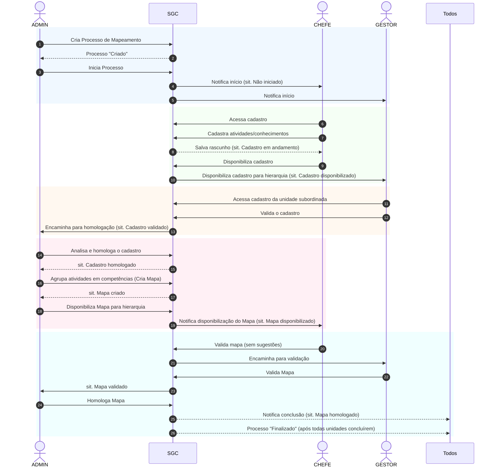

# Diagrama de Sequência: Processo de Mapeamento (Caminho Feliz)

Este diagrama ilustra a interação sequencial entre os atores do sistema (ADMIN, CHEFE e GESTOR) e o próprio Sistema de Gestão de Competências (SGC) durante o fluxo ideal (sem devoluções) de um Processo de Mapeamento.

