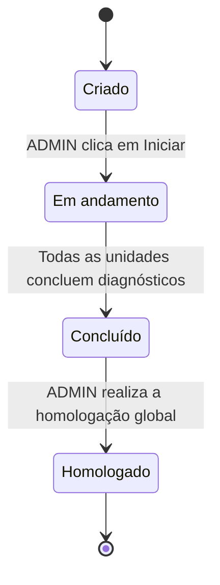
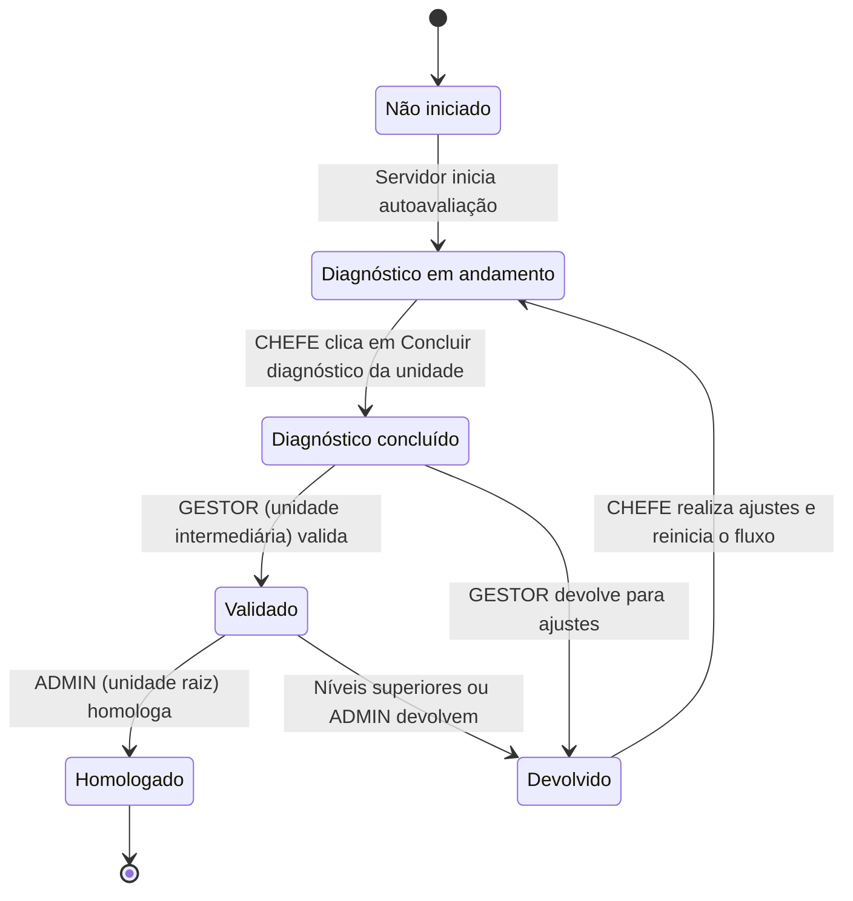
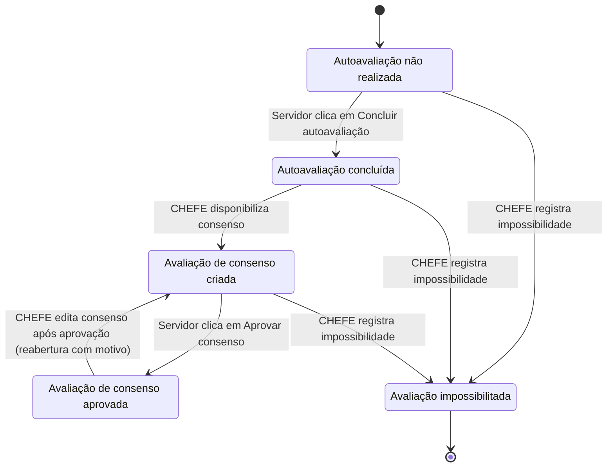

# Situações e Estados do Módulo de Diagnóstico

Este documento descreve as situações e transições de estado que compõem o módulo de **Diagnóstico de Competências Técnicas** no SGC, com base na análise da especificação preliminar (`espec-prelim-diagnostico.pdf`).

Nas especificações de casos de uso e na lógica de negócio do sistema, essas situações são indicadas entre aspas simples (ex: 'Diagnóstico em andamento').

---

## 1. Atores de Transição

Nos fluxos e diagramas de transição a seguir, são utilizadas as seguintes siglas e termos para os atores:

* **`udp`** (unidade do processo): A unidade operacional ou interoperacional participante, onde os servidores realizam a autoavaliação e o chefe elabora o consenso.
* **`int`** (unidade intermediária / GESTOR): A unidade de gestão superior na árvore hierárquica responsável por validar ou devolver os diagnósticos das unidades subordinadas.
* **ADMIN** (SEDOC): Unidade raiz administradora do sistema, responsável por gerenciar prazos, iniciar/finalizar processos e homologar os diagnósticos.

---

## 2. Níveis de Situação

O fluxo do módulo de Diagnóstico é estruturado em três níveis de controle complementares:

1. **Processo**: Nível macro de acompanhamento global do ciclo, gerido pelo perfil **ADMIN**.
2. **Subprocesso (Unidade)**: Nível intermediário representando o progresso da unidade participante, gerido pelo **CHEFE** e validado pelo **GESTOR**.
3. **Avaliação Individual (Servidor)**: Nível micro com as etapas de preenchimento individuais dos servidores de cada unidade, gerido pelo binômio **SERVIDOR / CHEFE**.

---

## 3. Catálogo de Situações

### 3.1. Situações de Processo (Global)
* **Criado**: O processo de diagnóstico foi cadastrado pelo ADMIN, mas ainda não foi iniciado. Permite edição e exclusão de parâmetros e unidades participantes.
* **Em andamento**: O processo foi iniciado. Os subprocessos de cada unidade foram gerados e os servidores notificados. Não permite mais edições estruturais no processo.
* **Concluído**: Situação em que todas as unidades participantes finalizaram seus diagnósticos (ou registraram impossibilidades justificadas).
* **Homologado**: A etapa final onde todos os diagnósticos foram homologados. Os relatórios consolidados e cálculos de gaps globais são liberados pelo ADMIN.

### 3.2. Situações do Subprocesso (Unidade)
* **Não iniciado**: A unidade foi notificada, mas nenhum servidor iniciou o preenchimento da autoavaliação ou registro de dados.
* **Diagnóstico em andamento**: Há pelo menos uma autoavaliação em preenchimento ou consenso criado pela chefia da unidade.
* **Diagnóstico concluído**: Todas as avaliações individuais dos servidores da unidade foram finalizadas (aprovadas em consenso ou marcadas como impossibilitadas) e a chefia da unidade submeteu o diagnóstico para a unidade superior.
* **Devolvido**: O diagnóstico foi analisado por uma unidade superior (GESTOR) ou pelo ADMIN e devolvido com justificativa obrigatória para retificação de informações.
* **Validado**: O diagnóstico da unidade subordinada foi analisado e aceito pela unidade superior imediata na cadeia hierárquica.
* **Homologado**: O diagnóstico da unidade passou por toda a validação hierárquica até a homologação final pela unidade raiz (ADMIN).

### 3.3. Situações da Avaliação Individual (Servidor)
* **Autoavaliação não realizada**: O servidor está ativo na unidade participante, mas ainda não enviou sua autoavaliação.
* **Autoavaliação concluída**: O servidor finalizou o preenchimento e enviou sua autoavaliação para análise da chefia.
* **Avaliação de consenso criada**: O CHEFE da unidade elaborou o consenso a partir dos dados preenchidos, que agora está disponível para visualização e aprovação do servidor.
* **Avaliação de consenso aprovada**: O servidor analisou e deu aceite formal nas informações de Importância e Domínio definidas em consenso com a chefia.
* **Avaliação impossibilitada**: A chefia registrou uma justificativa de impedimento (afastamento, licença, etc.) para o servidor, permitindo a conclusão da unidade sem esta autoavaliação.

---

## 4. Diagramas de Transição de Estado

### 4.1. Processo de Diagnóstico (Global)

### 4.2. Subprocesso de Diagnóstico (Unidade)

### 4.3. Avaliação Individual de Diagnóstico (Servidor)

