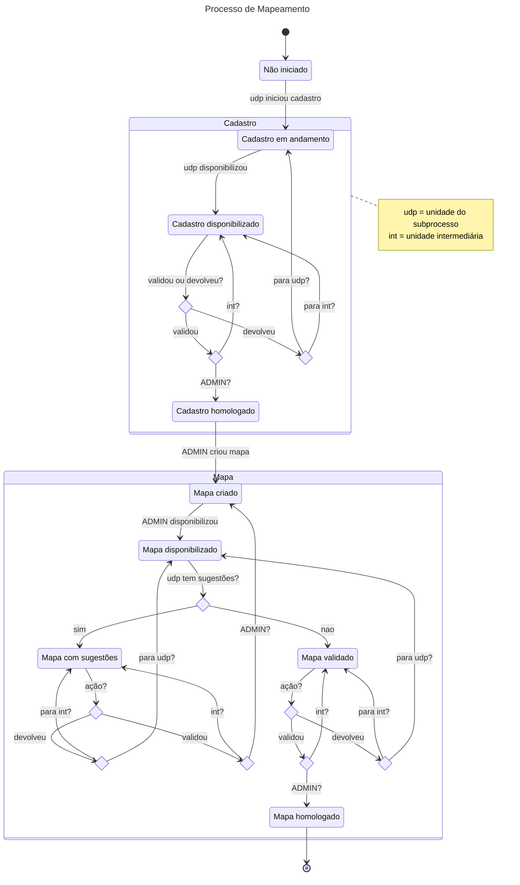
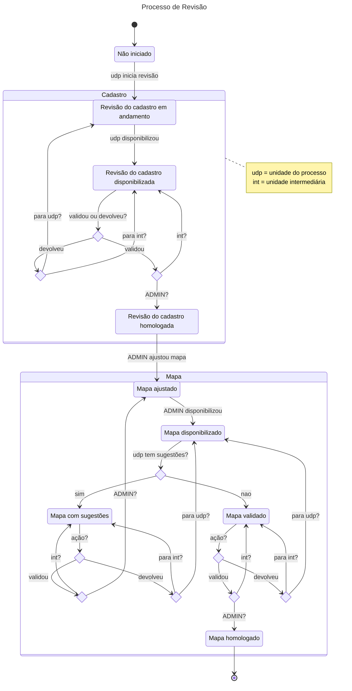
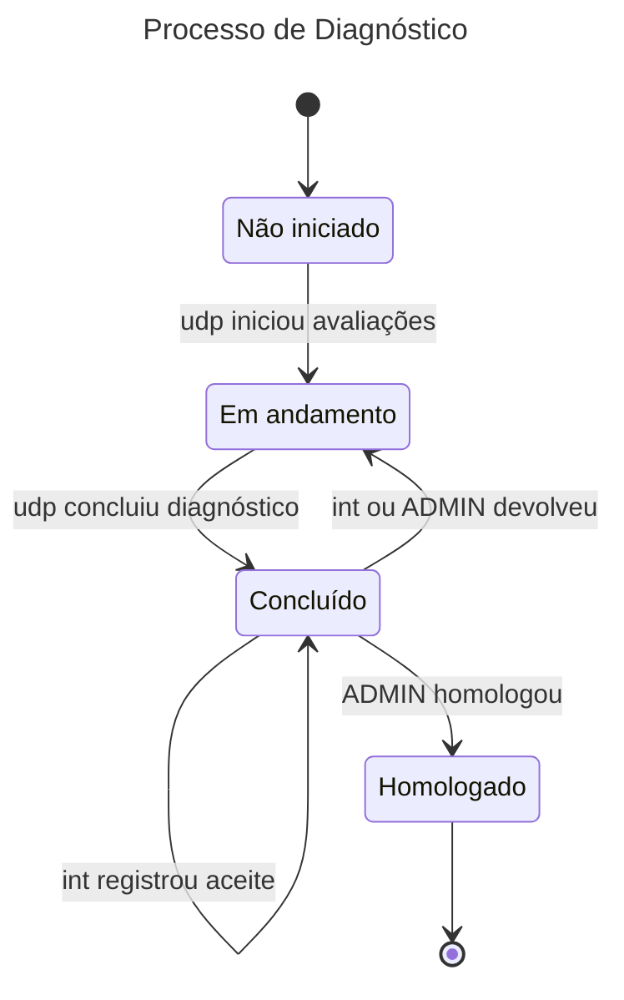
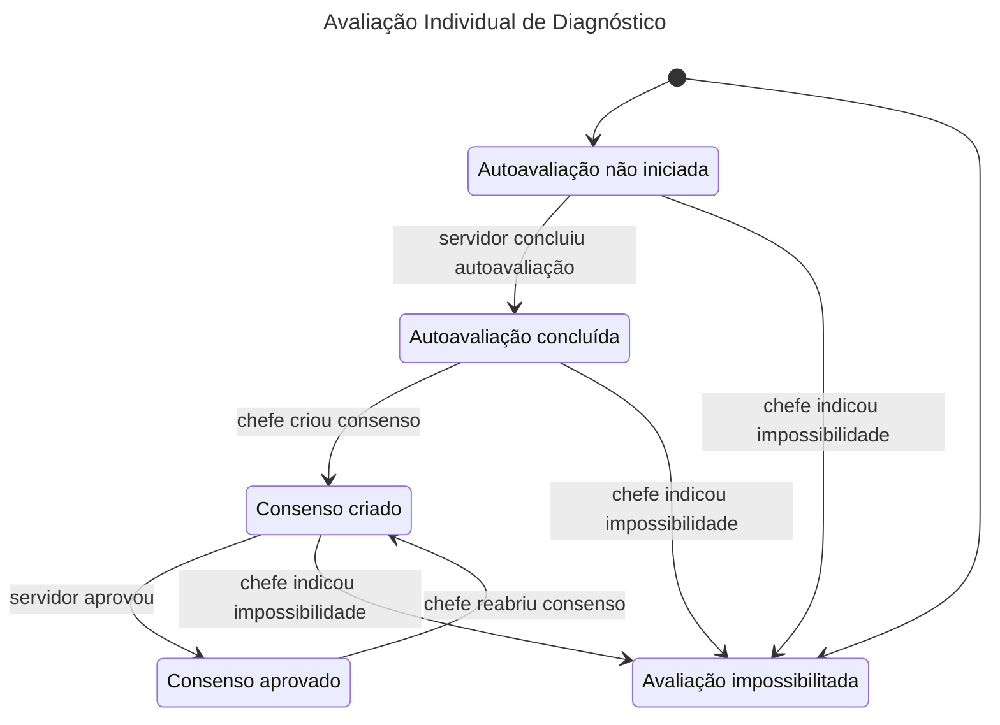

## Situações

Os processos e subprocessos mantidos pelo sistema seguem um fluxo que passa por situações que variam de acordo com o
tipo de processo/subprocesso. Essas situações são referenciadas entre aspas simples (por exemplo, 'Não iniciado') nas
especificações de casos de uso.

Nos fluxos e situações diagramados a seguir, adotamos as seguintes siglas para os atores de transição:

- **`udp`** (unidade do processo): A unidade operacional ou interoperacional participante, responsável pelo trabalho
  principal do subprocesso.
- **`int`** (unidade intermediária): A unidade de gestão imediatamente superior na árvore hierárquica, que avalia as
  informações submetidas pelas unidades a ela subordinadas.
- **ADMIN**: Unidade raiz administradora (geralmente um servidor da SEDOC).

### Situações de Processos (todos os tipos)

- **Criado**: Processo cadastrado, mas não iniciado.
- **Em andamento**: Processo foi iniciado e todas as unidades participantes foram notificadas.
- **Finalizado**: Fluxo do processo concluído para todas as unidades participantes. Em mapeamento e revisão, indica que
  os mapas homologados se tornaram vigentes. Em diagnóstico, indica que todas as unidades tiveram seus diagnósticos
  homologados e que os relatórios consolidados foram liberados.

### Situações de subprocessos de Mapeamento

- **Não iniciado**: Unidade notificada do início do processo, mas sem nenhum cadastro de atividades salvo.
- **Cadastro em andamento**: Cadastro salvo pela unidade, mas não marcado como finalizado.
- **Cadastro disponibilizado**: Cadastro finalizado, aguardando validação.
- **Cadastro homologado**: Cadastro validado na unidade ADMIN.
- **Mapa criado**: Perfil ADMIN criou o mapa para a unidade, mas ainda não disponibilizou.
- **Mapa disponibilizado**: Perfil ADMIN disponibilizou o mapa para validação.
- **Mapa com sugestões**: Perfil CHEFE indicou sugestões para o mapa.
- **Mapa validado**: Toda a hierarquia aprovou o mapa disponibilizado.
- **Mapa homologado**: Perfil ADMIN homologou o mapa após a sua validação pela hierarquia.

### Situações de subprocessos de Revisão

- **Não iniciado**: Unidade foi notificada do início do processo, mas ainda não iniciou a revisão do seu cadastro de atividades.
- **Revisão do cadastro em andamento**: Foi iniciada a revisão do cadastro de atividades da unidade.
- **Revisão do cadastro disponibilizada**: Foi concluída a revisão do cadastro de atividades da unidade, aguardando validação.
- **Revisão do cadastro homologada**: Foi concluída a validação da revisão do cadastro de atividades da unidade.
- **Mapa ajustado**: Perfil ADMIN criou o mapa ajustado para a unidade, mas ainda não o disponibilizou.
- **Mapa disponibilizado**: Perfil ADMIN disponibilizou o mapa ajustado para validação.
- **Mapa com sugestões**: Perfil CHEFE indicou sugestões para o mapa.
- **Mapa validado**: Toda a hierarquia aprovou o mapa disponibilizado.
- **Mapa homologado**: Perfil ADMIN homologou o mapa após a sua validação por toda a hierarquia.

### Situações de subprocessos de Diagnóstico

- **Não iniciado**: Unidade notificada do início do processo de diagnóstico, mas nenhuma avaliação individual foi
  concluída e nenhuma informação de capacitação foi registrada.
- **Em andamento**: Há autoavaliações, consensos, ocupações críticas ou ajustes do diagnóstico em elaboração na
  unidade.
- **Concluído**: A unidade concluiu o diagnóstico e o encaminhou para análise da unidade superior.
- **Homologado**: O diagnóstico da unidade foi aceito em toda a cadeia hierárquica e homologado pela unidade ADMIN.

### Situações de avaliações individuais de diagnóstico

- **Autoavaliação não iniciada**: Servidor ainda não concluiu sua autoavaliação.
- **Autoavaliação concluída**: Servidor concluiu a autoavaliação e chefe já pode elaborar o consenso.
- **Avaliação de consenso criada**: Chefe registrou uma avaliação de consenso para o servidor, a qual ainda aguarda aprovação final.
- **Avaliação de consenso aprovada**: O servidor aprovou a avaliação de consenso vigente.
- **Avaliação impossibilitada**: Chefe registrou impossibilidade de realização da avaliação daquele servidor no ciclo atual.

