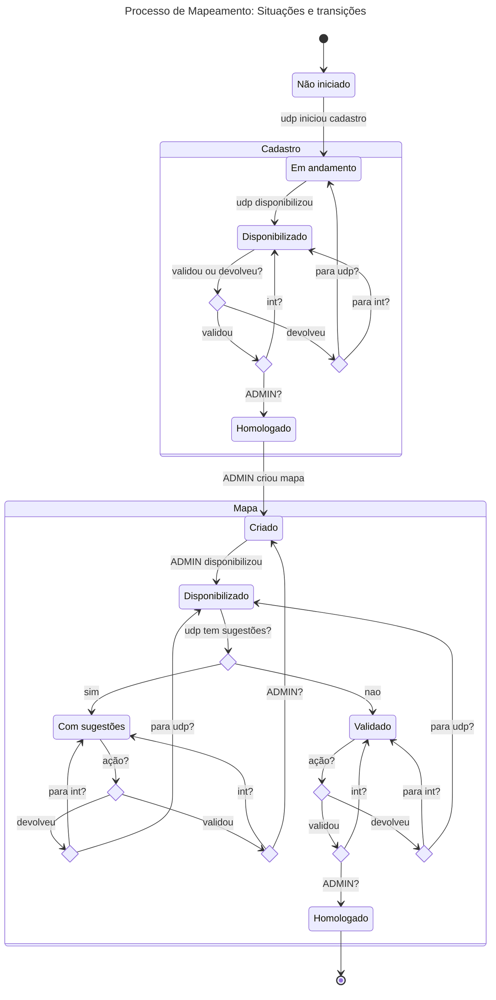
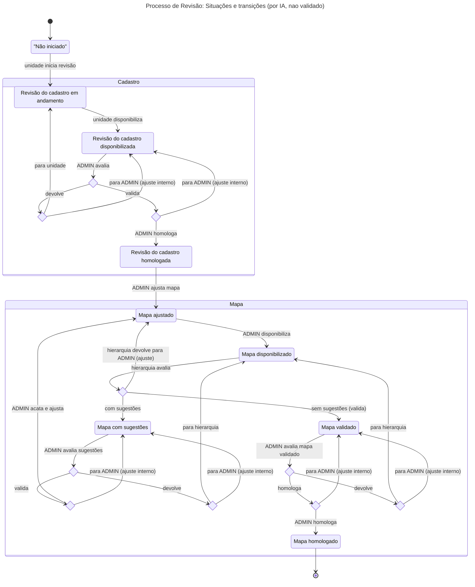

# Informações gerais

O Sistema de Gestão de Competências (SGC) visa gerenciar sistematicamente as competências técnicas das unidades
organizacionais do tribunal. O sistema opera com uma estrutura organizacional hierárquica em que a árvore de unidades
fica subordinada a uma unidade virtual raiz (sigla ADMIN) a partir da qual os processos de mapeamento, revisão e diagnóstico de 
competências são iniciados e concluídos, após passarem pela atuação das demais unidades da hierarquia.

Os componentes essenciais do sistema incluem atividades, que são ações específicas desempenhadas por cada unidade no
exercício de suas funções; conhecimentos, que representam o conjunto de conhecimentos técnicos necessários para executar
cada atividade; competências, que são elementos sintetizantes agrupando atividades relacionadas e são definidos e
mantidos apenas pela unidade raiz ADMIN; e mapas de competências, que constituem o conjunto consolidado de competências associadas a
uma unidade, resultante do processo de mapeamento.

O sistema suporta três tipos principais de processos: mapeamento, que representa o processo inicial de coleta
sistemática das atividades e conhecimentos necessários para cada unidade operacional visando a construção do primeiro
mapa de competências da unidade; revisão, que consiste na atualização periódica dos mapas de competências vigentes em
cada unidade considerando as mudanças organizacionais e de atribuições; e diagnóstico, que avalia a importância e domínio
das competências pelos servidores das unidades, identificando lacunas (gaps) e necessidades de capacitação.

## Atores e perfis

O sistema de Gestão de Competências opera com os seguintes perfis de usuários, cujas atribuições e acessos são
automaticamente reconhecidos com base na condição de responsabilidade ou lotação em uma unidade, de acordo com o SGRH,
ou por atribuição de responsabilidade temporária realizada no próprio sistema. Caso um usuário acumule mais de um perfil
ou seja responsável por mais de uma unidade, será necessário selecionar o perfil e a unidade de trabalho após o login.

- **ADMIN**: Administrador do sistema. Esse papel, que deverá ser geralmente exercido por servidores da SEDOC, é 
  responsável por criar, configurar e monitorar processos. Os usuários que logarem com este perfil no sistema estarão
  associados à unidade raiz ADMIN de maneira a atuar, ao final do processo de validação do cadastro de atividades das unidades,
  na criação, ajuste e homologação dos mapas de competências assim como na homologação do processo de diagnóstico.
- **GESTOR**: Responsável por uma unidade intermediária ou interoperacional (exemplo: Coordenador). Pode visualizar e 
  validar as informações cadastradas pelas unidades sob sua gestão, submetendo para análise da unidade superior, ou 
  devolvendo à unidade subordinada para realização de retificações.
- **CHEFE**: Responsável por uma unidade operacional ou interoperacional. Pode cadastrar as informações de sua unidade
  em cada processo e submeter essas informações para validação pela unidade superior.
- **SERVIDOR**: Servidor lotado em uma unidade operacional ou interoperacional. Este papel só atua nos processos de
  diagnóstico.

O sistema atribuirá simultaneamente os perfis GESTOR e CHEFE para os responsáveis por unidades interoperacionais.

## Situações

Os processos e subprocessos mantidos pelo sistema seguem um fluxo previsível, passando por um conjunto de situações que
varia de acordo com o tipo de processo/subprocesso. Essas situações são referenciadas entre aspas simples (por
exemplo, 'Não iniciado') nas especificações de casos de uso.

### Situações de Processos

- Criado: Processo cadastrado, mas não iniciado.
- Em andamento: Processo foi iniciado e todas as unidades participantes foram notificadas.
- Finalizado: Mapa de competências homologado para todas as unidades.

### Situações de Subprocessos de Mapeamento

- Não iniciado: Unidade notificada do início do processo, mas sem nenhum cadastro de atividades salvo.
- Cadastro em andamento: Cadastro salvo pela unidade mas não marcado como finalizado.
- Cadastro disponibilizado: Cadastro finalizado, aguardando validação.
- Cadastro homologado: Cadastro validado na unidade ADMIN.
- Mapa criado: Unidade ADMIN criou o mapa para a unidade mas ainda não disponibilizou.
- Mapa disponibilizado: Unidade ADMIN disponibilizou o mapa da unidade para validação.
- Mapa com sugestões: CHEFE indicou sugestões para o mapa da unidade.
- Mapa validado: Hierarquia aprovou o mapa disponibilizado pela unidade ADMIN.
- Mapa homologado: Unidade ADMIN homologou o mapa após a sua validação pela hierarquia da unidade.

### Situações de Subprocessos de Revisão

- Não iniciado: Unidade notificada do início do processo, mas ainda não iniciou a revisão do seu cadastro de atividades.
- Revisão do cadastro em andamento: Cadastro de atividades da unidade com revisão iniciada.
- Revisão do cadastro disponibilizada: Revisão do cadastro concluída, aguardando validação.
- Revisão do cadastro homologada: Revisão do cadastro validada na unidade ADMIN.
- Mapa ajustado: Unidade ADMIN criou o mapa ajustado para a unidade mas ainda não disponibilizou.
- Mapa disponibilizado: Unidade ADMIN disponibilizou o mapa ajustado da unidade para validação.
- Mapa com sugestões: CHEFE indicou sugestões para o mapa da unidade.
- Mapa validado: Hierarquia aprovou o mapa disponibilizado pela unidade ADMIN.
- Mapa homologado: Unidade ADMIN homologou o mapa após a sua validação pela hierarquia da unidade.

