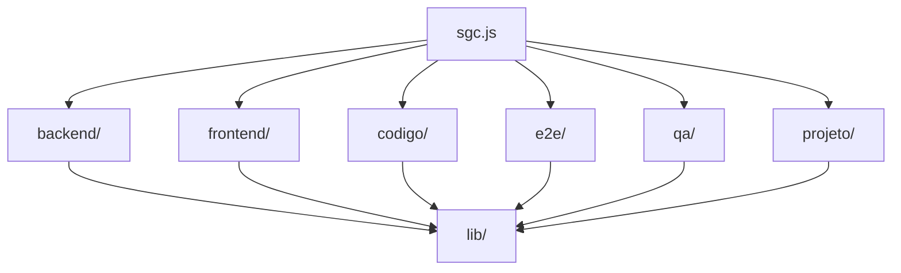

# Toolkit de Scripts do SGC

## Papel do módulo

`etc/scripts/` reúne a CLI de automação do repositório. Ela concentra comandos operacionais e de auditoria usados para qualidade, setup, diagnóstico do projeto, utilidades de backend/frontend e geração de dashboards de QA.

Ponto de entrada principal:

```bash
node etc/scripts/sgc.js
```

## Visão arquitetural

O toolkit é um módulo Node.js em ESM, separado do backend/frontend, com dependências próprias e testes próprios.



## Estrutura do diretório

| Caminho | Papel |
|---|---|
| `sgc.js` | roteador principal da CLI |
| `lib/` | infraestrutura compartilhada, execução, paths, saída e utilidades |
| `backend/` | comandos de cobertura, testes e higiene Java |
| `frontend/` | comandos de cobertura, mensagens, validações, test ids e cruft |
| `codigo/` | auditorias transversais de smells |
| `e2e/` | automações relacionadas à suíte E2E |
| `qa/` | snapshot, resumo e dashboard de qualidade |
| `projeto/` | setup, doctor, limpeza e qualidade do repositório |
| `test/` | testes do toolkit |

## Comandos por domínio

### Backend

```bash
node etc/scripts/sgc.js backend cobertura auditoria
node etc/scripts/sgc.js backend testes analisar
node etc/scripts/sgc.js backend testes priorizar
node etc/scripts/sgc.js backend testes gerar-stub
node etc/scripts/sgc.js backend java corrigir-fqn
node etc/scripts/sgc.js backend java auditar-null
node etc/scripts/sgc.js backend java instalar-certificados
```

### Frontend

```bash
node etc/scripts/sgc.js frontend cobertura auditoria
node etc/scripts/sgc.js frontend mensagens extrair
node etc/scripts/sgc.js frontend mensagens analisar
node etc/scripts/sgc.js frontend validacoes auditar
node etc/scripts/sgc.js frontend cruft auditar
node etc/scripts/sgc.js frontend cruft validar
node etc/scripts/sgc.js frontend views auditar-validacoes
node etc/scripts/sgc.js frontend test-ids listar
node etc/scripts/sgc.js frontend test-ids listar-duplicados
node etc/scripts/sgc.js frontend telas capturar
```

### Código transversal

```bash
node etc/scripts/sgc.js codigo smells auditar
```

### E2E

```bash
node etc/scripts/sgc.js e2e limpar
```

### QA

```bash
node etc/scripts/sgc.js qa snapshot coletar --perfil rapido
node etc/scripts/sgc.js qa resumo
node etc/scripts/sgc.js qa dashboard servir --porta 4179
```

### Projeto

```bash
node etc/scripts/sgc.js projeto doctor
node etc/scripts/sgc.js projeto dependencias auditar
node etc/scripts/sgc.js projeto limpar --confirmar
node etc/scripts/sgc.js projeto qualidade rapido
node etc/scripts/sgc.js projeto setup --instalar-dependencias
node etc/scripts/sgc.js projeto arvore-linhas
```

## Casos de uso típicos

- gerar snapshot consolidado de qualidade para revisão técnica;
- auditar cruft/duplicidade no frontend;
- apoiar evolução da suíte de testes backend;
- validar divergência entre Bean Validation e validação de UI;
- preparar ambiente local de desenvolvimento;
- servir dashboards de QA para inspeção manual.

## Dependências e execução

`etc/scripts/package.json` define dependências próprias, separadas do restante do repositório.

Instalação:

```bash
pnpm --dir etc/scripts install
```

Execução dos testes do toolkit:

```bash
pnpm --dir etc/scripts run test
```

Lint do toolkit:

```bash
pnpm --dir etc/scripts run lint
```

Auditoria de dependências:

```bash
pnpm --dir etc/scripts run deps:audit
node etc/scripts/sgc.js projeto dependencias auditar
```

## Organização dos testes

O diretório `test/` contém:

- `sgc.test.js`: testes da CLI principal
- `fixtures/`: dados auxiliares para simular cenários de execução

Esses testes garantem que a CLI continue roteando comandos, produzindo saídas e respeitando contratos básicos de operação.

## Relação com o restante do repositório

O toolkit não substitui os comandos nativos de Gradle, pnpm ou Playwright; ele os complementa com:

- automação padronizada;
- relatórios agregados;
- auditorias específicas do SGC;
- comandos de produtividade difíceis de expressar apenas com scripts simples.

## Referências

- [README raiz](../../README.md)
- [Backend do SGC](../../backend/README.md)
- [Frontend do SGC](../../frontend/README.md)
