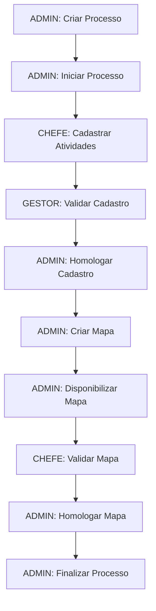

# Fluxo Geral de Mapeamento - Caminho Feliz

Este documento descreve o fluxo completo do "caminho feliz" para um processo de mapeamento, desde a criação até a finalização, envolvendo os diferentes perfis de usuário (ADMIN, GESTOR, CHEFE e SERVIDOR).

## Visão Geral do Processo

O processo de mapeamento envolve as seguintes etapas principais:
1. Criação e inicialização do processo (ADMIN)
2. Cadastro de atividades e conhecimentos (CHEFE)
3. Validação do cadastro (GESTOR/ADMIN)
4. Criação e disponibilização do mapa de competências (ADMIN)
5. Validação do mapa de competências (CHEFE/GESTOR/ADMIN)
6. Finalização do processo (ADMIN)

## Fluxo Detalhado

### 1. Login e Criação do Processo (ADMIN)

1. **ADMIN** realiza login no sistema com suas credenciais
2. O sistema exibe o Painel com a lista de processos ativos
3. **ADMIN** clica no botão "Criar processo"
4. O sistema exibe a tela de Cadastro de Processo
5. **ADMIN** preenche:
   - Descrição do processo
   - Tipo do processo: "Mapeamento"
   - Seleciona unidades participantes (operacionais e interoperacionais)
   - Define data limite para etapa 1
6. **ADMIN** clica em "Salvar"
7. O sistema valida os dados e cria o processo na situação "Criado"
8. O sistema redireciona para o Painel

### 2. Inicialização do Processo (ADMIN)

1. **ADMIN** clica no processo recém-criado na lista de processos
2. O sistema exibe a tela de Cadastro de Processo com os dados preenchidos
3. **ADMIN** clica no botão "Iniciar processo"
4. O sistema mostra diálogo de confirmação
5. **ADMIN** confirma a inicialização
6. O sistema:
   - Altera a situação do processo para "Em andamento"
   - Cria subprocessos para cada unidade participante
   - Cria mapas de competências vazios para cada unidade
   - Registra movimentações iniciais
   - Envia notificações por e-mail para todas as unidades participantes
   - Cria alertas para todas as unidades participantes
7. O sistema redireciona para o Painel

### 3. Cadastro de Atividades e Conhecimentos (CHEFE)

1. **CHEFE** realiza login no sistema com suas credenciais
2. O sistema exibe o Painel com o processo de mapeamento em andamento
3. **CHEFE** clica no processo de mapeamento
4. O sistema exibe a tela Detalhes do Subprocesso da unidade
5. **CHEFE** clica no card "Atividades e conhecimentos"
6. O sistema exibe a tela de Cadastro de Atividades e Conhecimentos
7. **CHEFE** realiza as seguintes ações:
   - Adiciona atividades com suas descrições
   - Adiciona conhecimentos associados a cada atividade
   - Opcionalmente, importa atividades de processos anteriores
8. O sistema altera automaticamente a situação do subprocesso para "Cadastro em andamento"
9. **CHEFE** clica no botão "Disponibilizar"
10. O sistema valida que todas as atividades têm pelo menos um conhecimento
11. O sistema mostra diálogo de confirmação
12. **CHEFE** confirma a disponibilização
13. O sistema:
    - Altera a situação do subprocesso para "Cadastro disponibilizado"
    - Registra movimentação para a unidade superior
    - Envia notificação por e-mail para a unidade superior
    - Cria alerta para a unidade superior
14. O sistema redireciona para o Painel

### 4. Validação do Cadastro (GESTOR)

1. **GESTOR** realiza login no sistema com suas credenciais
2. O sistema exibe o Painel com alertas de cadastros disponibilizados
3. **GESTOR** clica no processo de mapeamento
4. O sistema exibe a tela Detalhes do Processo
5. **GESTOR** clica na unidade subordinada com cadastro disponibilizado
6. O sistema exibe a tela Detalhes do Subprocesso
7. **GESTOR** clica no card "Atividades e conhecimentos"
8. O sistema exibe a tela de Atividades e Conhecimentos com os botões de análise
9. **GESTOR** analisa o cadastro e clica em "Registrar aceite"
10. O sistema mostra diálogo de confirmação
11. **GESTOR** confirma o aceite
12. O sistema:
    - Registra análise de cadastro com resultado "Aceite"
    - Registra movimentação para a unidade superior
    - Envia notificação por e-mail para a unidade superior
    - Cria alerta para a unidade superior
13. O sistema redireciona para o Painel

### 5. Homologação do Cadastro (ADMIN)

1. **ADMIN** realiza login no sistema com suas credenciais
2. O sistema exibe o Painel com alertas de cadastros aceitos
3. **ADMIN** clica no processo de mapeamento
4. O sistema exibe a tela Detalhes do Processo
5. **ADMIN** clica na unidade com cadastro aceito
6. O sistema exibe a tela Detalhes do Subprocesso
7. **ADMIN** clica no card "Atividades e conhecimentos"
8. O sistema exibe a tela de Atividades e Conhecimentos
9. **ADMIN** clica em "Homologar"
10. O sistema mostra diálogo de confirmação
11. **ADMIN** confirma a homologação
12. O sistema:
    - Altera a situação do subprocesso para "Cadastro homologado"
    - Registra movimentação
13. O sistema redireciona para a tela Detalhes do Subprocesso

### 6. Criação do Mapa de Competências (ADMIN)

1. **ADMIN** clica no card "Mapa de Competências"
2. O sistema exibe a tela de Edição de Mapa
3. **ADMIN** realiza as seguintes ações:
   - Clica em "Criar competência"
   - Preenche a descrição da competência
   - Seleciona atividades para associar à competência
   - Salva a competência
   - Repete o processo até criar todas as competências necessárias
4. O sistema altera automaticamente a situação do subprocesso para "Mapa criado"
5. **ADMIN** clica no botão "Disponibilizar"
6. O sistema valida que:
   - Todas as competências estão associadas a pelo menos uma atividade
   - Todas as atividades estão associadas a pelo menos uma competência
7. O sistema mostra janela modal para preenchimento de:
   - Data limite para validação do mapa
   - Observações (opcional)
8. **ADMIN** preenche os campos e clica em "Disponibilizar"
9. O sistema:
   - Altera a situação do subprocesso para "Mapa disponibilizado"
   - Registra movimentação
   - Envia notificações por e-mail para a unidade e unidades superiores
   - Cria alertas para a unidade e unidades superiores
10. O sistema redireciona para o Painel

### 7. Validação do Mapa de Competências (CHEFE)

1. **CHEFE** realiza login no sistema com suas credenciais
2. O sistema exibe o Painel com alerta de mapa disponibilizado
3. **CHEFE** clica no processo de mapeamento
4. O sistema exibe a tela Detalhes do Subprocesso
5. **CHEFE** clica no card "Mapa de Competências"
6. O sistema exibe a tela de Visualização de Mapa com os botões "Apresentar sugestões" e "Validar"
7. **CHEFE** analisa o mapa e clica em "Validar"
8. O sistema mostra diálogo de confirmação
9. **CHEFE** confirma a validação
10. O sistema:
    - Altera a situação do subprocesso para "Mapa validado"
    - Registra movimentação para a unidade superior
    - Envia notificação por e-mail para a unidade superior
    - Cria alerta para a unidade superior
11. O sistema redireciona para o Painel

### 8. Homologação do Mapa de Competências (ADMIN)

1. **ADMIN** realiza login no sistema com suas credenciais
2. O sistema exibe o Painel com alerta de mapa validado
3. **ADMIN** clica no processo de mapeamento
4. O sistema exibe a tela Detalhes do Processo
5. **ADMIN** clica na unidade com mapa validado
6. O sistema exibe a tela Detalhes do Subprocesso
7. **ADMIN** clica no card "Mapa de Competências"
8. O sistema exibe a tela de Visualização de Mapa
9. **ADMIN** clica em "Homologar"
10. O sistema mostra diálogo de confirmação
11. **ADMIN** confirma a homologação
12. O sistema:
    - Altera a situação do subprocesso para "Mapa homologado"
    - Registra movimentação
13. O sistema redireciona para o Painel

### 9. Finalização do Processo (ADMIN)

1. **ADMIN** clica no botão "Finalizar processo" na tela Detalhes do Processo
2. O sistema verifica se todos os subprocessos estão na situação "Mapa homologado"
3. O sistema mostra diálogo de confirmação
4. **ADMIN** confirma a finalização
5. O sistema:
   - Define os mapas de competências dos subprocessos como vigentes
   - Altera a situação do processo para "Finalizado"
   - Envia notificações por e-mail para todas as unidades participantes
6. O sistema redireciona para o Painel

## Diagrama de Fluxo

## Perfis Envolvidos

- **ADMIN**: Responsável por criar, iniciar e finalizar processos, além de criar e homologar mapas de competências
- **GESTOR**: Responsável por validar cadastros de atividades e conhecimentos
- **CHEFE**: Responsável por cadastrar atividades e conhecimentos e validar mapas de competências
- **SERVIDOR**: Participa apenas em processos de diagnóstico (não envolvido no fluxo de mapeamento)

## Situações dos Subprocessos

1. Não iniciado
2. Cadastro em andamento
3. Cadastro disponibilizado
4. Cadastro homologado
5. Mapa criado
6. Mapa disponibilizado
7. Mapa validado
8. Mapa homologado