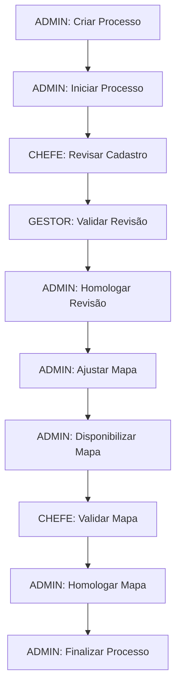

# Fluxo Geral de Revisão - Caminho Feliz

Este documento descreve o fluxo completo do "caminho feliz" para um processo de revisão, desde a criação até a finalização, envolvendo os diferentes perfis de usuário (ADMIN, GESTOR, CHEFE e SERVIDOR).

## Visão Geral do Processo

O processo de revisão envolve as seguintes etapas principais:
1. Criação e inicialização do processo (ADMIN)
2. Revisão do cadastro de atividades e conhecimentos (CHEFE)
3. Validação da revisão do cadastro (GESTOR/ADMIN)
4. Ajuste e disponibilização do mapa de competências (ADMIN)
5. Validação do mapa de competências ajustado (CHEFE/GESTOR/ADMIN)
6. Finalização do processo (ADMIN)

## Fluxo Detalhado

### 1. Login e Criação do Processo (ADMIN)

1. **ADMIN** realiza login no sistema com suas credenciais
2. O sistema exibe o Painel com a lista de processos ativos
3. **ADMIN** clica no botão "Criar processo"
4. O sistema exibe a tela de Cadastro de Processo
5. **ADMIN** preenche:
   - Descrição do processo
   - Tipo do processo: "Revisão"
   - Seleciona unidades participantes (operacionais e interoperacionais) que já possuem mapas de competência vigentes
   - Define data limite para etapa 1
6. **ADMIN** clica em "Salvar"
7. O sistema valida os dados e cria o processo na situação "Criado"
8. O sistema redireciona para o Painel

### 2. Inicialização do Processo (ADMIN)

1. **ADMIN** clica no processo recém-criado na lista de processos
2. O sistema exibe a tela de Cadastro de Processo com os dados preenchidos
3. **ADMIN** clica no botão "Iniciar processo"
4. O sistema mostra diálogo de confirmação
5. **ADMIN** confirma a inicialização
6. O sistema:
   - Altera a situação do processo para "Em andamento"
   - Cria subprocessos para cada unidade participante
   - Cria cópias dos mapas de competências vigentes para cada unidade
   - Registra movimentações iniciais
   - Envia notificações por e-mail para todas as unidades participantes
   - Cria alertas para todas as unidades participantes
7. O sistema redireciona para o Painel

### 3. Revisão do Cadastro de Atividades e Conhecimentos (CHEFE)

1. **CHEFE** realiza login no sistema com suas credenciais
2. O sistema exibe o Painel com o processo de revisão em andamento
3. **CHEFE** clica no processo de revisão
4. O sistema exibe a tela Detalhes do Subprocesso da unidade
5. **CHEFE** clica no card "Atividades e conhecimentos"
6. O sistema exibe a tela de Cadastro de Atividades e Conhecimentos com os dados atuais
7. **CHEFE** realiza as seguintes ações:
   - Revisa atividades e conhecimentos existentes
   - Edita descrições de atividades e conhecimentos conforme necessário
   - Adiciona novas atividades e conhecimentos
   - Remove atividades e conhecimentos obsoletos
   - Opcionalmente, importa atividades de outros processos
   - Clica no botão "Impactos no mapa" para verificar impactos das alterações
8. O sistema altera automaticamente a situação do subprocesso para "Revisão do cadastro em andamento"
9. **CHEFE** clica no botão "Disponibilizar"
10. O sistema valida que todas as atividades têm pelo menos um conhecimento
11. O sistema mostra diálogo de confirmação
12. **CHEFE** confirma a disponibilização
13. O sistema:
    - Altera a situação do subprocesso para "Revisão do cadastro disponibilizada"
    - Registra movimentação para a unidade superior
    - Envia notificação por e-mail para a unidade superior
    - Cria alerta para a unidade superior
14. O sistema redireciona para o Painel

### 4. Validação da Revisão do Cadastro (GESTOR)

1. **GESTOR** realiza login no sistema com suas credenciais
2. O sistema exibe o Painel com alertas de revisões de cadastro disponibilizadas
3. **GESTOR** clica no processo de revisão
4. O sistema exibe a tela Detalhes do Processo
5. **GESTOR** clica na unidade subordinada com revisão disponibilizada
6. O sistema exibe a tela Detalhes do Subprocesso
7. **GESTOR** clica no card "Atividades e conhecimentos"
8. O sistema exibe a tela de Atividades e Conhecimentos com os botões de análise
9. **GESTOR** analisa as alterações e clica em "Registrar aceite"
10. O sistema mostra diálogo de confirmação
11. **GESTOR** confirma o aceite
12. O sistema:
    - Registra análise de revisão com resultado "Aceite"
    - Registra movimentação para a unidade superior
    - Envia notificação por e-mail para a unidade superior
    - Cria alerta para a unidade superior
13. O sistema redireciona para o Painel

### 5. Homologação da Revisão do Cadastro (ADMIN)

1. **ADMIN** realiza login no sistema com suas credenciais
2. O sistema exibe o Painel com alertas de revisões de cadastro aceitas
3. **ADMIN** clica no processo de revisão
4. O sistema exibe a tela Detalhes do Processo
5. **ADMIN** clica na unidade com revisão aceita
6. O sistema exibe a tela Detalhes do Subprocesso
7. **ADMIN** clica no card "Atividades e conhecimentos"
8. O sistema exibe a tela de Atividades e Conhecimentos
9. **ADMIN** clica em "Homologar"
10. O sistema mostra diálogo de confirmação
11. **ADMIN** confirma a homologação
12. O sistema:
    - Altera a situação do subprocesso para "Revisão do cadastro homologada"
    - Registra movimentação
13. O sistema redireciona para a tela Detalhes do Subprocesso

### 6. Ajuste do Mapa de Competências (ADMIN)

1. **ADMIN** clica no card "Mapa de Competências"
2. O sistema exibe a tela de Edição de Mapa com o mapa atual
3. **ADMIN** clica no botão "Impactos no mapa"
4. O sistema exibe a tela modal com os impactos das alterações no cadastro
5. **ADMIN** realiza as seguintes ações:
   - Analisa os impactos mostrados
   - Ajusta o mapa de competências conforme necessário
   - Edita descrições de competências
   - Remove ou cria novas competências
   - Ajusta a associação das atividades às competências
   - Associa todas as atividades a competências
6. O sistema altera automaticamente a situação do subprocesso para "Mapa ajustado"
7. **ADMIN** clica no botão "Disponibilizar"
8. O sistema valida que:
   - Todas as competências estão associadas a pelo menos uma atividade
   - Todas as atividades estão associadas a pelo menos uma competência
9. O sistema mostra janela modal para preenchimento de:
   - Data limite para validação do mapa
   - Observações (opcional)
10. **ADMIN** preenche os campos e clica em "Disponibilizar"
11. O sistema:
    - Altera a situação do subprocesso para "Mapa disponibilizado"
    - Registra movimentação
    - Envia notificações por e-mail para a unidade e unidades superiores
    - Cria alertas para a unidade e unidades superiores
12. O sistema redireciona para o Painel

### 7. Validação do Mapa de Competências Ajustado (CHEFE)

1. **CHEFE** realiza login no sistema com suas credenciais
2. O sistema exibe o Painel com alerta de mapa disponibilizado
3. **CHEFE** clica no processo de revisão
4. O sistema exibe a tela Detalhes do Subprocesso
5. **CHEFE** clica no card "Mapa de Competências"
6. O sistema exibe a tela de Visualização de Mapa com os botões "Apresentar sugestões" e "Validar"
7. **CHEFE** analisa o mapa ajustado e clica em "Validar"
8. O sistema mostra diálogo de confirmação
9. **CHEFE** confirma a validação
10. O sistema:
    - Altera a situação do subprocesso para "Mapa validado"
    - Registra movimentação para a unidade superior
    - Envia notificação por e-mail para a unidade superior
    - Cria alerta para a unidade superior
11. O sistema redireciona para o Painel

### 8. Homologação do Mapa de Competências Ajustado (ADMIN)

1. **ADMIN** realiza login no sistema com suas credenciais
2. O sistema exibe o Painel com alerta de mapa validado
3. **ADMIN** clica no processo de revisão
4. O sistema exibe a tela Detalhes do Processo
5. **ADMIN** clica na unidade com mapa validado
6. O sistema exibe a tela Detalhes do Subprocesso
7. **ADMIN** clica no card "Mapa de Competências"
8. O sistema exibe a tela de Visualização de Mapa
9. **ADMIN** clica em "Homologar"
10. O sistema mostra diálogo de confirmação
11. **ADMIN** confirma a homologação
12. O sistema:
    - Altera a situação do subprocesso para "Mapa homologado"
    - Registra movimentação
13. O sistema redireciona para o Painel

### 9. Finalização do Processo (ADMIN)

1. **ADMIN** clica no botão "Finalizar processo" na tela Detalhes do Processo
2. O sistema verifica se todos os subprocessos estão na situação "Mapa homologado"
3. O sistema mostra diálogo de confirmação
4. **ADMIN** confirma a finalização
5. O sistema:
   - Define os mapas de competências ajustados dos subprocessos como vigentes
   - Altera a situação do processo para "Finalizado"
   - Envia notificações por e-mail para todas as unidades participantes
6. O sistema redireciona para o Painel

## Diagrama de Fluxo

## Perfis Envolvidos

- **ADMIN**: Responsável por criar, iniciar e finalizar processos, além de ajustar e homologar mapas de competências
- **GESTOR**: Responsável por validar revisões de cadastros de atividades e conhecimentos
- **CHEFE**: Responsável por revisar atividades e conhecimentos e validar mapas de competências ajustados
- **SERVIDOR**: Participa apenas em processos de diagnóstico (não envolvido no fluxo de revisão)

## Situações dos Subprocessos

1. Não iniciado
2. Revisão do cadastro em andamento
3. Revisão do cadastro disponibilizada
4. Revisão do cadastro homologada
5. Mapa ajustado
6. Mapa disponibilizado
7. Mapa com sugestões
8. Mapa validado
9. Mapa homologado

## Principais Diferenças em Relação ao Mapeamento

1. **Pré-requisito**: Unidades participantes devem ter mapas de competência vigentes
2. **Cópia de dados**: O sistema cria cópias dos mapas vigentes ao iniciar o processo
3. **Impactos**: Verificação de impactos das alterações no cadastro sobre o mapa de competências
4. **Ajuste de mapa**: O ADMIN ajusta o mapa existente em vez de criar um novo
5. **Fluxo de homologação**: Inclui verificação de impactos antes da homologação final