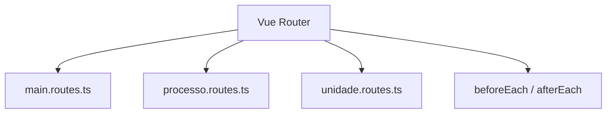
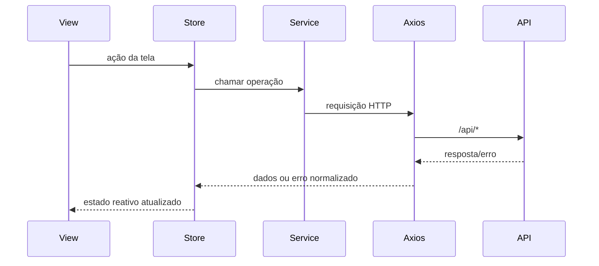

# Frontend do SGC

## Papel do módulo

`frontend/` implementa a SPA do SGC. Ele traduz os fluxos de processo/subprocesso em telas, componentes e stores, consumindo contratos REST do backend e aplicando regras de navegação, cache local e renderização por permissão.

## Stack técnica

- **Vue 3.5** com `<script setup lang="ts">`
- **TypeScript 5.9**
- **Vite 7**
- **Pinia 3** em setup stores
- **Vue Router 5**
- **BootstrapVueNext + Bootstrap 5**
- **Axios** para integração HTTP
- **Vitest** para testes unitários

## Estrutura principal

`src/` está dividido em camadas orientadas ao uso da UI:

| Pasta | Papel |
|---|---|
| `views/` | telas de caso de uso (`PainelView`, `SubprocessoView`, `MapaView`, `RelatoriosView`...) |
| `components/` | componentes de domínio e infraestrutura visual |
| `stores/` | estado global de processos, mapas, painel, sessão, organização, toasts e subprocessos |
| `services/` | chamadas HTTP segmentadas por contexto |
| `composables/` | lógica reutilizável de fluxo, formulário, cache, sessão e erros |
| `router/` | montagem das rotas modulares |
| `types/` | DTOs e tipos de negócio |
| `utils/` | logger, normalização de erro e utilitários transversais |
| `test-utils/` / `test/` | apoio de testes |

### Organização dos componentes

`components/` espelha áreas funcionais do produto:

- `administracao/`
- `atividades/`
- `cadastro/`
- `feedback/`
- `layout/`
- `login/`
- `mapa/`
- `processo/`
- `relatorios/`
- `unidade/`
- `comum/`

## Arquitetura de navegação

As rotas são montadas em `router/index.ts` a partir de três módulos:

- `main.routes.ts`: login, painel, histórico, relatórios e telas administrativas
- `processo.routes.ts`: processo, subprocesso, cadastro e mapa por processo/unidade
- `unidade.routes.ts`: consulta de unidades, mapa vigente e atribuição temporária

O router também centraliza:

- proteção de páginas autenticadas;
- restrições por perfil para relatórios e administração;
- atualização do título do documento.



## Estado e orquestração

### Stores principais

| Store | Responsabilidade |
|---|---|
| `usePerfilStore` | login, seleção de perfil/unidade, sessão e invalidação global de caches |
| `usePainelStore` | processos e alertas do painel |
| `useProcessoStore` | dados de processo e contexto da tela macro |
| `useSubprocessoStore` | cache de contexto de edição/cadastro por subprocesso ou processo+unidade |
| `useMapasStore` | operações de mapa |
| `useUnidadeStore` | consulta e estado de unidades |
| `useOrganizacaoStore` | dados organizacionais auxiliares |
| `useRelatoriosStore` | relatórios |
| `useToastStore` | notificações visuais |

### Padrões importantes

- stores usam `ref`/`computed`, não option stores;
- a sessão invalida caches de múltiplas stores ao trocar perfil ou logout;
- `useSubprocessoStore` deduplica carregamentos e mantém cache curto por chave;
- erros de backend devem ser normalizados/centralizados, evitando tratamento local excessivo.

## Integração HTTP

A infraestrutura está em `src/axios-setup.ts`.

Ela centraliza:

- `baseURL` da API;
- cookies XSRF;
- cancelamento de requisições pendentes;
- proteção durante transição de sessão;
- logging de monitoramento com correlação;
- redirecionamento para `/login` em 401.



## Widget de feedback

O `main.ts` carrega dinamicamente `FeedbackWidget.vue` quando `VITE_FEEDBACK_WIDGET=true`. Isso permite habilitar o widget em ambientes específicos sem acoplar a experiência padrão.

## Execução local

```bash
pnpm --dir frontend install
pnpm --dir frontend run dev
```

Aplicação em `http://localhost:5173`.

## Builds

```bash
pnpm --dir frontend run build
pnpm --dir frontend run build:hom
pnpm --dir frontend run build:prod
```

No build integrado via Gradle, `:frontend:buildVue` gera `dist/` e a raiz copia esse conteúdo para o backend.

## Estratégia de testes do frontend

Os testes se distribuem entre diretórios centrais e testes co-localizados.

### Onde os testes vivem

- `src/__tests__/`: testes de infraestrutura e views globais (`App`, router, axios, logger...)
- `src/views/__tests__/`: testes de telas e fluxos de caso de uso
- `src/components/__tests__/`: testes de componentes reutilizáveis
- `src/router/__tests__/`: testes específicos de roteamento

### O que é coberto

- resolução de rotas e títulos;
- login, painel, histórico, relatórios e telas administrativas;
- infraestrutura HTTP e fluxo de sessão;
- comportamento de componentes-chave;
- cenários de cobertura complementar em arquivos `*Coverage.spec.ts`.

Comandos principais:

```bash
pnpm --dir frontend run test:unit
pnpm --dir frontend run typecheck
pnpm --dir frontend run lint
pnpm --dir frontend run quality:all
```

Na raiz do repositório também existem atalhos:

```bash
npm run test:unit
npm run typecheck
npm run lint
```

## Convenções do módulo

- componentes em `PascalCase`
- arquivos TS em `camelCase`
- stores no padrão `use{Nome}Store`
- UI deve consumir permissões estruturadas vindas do backend
- preferir erro inline e foco no campo em validações, em vez de bloquear submissão antecipadamente
- evitar recuperação local de erros irrecuperáveis do backend

## Referências

- [README raiz](../README.md)
- [Backend do SGC](../backend/README.md)
- [Regras de acesso](../etc/reqs/regras-acesso.md)
- [Regras E2E](../etc/docs/regras-e2e.md)
