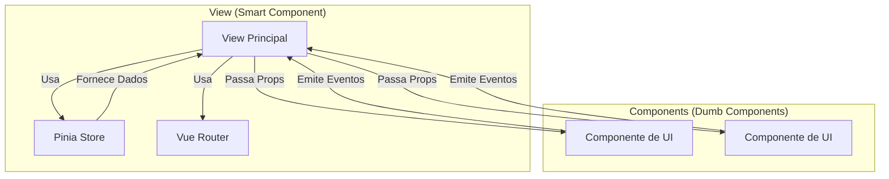

# Views (Páginas da Aplicação)

Este diretório contém os componentes de **página** (Views) do Vue.js. As views são os componentes de nível superior que
são carregados diretamente pelo Vue Router.

## Responsabilidades de uma View

Diferente dos componentes "burros" (`src/components`), as views são "inteligentes":

1. **Orquestração:** Conectam o estado global (`stores`) aos componentes de UI.
2. **Ciclo de Vida:** Gerenciam o carregamento inicial de dados (geralmente no `onMounted`).
3. **Layout:** Definem a estrutura macro da página (títulos, disposição dos componentes).

## Views Principais

### Autenticação e Painel

- **`LoginView.vue`**: Tela de login.
- **`PainelView.vue`**: Dashboard principal do usuário, exibindo alertas e movimentações recentes.

### Processos e Subprocessos

- **`ProcessoView.vue`**: Listagem de processos.
- **`CadProcesso.vue`**: Formulário para criação de novos processos.
- **`SubprocessoView.vue`**: Tela de detalhes de um subprocesso específico. É o hub central para as ações de uma
  unidade (ver mapa, diagnósticos, etc.).

### Gestão de Mapas e Atividades

- **`CadMapa.vue`**: Tela para edição do mapa de competências.
- **`VisMapa.vue`**: Tela para visualização (leitura) do mapa de competências.
- **`CadAtividades.vue`**: Tela para cadastro e edição de atividades e conhecimentos.
- **`VisAtividades.vue`**: Visualização de atividades e conhecimentos.

### Diagnóstico

- **`DiagnosticoEquipe.vue`**: Tela para realizar o diagnóstico da equipe.
- **`OcupacoesCriticas.vue`**: Tela para identificação de ocupações críticas.

### Outros

- **`CadAtribuicao.vue`**: Tela para cadastro de atribuições temporárias.
- **`UnidadeView.vue`**: Visualização de detalhes de uma unidade organizacional.
- **`HistoricoView.vue`**: Visualização de históricos.
- **`RelatoriosView.vue`**: Geração e visualização de relatórios gerenciais.
- **`ConfiguracoesView.vue`**: Configurações do sistema (acesso restrito a administradores).

