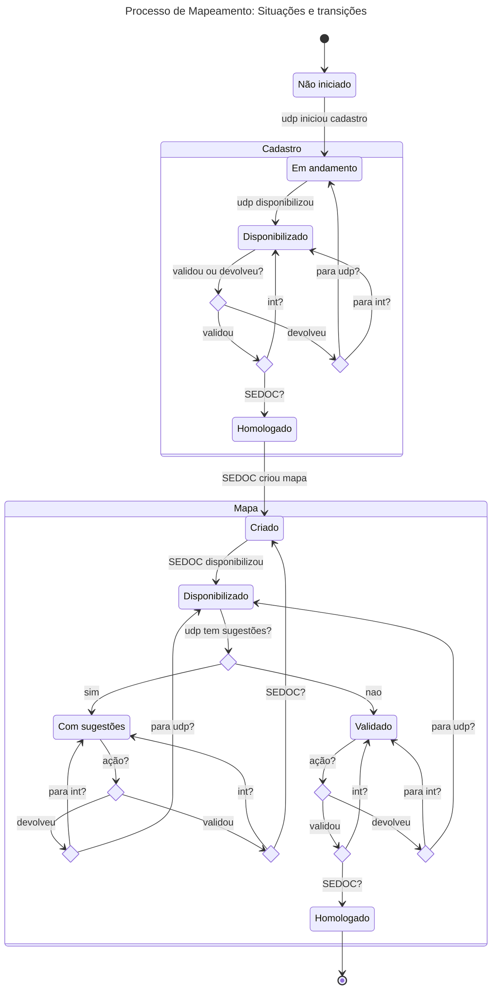
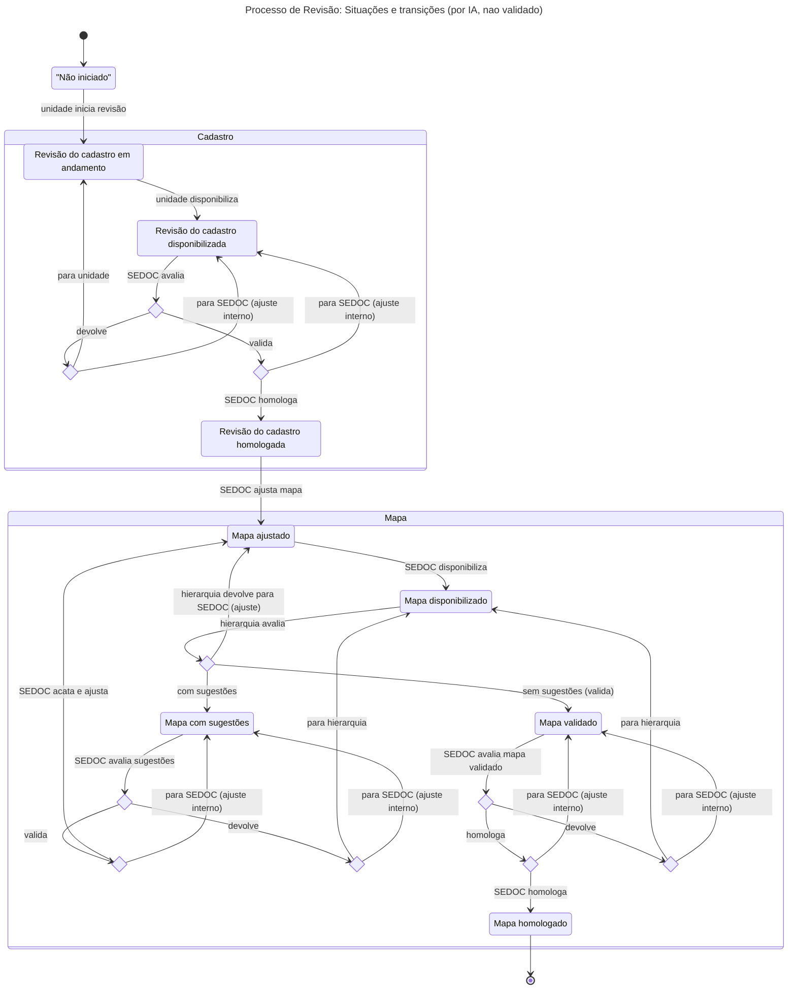

# Informações gerais

O Sistema de Gestão de Competências (SGC) visa gerenciar sistematicamente as competências técnicas das unidades organizacionais do tribunal. O sistema opera com uma estrutura organizacional hierárquica onde a SEDOC (Seção de Desenvolvimento Organizacional e Capacitação) exerce o papel de unidade raiz para todos os processos de mapeamento, de revisão e de diagnóstico de competências.

Os componentes essenciais do sistema incluem atividades, que são ações específicas desempenhadas por cada unidade no exercício de suas funções; conhecimentos, que representam o conjunto de conhecimentos técnicos necessários para executar cada atividade; competências, que são elementos sintetizantes agrupando atividades relacionadas e são definidos e mantidos apenas pela SEDOC; e mapas de competências, que constituem o conjunto consolidado de competências associadas a uma unidade, resultante do processo de mapeamento.

O sistema suporta três tipos principais de processos: mapeamento, que representa o processo inicial de coleta sistemática das atividades e conhecimentos necessários para cada unidade operacional; revisão, que consiste na atualização periódica dos mapas de competências vigentes considerando mudanças organizacionais; e diagnóstico, que avalia a importância e domínio das competências pelos servidores, identificando lacunas (gaps) e necessidades de capacitação.

## Atores e perfis

O sistema de Gestão de Competências opera com os seguintes perfis de usuários, cujas atribuições e acessos são automaticamente reconhecidos com base na condição de responsabilidade ou lotação em uma unidade, de acordo com o SGRH, ou por atribuição de responsabilidade temporária realizada no próprio sistema. Caso um usuário acumule mais de um perfil ou seja responsável por mais de uma unidade, será necessário selecionar o perfil e a unidade de trabalho após o login.

* **ADMIN**: Administrador da SEDOC. É responsável por criar, configurar e monitorar processos, além de criar/ajustar os mapas de competências das unidades. A unidade SEDOC é tratada como unidade raiz da estrutura organizacional para efeito dos processos de mapeamento, de revisão e de diagnóstico.
* **GESTOR**: Responsável por uma unidade intermediária (exemplo: Coordenador). Pode visualizar e validar as informações cadastradas pelas unidades sob sua gestão, submetendo para análise da unidade superior, ou devolver à unidade subordinada para realização de retificações.
* **CHEFE**: Responsável por uma unidade operacional ou interoperacional. Pode cadastrar as informações de sua unidade em cada processo e submeter essas informações para validação pela unidade superior.
* **SERVIDOR**: Servidor lotado em uma unidade operacional ou interoperacional. Este papel só atua nos processos de diagnóstico.

## Glossário

### Acesso TRE-PE

O sistema de Acesso do TRE-PE, que oferece uma API REST de autenticação de usuários, usando título de eleitor e senha. O Acesso também inclui sistemas e perfis de usuários, mas esta funcionalidade não será usada no sistema, sendo os perfis determinados a partir do SGRH juntamente com atribuições temporárias cadastradas.

### Atribuição temporária

Designação provisória da responsabilidade de uma unidade organizacional, realizada pela SEDOC, com data de início e término definidas, sobrepondo temporariamente a informação de responsabilidade obtida do SGRH. Também referida como atribuição temporária de responsabilidade.

### Atividade

Ação desempenhada por uma unidade operacional ou interoperacional no exercício de suas funções.

### Árvore de unidades

Estrutura hierárquica das unidades organizacionais; no contexto dos processos de mapeamento, de revisão e de diagnóstico, tem a SEDOC como unidade raiz.

### Cadastro

Termo simplificado para o cadastro de atividades e conhecimentos. Sempre que for usado o termo sem qualificações, refere-se a esse cadastro e a apenas este.

### Conhecimento

Conhecimento técnico necessário para desempenhar uma atividade específica. Uma atividade geralmente requer mais de um conhecimento.

### Competência

Elemento sintetizante das atribuições de uma unidade. É criado pela SEDOC a partir das atividades e conhecimentos cadastrados pelas unidades.

### Devolução

Ato de devolver para ajustes, após análise, as informações fornecidas (cadastro, mapa etc.) por uma unidade subordinada.

### Localização atual de subprocesso

Unidade destino da última movimentação registrada para o subprocesso.

### Mapa de competências

Conjunto consolidado de competências criado pela SEDOC, para uma unidade. Também referido como mapa de competências técnicas.

### Movimentação

Registro da transição do subprocesso de uma unidade de origem para uma unidade de destino.

### Processos ativos/inativos

Os processos são considerados ativos no sistema quando ainda não estão finalizados ou foram finalizados há no máximo o número de dias definidos na configuração DIAS_INATIVACAO_PROCESSO (padrão 10 dias). A partir dessa quantidade de dias da finalização do processo, ele será considerado inativo, sendo disponível apenas para consulta a partir da tela Histórico de processos;

### Processo de mapeamento

Ciclo completo de coleta, validação e consolidação de atividades e conhecimentos das unidades operacionais e interoperacionais, e posterior geração e validação do mapa de competências. Também referido como processo de mapeamento de competências técnicas.

### Processo de revisão

Ciclo de revisão e validação do cadastro de atividades e conhecimentos das unidades operacionais e interoperacionais, e posterior adequação e validação do mapa de competências. Também referido como processo de revisão do mapa de competências técnicas.

### Processo de diagnóstico

Avaliação realizada pelos servidores e pelos responsáveis pelas unidades para identificar a importância e o domínio das competências das unidades por parte dos seus servidores, assim como as competências com poucos servidores capacitados. Também referido como de competências técnicas e identificação das ocupações críticas.

### Responsável

Servidor titular ou substituto da titularidade de uma unidade organizacional, de acordo com as informações vigentes no SGRH no momento da consulta.

### SEDOC

Seção de desenvolvimento organizacional e capacitação. Principal unidade usuária do sistema no contexto dos processos de mapeamento, de revisão e de diagnóstico.

### SGRH

O sistema de Gestão de Recursos Humanos. É o sistema cujo banco de dados fornecerá as informações das unidades de lotação e titularidade dos servidores do Tribunal.

### Subprocesso

Instância de um processo de mapeamento, revisão ou diagnóstico no contexto de uma unidade operacional ou interoperacional.

### Unidade

Elemento da estrutura hierárquica do tribunal (árvore de unidades) onde os servidores estão lotados. Para efeito do sistema, podem ser classificadas em intermediárias, operacionais ou interoperacionais. Também referido como unidade organizacional.

### Unidade intermediária

Unidade abaixo da SEDOC (raiz) que possua uma ou mais unidades subordinadas a ela.

### Unidade interoperacional

Unidade que possui unidades subordinadas, mas também mais de um servidor lotado.

### Unidade operacional

Unidade com mais de um servidor lotado.

### Unidade raiz

Unidade que não possui unidade superior na árvore de unidades do sistema. Com relação aos processos de mapeamento, de revisão e de diagnóstico, esse papel é exercido pela SEDOC.

### Validação

Ato de ratificar, após análise, as informações fornecidas por uma unidade subordinada. A validação encaminha a análise para a unidade superior.

## Situações

Os processos e subprocessos mantidos pelo sistema seguem um fluxo previsível, passando por um conjunto de situações que varia de acordo com o tipo de processo/subprocesso. Essas situações são referenciadas entre aspas simples (por exemplo, 'Não iniciado') nas especificações de casos de uso.

### Situações de Processos

* Criado: Processo cadastrado, mas não iniciado.
* Em andamento: Processo foi iniciado e todas as unidades participantes foram notificadas.
* Finalizado: Mapa de competências homologado para todas as unidades.

### Situações de Subprocessos de Mapeamento

* Não iniciado: Unidade notificada pela SEDOC, mas sem cadastro salvo.
* Cadastro em andamento: Cadastro salvo mas não finalizado.
* Cadastro disponibilizado: Cadastro finalizado, aguardando validação.
* Cadastro homologado: Cadastro validado pela SEDOC.
* Mapa criado: SEDOC criou mapa para a unidade mas ainda não disponibilizou.
* Mapa disponibilizado: SEDOC disponibilizou mapa da unidade para validação.
* Mapa com sugestões: CHEFE indicou sugestões para o mapa da unidade.
* Mapa validado: Hierarquia aprovou mapa disponibilizado pela SEDOC.
* Mapa homologado: SEDOC homologou mapa para a unidade após validações sem sugestões.

### Situações de Subprocessos de Revisão

* Não iniciado: Unidade foi notificada, mas não alterou cadastro.
* Revisão do cadastro em andamento: Unidade fez alteração no cadastro.
* Revisão do cadastro disponibilizada: Revisão do cadastro concluída, aguardando validação.
* Revisão do cadastro homologada: Revisão do cadastro validada pela SEDOC.
* Mapa ajustado: SEDOC criou mapa ajustado para a unidade mas ainda não disponibilizou.
* Mapa disponibilizado: SEDOC disponibilizou mapa ajustado da unidade para validação.
* Mapa com sugestões: CHEFE indicou sugestões para o mapa da unidade.
* Mapa homologado: SEDOC homologou mapa para a unidade após validações sem sugestões.
* Mapa validado: Hierarquia aprovou o mapa disponibilizado pela SEDOC.

