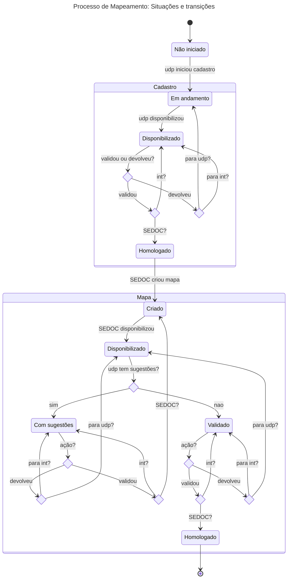
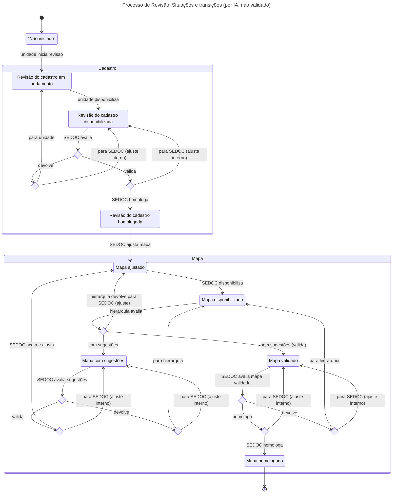

# Situações

Os processos e subprocessos mantidos pelo sistema seguem um fluxo previsível, passando por um conjunto de situações que varia de acordo com o tipo de processo/subprocesso. Essas situações são referenciadas entre aspas simples (por exemplo, 'Não iniciado') nas especificações de casos de uso.

## Situações de Processos
- Criado: Processo cadastrado, mas não iniciado.
- Em andamento: Processo foi iniciado e todas as unidades participantes foram notificadas.
- Finalizado: Mapa de competências homologado para todas as unidades.

## Situações de Subprocessos de Mapeamento
- Não iniciado: Unidade notificada pela SEDOC, mas sem cadastro salvo.
- Cadastro em andamento: Cadastro salvo mas não finalizado.
- Cadastro disponibilizado: Cadastro finalizado, aguardando validação.
- Cadastro homologado: Cadastro validado pela SEDOC.
- Mapa criado: SEDOC criou mapa para a unidade mas ainda não disponibilizou.
- Mapa disponibilizado: SEDOC disponibilizou mapa da unidade para validação.
- Mapa com sugestões: CHEFE indicou sugestões para o mapa da unidade.
- Mapa validado: Hierarquia aprovou mapa disponibilizado pela SEDOC.
- Mapa homologado: SEDOC homologou mapa para a unidade após validações sem sugestões.

## Situações de Subprocessos de Revisão
- Não iniciado: Unidade foi notificada, mas não alterou cadastro.
- Revisão do cadastro em andamento: Unidade fez alteração no cadastro.
- Revisão do cadastro disponibilizada: Revisão do cadastro concluída, aguardando validação.
- Revisão do cadastro homologada: Revisão do cadastro validada pela SEDOC.
- Mapa ajustado: SEDOC criou mapa ajustado para a unidade mas ainda não disponibilizou.
- Mapa disponibilizado: SEDOC disponibilizou mapa ajustado da unidade para validação.
- Mapa com sugestões: CHEFE indicou sugestões para o mapa da unidade.
- Mapa homologado: SEDOC homologou mapa para a unidade após validações sem sugestões.
- Mapa validado: Hierarquia aprovou o mapa disponibilizado pela SEDOC.

