# Plano de Simplificação do SGC

> **Escala real:** 5-10 usuários simultâneos, intranet, equipe única.
> **Referências:** [ADR-008](file:///c:/sgc/backend/etc/docs/adr/ADR-008-simplification-decisions.md), [acesso.md](file:///c:/sgc/acesso.md)

## Decisões Arquiteturais (definidas em discussão)

- ✅ **Facades mantidas** como padrão para todos os módulos — ponto de entrada único por domínio
- ✅ **Problema real = fragmentação interna** dos services, não o padrão Facade em si
- ✅ **Consolidação de módulos pequenos**: reduzir de 13 para 10 módulos
- ✅ **`relatorio` mantido separado** — responsabilidade técnica distinta (PDF) com potencial de crescimento

---

## Fase 1 — Remover Código Morto (Pact) 🟢 Risco Baixo

Pact foi removido das dependências mas os arquivos permanecem como código morto.

### Deletar

- `backend/src/test/java/sgc/pact/` (diretório)
- `frontend/src/services/__tests__/ProcessoService.pact.spec.ts`
- `frontend/pact/` (diretório)
- `frontend/vitest.pact.config.ts`

### Verificação

`./gradlew :backend:test` + `cd frontend && npm run test:unit`

---

## Fase 2 — Consolidar Services do `subprocesso` 🟡 Risco Médio

Manter a `SubprocessoFacade` e os 4 controllers, mas **reduzir os 12 services internos**.

### Inventário Atual → Alvo

| Service | Tamanho | Ação |
|:--|:--:|:--|
| `SubprocessoCadastroWorkflowService` | 15KB | → Mergear em `SubprocessoWorkflowService` |
| `SubprocessoAdminWorkflowService` | 4.5KB | → Mergear em `SubprocessoWorkflowService` |
| `SubprocessoTransicaoService` | 5KB | → Mergear em `SubprocessoWorkflowService` |
| `SubprocessoFactory` | 7.4KB | → Mergear em `SubprocessoWorkflowService` |
| `SubprocessoMapaWorkflowService` | 20KB | **Manter** (grande e coeso) |
| `SubprocessoCrudService` | 5.6KB | **Manter** (CRUD puro) |
| `SubprocessoValidacaoService` | 9.6KB | **Manter** (validações) |
| `SubprocessoContextoService` | 8.4KB | Avaliar absorção |
| `SubprocessoAtividadeService` | 5.5KB | Avaliar absorção |
| `SubprocessoAjusteMapaService` | 6.5KB | Avaliar absorção em `MapaWorkflowService` |
| `ConsultasSubprocessoService` | 3.8KB | **Manter** (queries) |
| `SubprocessoEmailService` | 7.9KB | **Manter** (notificações) |

**Resultado esperado:** 12 services → ~6-7 services. Facade mantida intacta.

### Passos

1. Criar `SubprocessoWorkflowService` unificando Cadastro + Admin + Transição + Factory
2. Avaliar absorção dos helpers (`Contexto`, `Atividade`, `AjusteMapa`)
3. Atualizar `SubprocessoFacade` para delegar aos novos services
4. Atualizar testes unitários
5. Deletar subdiretórios esvaziados

**Verificação:** `./gradlew :backend:test`

---

## Fase 3 — Consolidar Módulos Pequenos 🟡 Risco Médio

Reduzir de 13 para 10 módulos:

### 3A. `alerta` absorve `notificacao`

| Antes | Depois |
|:--|:--|
| `alerta/` — AlertaController, AlertaFacade, AlertaService, models | `alerta/` — tudo + notificação |
| `notificacao/` — EmailService, EmailModelosService, Notificacao, NotificacaoRepo | Absorvido em `alerta/notificacao/` |

**Motivo:** Ambos são comunicação do sistema — alerta detecta, notificação entrega.

### 3B. `processo` absorve `painel`

| Antes | Depois |
|:--|:--|
| `painel/` — PainelController, PainelFacade | `processo/painel/` |

**Motivo:** Painel é uma view agregada de processos, não um domínio próprio.

### 3C. `subprocesso` absorve `analise`

| Antes | Depois |
|:--|:--|
| `analise/` — AnaliseController, AnaliseFacade, AnaliseService, models, dtos | `subprocesso/analise/` |

**Motivo:** Análise é o histórico de devoluções/aceites do subprocesso.

### Passos (para cada absorção)

1. Mover arquivos para sub-pacote do módulo destino
2. Atualizar `package` declarations em todos os arquivos movidos
3. Atualizar imports em todos os consumidores
4. Remover diretório antigo
5. Atualizar testes

**Verificação:** `./gradlew :backend:test` + `cd frontend && npm run test:unit`

---

## Fase 4 — Remover Mappers Manuais do Frontend 🟡 Risco Médio

### Inventário (9 mappers + 6 testes)

`alertas.ts`, `analises.ts`, `atividades.ts`, `mapas.ts`, `processos.ts`, `sgrh.ts`, `subprocessos.ts`, `unidades.ts`, `usuarios.ts`

### Passos

1. Categorizar cada mapper: passthrough (remover) vs. transformação real (mover para backend/inline)
2. Deletar `frontend/src/mappers/` inteiro
3. Atualizar imports nos services

**Verificação:** `npm run typecheck && npm run lint && npm run test:unit`

---

## Ordem de Execução

```mermaid
graph LR
    F1[Fase 1: Pact] --> F2[Fase 2: Services subprocesso]
    F2 --> F3[Fase 3: Módulos]
    F1 --> F4[Fase 4: Mappers frontend]

    style F1 fill:#4CAF50,color:#fff
    style F2 fill:#FFC107,color:#000
    style F3 fill:#FFC107,color:#000
    style F4 fill:#FFC107,color:#000
```

## Impacto Estimado

| Métrica | Antes | Depois |
|:--|:--:|:--:|
| Módulos backend | 13 | 10 |
| Services no subprocesso | 12 | ~6-7 |
| Mappers frontend | 9 + 6 testes | 0 |
| Código morto Pact | 5 arquivos | 0 |
