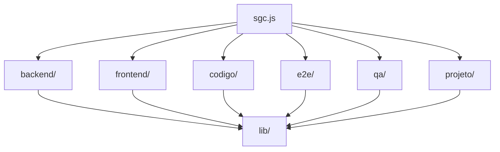

# Toolkit de Scripts do SGC

## Papel do módulo

`toolkit/` reúne a CLI de automação do repositório. Ela concentra comandos operacionais e de auditoria usados para
qualidade, setup, diagnóstico do projeto, utilidades de backend/frontend e geração de dashboards de QA.

Ponto de entrada principal:

```bash
node toolkit/sgc.js
```

## Visão arquitetural

O toolkit é um módulo Node.js em ESM, separado do backend/frontend, com dependências próprias e testes próprios.



## Estrutura do diretório

| Caminho       | Papel                                                             |
|---------------|-------------------------------------------------------------------|
| `sgc.js`      | roteador principal da CLI                                         |
| `*.js` (raiz) | auditorias transversais de comunicação, templates e notificações  |
| `lib/`        | infraestrutura compartilhada, execução, paths, saída e utilidades |
| `backend/`    | comandos de cobertura, testes e higiene Java                      |
| `frontend/`   | comandos de cobertura, mensagens, validações, test ids e cruft    |
| `codigo/`     | auditorias transversais de smells                                 |
| `e2e/`        | automações relacionadas à suíte E2E                               |
| `qa/`         | snapshot, resumo e dashboard de qualidade                         |
| `projeto/`    | setup, doctor, limpeza e qualidade do repositório                 |
| `test/`       | testes do toolkit                                                 |

## Comandos por domínio

### Backend

```bash
node toolkit/sgc.js backend cobertura auditoria
node toolkit/sgc.js backend cobertura jornada
node toolkit/sgc.js backend cobertura cruzada
node toolkit/sgc.js backend testes analisar
node toolkit/sgc.js backend testes priorizar
node toolkit/sgc.js backend testes gerar-stub
node toolkit/sgc.js backend java corrigir-fqn
node toolkit/sgc.js backend java auditar-null
node toolkit/sgc.js backend java instalar-certificados
node toolkit/sgc.js backend notificacoes auditar-assuntos
```

### Frontend

```bash
node toolkit/sgc.js frontend cobertura auditoria
node toolkit/sgc.js frontend mensagens extrair
node toolkit/sgc.js frontend mensagens analisar
node toolkit/sgc.js frontend validacoes auditar
node toolkit/sgc.js frontend cruft auditar
node toolkit/sgc.js frontend cruft validar
node toolkit/sgc.js frontend views validacoes-auditar
node toolkit/sgc.js frontend test-ids listar
node toolkit/sgc.js frontend test-ids listar-duplicados
node toolkit/sgc.js frontend test-ids duplicados
node toolkit/sgc.js frontend telas capturar
node toolkit/sgc.js frontend a11y auditar
node toolkit/sgc.js frontend a11y crawler
node toolkit/sgc.js frontend a11y processar
```

### Código transversal

```bash
node toolkit/sgc.js codigo smells auditar
node toolkit/sgc.js codigo nomes coletar-simbolos
node toolkit/sgc.js codigo nomes auditar-consistencia
```

### E2E

```bash
node toolkit/sgc.js e2e limpar
```

### Comunicação

```bash
node toolkit/sgc.js comunicacao cobertura-notificacoes
node toolkit/sgc.js comunicacao strings
node toolkit/sgc.js comunicacao templates-email
```

### Requisitos

```bash
node toolkit/sgc.js requisitos cdus inventariar
node toolkit/sgc.js requisitos cdus auditar
node toolkit/sgc.js requisitos cdus auditar-estilo
node toolkit/sgc.js requisitos cdus inventariar-vocabulario
node toolkit/sgc.js requisitos cdus auditar-vocabulario
node toolkit/sgc.js requisitos cdus inventariar-mensagens
node toolkit/sgc.js requisitos cdus auditar-mensagens
node toolkit/sgc.js requisitos cdus auditar-mensagens-codigo
node toolkit/sgc.js requisitos cdus inventariar-densidade
node toolkit/sgc.js requisitos cdus inventariar-duplicacoes
```

### QA

```bash
node toolkit/sgc.js qa snapshot coletar --perfil rapido
node toolkit/sgc.js qa resumo
node toolkit/sgc.js qa dashboard servir --porta 4179
```

### Projeto

```bash
node toolkit/sgc.js projeto doctor
node toolkit/sgc.js projeto dependencias auditar
node toolkit/sgc.js projeto limpar --confirmar
node toolkit/sgc.js projeto qualidade rapido
node toolkit/sgc.js projeto setup --instalar-dependencias
node toolkit/sgc.js projeto arvore-linhas
node toolkit/sgc.js projeto versao-sincronizar 1.2.3
```

## Casos de uso típicos

- gerar snapshot consolidado de qualidade para revisão técnica;
- auditar cruft/duplicidade no frontend;
- apoiar evolução da suíte de testes backend;
- validar divergência entre Bean Validation e validação de UI;
- preparar ambiente local de desenvolvimento;
- servir dashboards de QA para inspeção manual.

## Dependências e execução

`toolkit/package.json` define dependências próprias, separadas do restante do repositório.

Instalação:

```bash
npm --prefix toolkit install
```

Execução dos testes do toolkit:

```bash
npm --prefix toolkit run test
```

Lint do toolkit:

```bash
npm --prefix toolkit run lint
```

Auditoria de dependências:

```bash
npm --prefix toolkit run deps:audit
node toolkit/sgc.js projeto dependencias auditar
```

## Organização dos testes

O diretório `test/` contém:

- `sgc.test.js`: testes da CLI principal
- `fixtures/`: dados auxiliares para simular cenários de execução

Esses testes garantem que a CLI continue roteando comandos, produzindo saídas e respeitando contratos básicos de
operação.

## Relação com o restante do repositório

O toolkit não substitui os comandos nativos de Gradle, npm ou Playwright; ele os complementa com:

- automação padronizada;
- relatórios agregados;
- auditorias específicas do SGC;
- comandos de produtividade difíceis de expressar apenas com scripts simples.

## Referências

- [README raiz](../../README.md)
- [Backend do SGC](../../backend/README.md)
- [Frontend do SGC](../../frontend/README.md)
